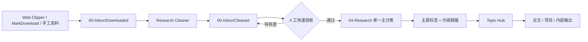

# Research Collection Workflow

```mermaid
flowchart LR
    A[Web Clipper / MarkDownload / 手工资料] --> B[00-Inbox/Downloaded]
    B --> C[Research Cleaner]
    C --> D[00-Inbox/Cleaned]
    D --> E{人工快速验收}
    E -->|通过| F[04-Research 单一主分类]
    E -->|待核查| D
    F --> G[主题标签 + 内部链接]
    G --> H[Topic Hub]
    H --> I[论文 / 项目 / 内容输出]
```

快捷执行：`powershell -ExecutionPolicy Bypass -File "98-AI-Context/Automation/Run-Research-Cleaner.ps1" -Promote`
