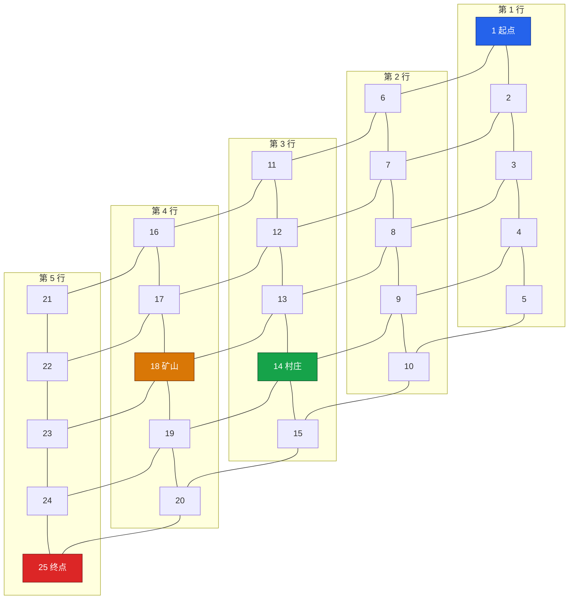

# 2020 国赛 B 题第一关地图与邻接关系

## 结论

B078 附录代码给出 `dis[26][26]`，注释说明节点从 1 编号，0 号行列为占位。去掉占位后得到 25×25 的无权图最短距离矩阵。对所有非对角元素取 `distance = 1` 的节点对，可唯一恢复原图：25 个节点、40 条无向边，为 5×5 四邻接网格。

特殊节点由同一代码的 `quai[4] = {1, 14, 18, 25}` 给出：

| 节点 | 类型 |
|---:|---|
| 1 | 起点 |
| 14 | 村庄 |
| 18 | 矿山 |
| 25 | 终点 |

## 推出的图

## 可复现数据与验证

- 距离矩阵：`06-Projects/2020国赛B题-穿越沙漠研究/Code/data/level1_b078_distance_matrix.csv`
- 节点表：`06-Projects/2020国赛B题-穿越沙漠研究/Code/data/level1_b078_nodes.csv`
- 推导边表：`06-Projects/2020国赛B题-穿越沙漠研究/Code/data/level1_b078_edges.csv`
- 验证程序：`06-Projects/2020国赛B题-穿越沙漠研究/Code/src/graph_reconstruction.py`

验证不是只检查矩阵对称性：程序先从 `distance = 1` 反推 40 条边，再对该图运行 Floyd–Warshall；回算出的 625 个最短距离与论文矩阵逐项完全一致。

## 版本与编号警告

> [!warning]
> B108 的附录把第一关写成 27 节点，并标注矿山 12、村庄 15；这与 B078 的 25 节点编号体系不同。B108 第二关另有 64 节点图。它们必须作为独立图版本保留，不能只凭节点编号合并。

> [!note]
> B125、B175 的 MATLAB 代码通过 `load u1.mat` 读取邻接矩阵；当前导入资料不含 `u1.mat`，因此本页只把 B078 的完整矩阵标记为 `verified`，不会用 OCR 猜测缺失边。

## 关联

- [[2020-B题-穿越沙漠-题目总览]]
- [[2020-B题-获奖论文横向对比]]
- [[B078-论文拆解]]
- [[四篇论文核心代码索引]]

