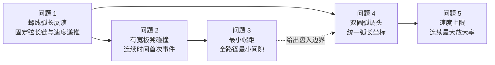

# 2024 A 题：板凳龙案例索引

> [!summary] 案例定位
> 这是一个把 **曲线运动学、固定弦长链、刚体碰撞、临界参数搜索、分段路径和连续极值** 串成完整证据链的综合案例。本笔记只保存可迁移的关系与复习入口；完整推导、结果、代码和论文以 [[06-Projects/2024国赛A题-板凳龙/Readme|板凳龙项目主页]] 为唯一事实源。

## 五问之间的模型关系

| 子问题 | 可迁移的建模核心 | 算法与实现入口 | 最重要的验证 |
|---|---|---|---|
| 问题 1：位置与速度 | 龙头按阿基米德螺线弧长运动；后继把手满足相邻点固定**弦长**；对距离约束隐式求导得到速度递推 | [[06-Projects/2024国赛A题-板凳龙/Code/src/geometry.py\|弧长与几何]]、[[06-Projects/2024国赛A题-板凳龙/Code/src/chain.py\|链式递推]] | 弧长残差、相邻弦长残差、符号推导与有限差分互证 |
| 问题 2：首次碰撞 | 把板凳表示为有宽度的有向矩形，而非只检查把手中心线；用 SAT 判断矩形相交，并将“首次碰撞”视为连续时间事件 | [[06-Projects/2024国赛A题-板凳龙/Code/src/collision.py\|碰撞判定]] | 排除结构上相邻板凳；粗扫描只负责夹逼，最终用事件根细化；临界点双侧扰动 |
| 问题 3：最小螺距 | 对每个候选螺距计算完整盘入区间的最小安全间隙，再在外层搜索可行与不可行的分界 | [[06-Projects/2024国赛A题-板凳龙/Code/src/pitch_feasibility.py\|螺距可行性]] | 不用端点代替全路径；同时检查调头空间边界与自碰撞约束；报告可行侧数值 |
| 问题 4：调头路径 | 用两段相切圆弧连接中心对称螺线，并用统一弧长坐标封装“盘入螺线—圆弧—盘出螺线” | [[06-Projects/2024国赛A题-板凳龙/Code/src/turning_path.py\|路径构造]]、[[06-Projects/2024国赛A题-板凳龙/Code/src/path_chain.py\|全链传播]] | 切点位置、切向连续、圆弧相切、把手间距和分段边界双侧一致 |
| 问题 5：最大龙头速度 | 先在单位龙头速度下求各把手速度放大率，再对时间与把手索引构成的上包络做连续极值搜索 | [[06-Projects/2024国赛A题-板凳龙/Code/src/speed_limit.py\|速度极值]] | 整数时刻仅作初筛；连续局部细化；网格加密和搜索尾部覆盖 |

## 一条可复用的解题主线

1. **统一几何参数**：先建立曲线位置、切向、弧长和逆映射，后续所有子问题共享同一坐标约定。
2. **递推链而非独立点**：后继把手由最近的合法距离根确定；错误选根会让整条龙跳支或倒序。
3. **把离散扫描升级为事件搜索**：扫描用于发现区间，临界时刻、临界螺距和最大速度必须再做连续细化。
4. **按真实物体检验约束**：中心线不碰不代表有宽度板凳不碰；可行性必须覆盖完整路径而非单个端点。
5. **证据闭环**：每个结论同时保留公式依据、代码模块、数值残差、双侧扰动或基线对照和论文图表。

## 复习与调用入口

- 完整推导与五问结果：[[06-Projects/2024国赛A题-板凳龙/Readme|项目主页]]
- 当前状态与验收证据：[[06-Projects/2024国赛A题-板凳龙/Project-Status|Project Status]]
- 代码运行顺序与测试：[[06-Projects/2024国赛A题-板凳龙/Code/Readme|代码与复现说明]]
- 易读增强版正文：[[06-Projects/2024国赛A题-板凳龙/Paper/论文正文|论文正文]]
- 与优秀论文的差距：[[06-Projects/2024国赛A题-板凳龙/Paper/优秀论文对照分析-A163|A163 优秀论文对照分析]]
- 方法归属：[[数学建模 Hub]] · [[优化模型 Hub]] · [[模型检验 Hub]] · [[Python Hub]] · [[可视化 Hub]] · [[论文写作 Hub]]
- 上级索引：[[04-Research/04-竞赛真题研究/Readme|竞赛真题研究]]
