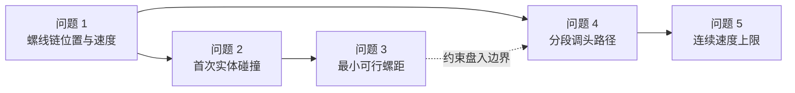

# 2024 国赛 A 题：板凳龙

> [!summary] 问题本质
> 这不是五个互不相关的小题，而是一条逐层扩展的几何运动学链：先求螺线上的刚性链运动，再加入板凳实体宽度和连续碰撞事件，随后搜索最小可行螺距、构造分段光滑调头路径，最后求全体把手速度上限。前一问的几何与速度求解器是后一问的基础。

## 原始材料与成果

- 赛题原文：[[06-Projects/2024国赛A题-板凳龙/Data/Raw/A题.pdf|2024 国赛 A 题 PDF]]
- 官方结果模板：[[06-Projects/2024国赛A题-板凳龙/Data/Raw/result1.xlsx|result1.xlsx]]、[[06-Projects/2024国赛A题-板凳龙/Data/Raw/result2.xlsx|result2.xlsx]]、[[06-Projects/2024国赛A题-板凳龙/Data/Raw/result4.xlsx|result4.xlsx]]
- 完整项目：[[06-Projects/2024国赛A题-板凳龙/Readme|板凳龙项目主页]]
- 本地论文复现：[[2024-A题-板凳龙-本地论文复现]]
- 优秀论文：[[00-Inbox/Downloaded/A163.pdf|A163 原论文]]，拆解见 [[2024-A题-板凳龙-A163优秀论文拆解]]
- 双论文对照：[[2024-A题-板凳龙-双论文对照与复习结论]]

## 对象、参数与统一编号

板凳龙由 223 节板凳首尾相接形成，共有 224 个把手位置。建模时必须区分“板凳实际长度”和“相邻把手孔中心距离”：

| 对象 | 实际板长 | 把手孔中心距 | 板宽 |
|---|---:|---:|---:|
| 龙头板凳 | $3.41\ \mathrm m$ | $2.86\ \mathrm m$ | $0.30\ \mathrm m$ |
| 龙身与龙尾板凳 | $2.20\ \mathrm m$ | $1.65\ \mathrm m$ | $0.30\ \mathrm m$ |

每个把手孔中心距最近板头 $0.275\ \mathrm m$。因此把手中心线不相交并不等价于实体板凳不碰撞，问题二和问题三必须使用有长度、有宽度的矩形板凳。

统一编号采用：

- $P_0$：龙头前把手；
- $P_1,\ldots,P_{222}$：后续把手；
- $P_{223}$：龙尾后把手；
- 第 $i$ 节板凳连接 $P_i$ 与 $P_{i+1}$。

![[06-Projects/2024国赛A题-板凳龙/Paper/Figures/problem_geometry_overview.png]]

## 五问任务矩阵

| 问题 | 已知条件 | 需要输出 | 数学核心 | 关键风险 |
|---|---|---|---|---|
| 1 | 螺距 $0.55$ m，龙头速度 $1$ m/s，初始位于第 16 圈 | $0$–$300$ s 全部把手的位置与速度 | 阿基米德螺线弧长反演、固定弦长最近根、隐式速度递推 | 把弦长误当弧长；选到错误距离根 |
| 2 | 继续按问题一盘入，板凳有实际长宽 | 不能继续盘入的最早时刻及当时状态 | 有向矩形、AABB 初筛、SAT、连续首次事件 | 只检查中心线或少数板凳；用整数时刻代替临界时刻 |
| 3 | 龙头需盘入直径 9 m 的调头空间 | 保证能够到达调头空间的最小螺距 | 完整路径最小分离裕量、内层极小值与外层临界搜索 | 只检查 $r=4.5$ m 的终点构型 |
| 4 | 螺距 $1.7$ m，盘入与盘出螺线中心对称，调头曲线由两段相切圆弧组成 | 调头路径及 $-100$–$100$ s 的位置、速度 | 双圆弧相切几何、统一弧长坐标、分段路径刚性链 | 分段边界漏解；位置连续但切向不连续 |
| 5 | 所有把手速度不超过 $2$ m/s | 龙头最大恒定速度 | 单位速度放大率、全路径全把手上包络、连续极值 | 只查看问题四整数时刻或预先固定一个把手 |

## 子问题依赖

## 统一建模主线

### 1. 用弧长描述龙头，而不是直接对角度匀速

阿基米德螺线写作

$$
r=b\theta,\qquad b=\frac{p}{2\pi}.
$$

龙头沿曲线以恒定线速度运动，因此应由弧长方程反求 $\theta(t)$。角速度并非常数。

### 2. 用固定弦长递推整条龙

给定前一个把手 $P_{i-1}$，后继把手 $P_i$ 应取沿链方向满足

$$
\|P_i-P_{i-1}\|=d_i
$$

的第一个合法根。这里的 $d_i$ 是把手孔中心距，不是两点之间的曲线弧长。

### 3. 对几何约束求导得到速度

对固定距离约束求时间导数，可得到相邻把手速度在连杆方向上的投影关系。该方法比用相邻时刻位置差近似速度更稳定，也能直接检查约束导数残差。

### 4. 把临界答案写成连续事件

- 问题二：最早满足最小分离裕量 $m(t)=0$ 的时刻；
- 问题三：完整盘入路径的最小裕量 $\Phi(p)=0$；
- 问题五：全路径、全把手速度放大率的最大值。

离散扫描只负责发现候选区间，最终答案必须连续细化并做临界点两侧验证。

## 本地复现结果速查

> [!note] 证据边界
> 下表来自本地项目中已运行并通过 35 项测试的实现，不是赛题原文，也不把与 A163 的一致性当作正确性证明。完整证据见 [[2024-A题-板凳龙-本地论文复现]]。

| 问题 | 本地结果 |
|---|---|
| 2 | 首次接触时刻 $412.473837682115$ s；龙头板凳与第 8 节龙身板凳接触 |
| 3 | 临界螺距 $0.450337393027$ m；严格可行六位值 $0.450338$ m |
| 4 | 两圆弧半径 $3.005417667789$ m、$1.502708833895$ m；总弧长 $13.621244906821$ m |
| 5 | $K_{\max}=1.604793378967$；最大龙头速度 $1.246266358157$ m/s；安全六位值 $1.246266$ m/s |

## 赛题最值得复习的六个能力

1. 曲线弧长的正向计算与数值反演；
2. 多节刚性链的最近根递推与隐式速度；
3. 有向矩形的 SAT 碰撞判定；
4. 粗扫描、夹逼与连续事件求根；
5. 分段光滑路径的统一弧长封装；
6. 从“有一个数值”升级为残差、双侧扰动、网格覆盖、失败基线和可复现代码证据。

## 相关

- [[2024-A题-板凳龙-案例索引]]
- [[2024-A题-板凳龙-本地论文复现]]
- [[2024-A题-板凳龙-A163优秀论文拆解]]
- [[2024-A题-板凳龙-双论文对照与复习结论]]
- [[数学建模 Hub]] · [[优化模型 Hub]] · [[模型检验 Hub]] · [[Python Hub]]
