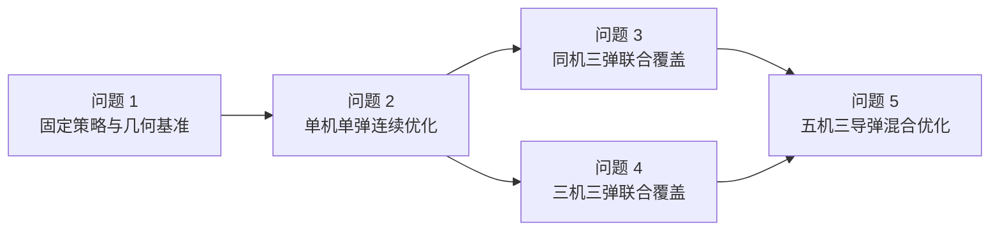

# 2025 A 题：烟幕干扰弹案例索引

> [!summary] 案例定位
> 这是一个把 **三维运动学、有限线段几何、连续时间覆盖、非光滑优化、资源分配与量词审计** 串成完整证据链的案例。完整计算事实以 [[06-Projects/2025国赛A题-烟幕干扰弹投放策略/Readme|项目主页]] 和代码输出为准。

## 建议阅读顺序

1. [[2025-A题-烟幕干扰弹-题目总览]]：理解对象、五问依赖和统一遮蔽定义。
2. [[2025-A题-烟幕干扰弹-本地论文复现]]：查看本地模型、结果、代码入口和验证证据。
3. [[2025-A题-烟幕干扰弹-A196优秀论文对照]]：学习优秀论文的优点，并审计本地结果的口径与差距。
4. [[06-Projects/2025国赛A题-烟幕干扰弹投放策略/建模复盘与经验总结|建模复盘与经验总结]]：查看本次返工的失败模式与可执行改进。

## 五问关系

| 子问题 | 数学核心 | 最重要的验证 |
|---|---|---|
| 问题 1 | 导弹、无人机、干扰弹、烟幕轨迹；球到有限视线段距离 | 中心点基线、完整圆柱加密、解析退出时刻 |
| 问题 2 | 航向、速度、投放、引信的连续优化 | 多种子预算审计、完整圆柱重排、坐标精化 |
| 问题 3 | 共享航迹、投放间隔、多烟幕联合覆盖 | $\forall P\exists k$ 量词反例、逐弹删除边际、已知可行解保护 |
| 问题 4 | 多平台独立决策、同一物理联合判据 | 逐机结果只作种子；联合复算与空间协同增益 |
| 问题 5 | 离散任务标签、固定航迹、连续时序、跨导弹聚合 | 同时报 $J_{sum}$、$J_{min}$、$J_{safe}$；约束与候选库下界 |

## 最值得迁移的四条原则

1. 先把自然语言写成量词，再实现距离和时间聚合。
2. 代理目标负责找非零区域，正式结论必须回到严格物理判据。
3. 随机优化的新结果若不如已验证可行解，应保留 incumbent 并记录退化。
4. 与优秀论文对照前先统一“目标—量词—约束—单位”，数值接近不是证明，口径不同也不能排名。

## 入口

- [[2025-A题-烟幕干扰弹-题目总览]]
- [[2025-A题-烟幕干扰弹-本地论文复现]]
- [[2025-A题-烟幕干扰弹-A196优秀论文对照]]
- [[06-Projects/2025国赛A题-烟幕干扰弹投放策略/Paper/参赛论文-赛后复现稿|论文源稿]]
- [[06-Projects/2025国赛A题-烟幕干扰弹投放策略/Code/Readme|代码与复现说明]]
- [[数学建模 Hub]] · [[优化模型 Hub]] · [[模型检验 Hub]] · [[可视化 Hub]] · [[论文写作 Hub]]

