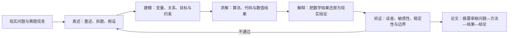

# 竞赛真题研究

国赛、美赛真题、优秀论文拆解与数据集。

## 真实赛题案例索引

- [[04-Research/04-竞赛真题研究/01-全国大学生数学建模竞赛/2025-A题-烟幕干扰弹/2025-A题-烟幕干扰弹-案例索引|2025 A 题：烟幕干扰弹]] — 三维运动学、有限视线几何、多烟幕联合覆盖、连续优化与多目标聚合审计。
- [[04-Research/04-竞赛真题研究/01-全国大学生数学建模竞赛/2024-A题-板凳龙/2024-A题-板凳龙-案例索引|2024 A 题：板凳龙]] — 曲线运动学、固定弦长链、刚体碰撞、临界参数搜索、分段路径与连续极值的综合案例。
- [[04-Research/04-竞赛真题研究/01-全国大学生数学建模竞赛/2023年赛题/2023年赛题资料索引|2023 年国赛题目资料索引]] — 对 Inbox 中 A–E 题原始资料建立可点击入口、大小与 SHA-256 清单；当前只做资料盘点，尚未形成题目拆解。

## 官方规则与国际竞赛入口

- [[04-Research/04-竞赛真题研究/05-官方规则与评阅/官方评阅资料索引|国赛官方评阅资料索引]] — 区分公开规则、评阅流程、当年格式与未公开的逐题细则。
- [[04-Research/04-竞赛真题研究/02-美国大学生数学建模竞赛/MCM-ICM官方资料入口|MCM/ICM 官方资料入口]] — COMAP 规则、历年题目、结果和 Outstanding Papers 的官方检索路径。
- [[04-Research/04-竞赛真题研究/02-美国大学生数学建模竞赛/2024年赛题/2024年赛题资料索引|2024 MCM/ICM 赛题资料索引]] — A–F 六题的官方题名、结果入口与待复现路线。

## 竞赛备战与组队策略

> [!summary] 一句话结论
> 数学建模竞赛不是“建模、编程、写作三个人各做各的”，而是三人共同完成 **理解问题 → 建立可解释模型 → 可靠求解 → 解释与检验 → 形成合规论文** 的闭环；赛前分工的目的，是提高并行效率，而不是制造知识孤岛。

### 来源与使用边界

- **课程来源**：`D:\BaiduNetdiskDownload\【零基础教程】数学建模算法 编程 写作和获奖指南全流程培训120课\002 1.2 数学建模各模块备战及组队策略.mp4`
- **视频时长**：29:25
- **整理日期**：2026-07-27
- **整理方法**：本地语音转写 + 幻灯片关键帧复核；未联网检索课程解说或第三方答案。
- **证据标记**：
  - “课程主张”表示讲师在视频中的观点，不等于竞赛官方规则。
  - “架构师修正”表示结合本知识库复习、复现和协作需求做出的改进建议。
  - 机器转写对个别人名、书名和口语存在误识别，因此本笔记保留可确认的策略，不记录无法可靠核对的专有名词。

### 视频结构与时间轴

| 时间 | 课程内容 | 复习时应抓住什么 |
|---|---|---|
| 00:00–02:47 | 模型假设、建立模型、是否需要自创算法 | 假设用于划定模型边界；先检索成熟方法，自创模型必须给出必要性和验证 |
| 02:47–04:59 | 从现实问题到数学解，再回到现实解释 | 建模闭环不是“跑出数值”，还包含解释和验证 |
| 04:59–07:10 | 竞赛论文的固定模块 | 题目、摘要、重述、假设、分析、符号、建模、求解、评价、参考文献 |
| 07:10–10:45 | 各模块如何备战；题目写法 | 标题只是入口；核心能力是把完整工作压缩成清晰叙事 |
| 10:45–15:56 | 摘要、假设、问题分析、符号、建模、求解、评价 | 每个模块都应提前形成模板、检查表和案例库 |
| 15:56–20:35 | 队友、分工、学习顺序、论文阅读、模拟训练 | 技能覆盖、稳定协作、定期复盘比“临时抱大腿”可靠 |
| 20:35–24:43 | 团队关系与人员组合 | 课程含明显性别刻板印象；应改写为能力、可靠性和沟通风格的组合 |
| 24:43–26:46 | 队长职责 | 队长负责组织、后勤、冲突决策、规则核验和赛后复盘 |
| 26:46–29:25 | 比赛中的协作方式 | 先共同选题和形成总方案，再并行；建模、代码、论文必须同步反馈 |

### 建模与论文的统一闭环



课程将全过程概括为“表述—求解—解释—验证”。对本知识库而言，应再补上两条约束：

1. **可追溯**：论文中的关键数字必须能追到代码输出、数据版本和参数。
2. **可复现**：另一位队员应能根据说明重新运行核心结果，不能只由原作者“在自己电脑上跑通”。

### 各模块的复习卡

| 模块   | 核心问题                 | 赛前应准备的资产                    | 常见失败                     |
| ---- | -------------------- | --------------------------- | ------------------------ |
| 模型假设 | 为了可解，忽略了什么；这些忽略何时会失效 | 假设分类表：环境稳定、数据可信、主体理性、边界不变等  | 写“方便计算”但不说明合理性；假设与后文模型无关 |
| 问题重述 | 我们究竟要解决哪些子问题         | 用自己的语言重写输入、任务、输出和限制         | 原样复制题目；没有体现任务之间的依赖       |
| 问题分析 | 每个子问题为什么用这个思路        | “任务—数据—模型—输出—验证”五联表、流程图     | 只报算法名；先定模型再硬套题目          |
| 符号说明 | 读者能否无歧义理解公式          | 统一变量名、上下标、单位、集合和维度规范        | 同符号多义；代码变量与论文变量完全脱节      |
| 模型建立 | 现实关系如何变成数学关系         | 每个算法的原理、适用条件、输入输出、关键公式和限制   | 公式堆砌；没有从假设推到目标与约束        |
| 模型求解 | 如何稳定得到结果             | 最小可运行代码、参数入口、环境说明、基准样例      | 只粘贴代码；硬编码；没有检查目标方向和单位    |
| 结果解释 | 数值对现实意味着什么           | 图表模板、对比基线、决策语言模板            | 只报数值；图表没有结论；夸大因果关系       |
| 模型检验 | 结果是否可信、在何处失效         | 误差、交叉验证、敏感性、稳健性、极端情形检查表     | 把“模型优缺点”当检验；只写优点不做实验     |
| 摘要   | 能否独立交代问题、方法、结果和价值    | 四句骨架：任务 → 方法 → 关键结果 → 检验/结论 | 只写背景；只列模型名；没有定量结果        |
| 参考文献 | 方法和数据能否追溯            | 统一引用格式、来源台账                 | 正文不引用；数据来源缺失；格式前后不一致     |

### 对课程关键主张的分析

#### 1. “竞赛论文流程相对固定”——基本正确，但不能机械套模板

**课程主张（00:27–00:46）**：不同赛题的论文流程比较固定。
**判断**：固定的是交付逻辑，不是算法组合。摘要、假设、分析、模型、结果和检验构成稳定骨架；题型不同，证据强度和章节比例必须变化。预测题应强化外推误差，优化题应强化约束、可行性和基线，机理题应强化守恒关系和参数依据。

#### 2. “优先使用成熟模型，谨慎自创算法”——适合作为默认策略

**课程主张（01:38–02:45）**：先查阅已有研究，成熟模型无法满足任务时再构造新方法。
**判断**：这能降低概念错误和时间风险，但引用成熟模型不等于照搬。至少要回答：

- 当前数据与模型适用条件是否一致？
- 为什么该模型优于一个简单基线？
- 做了哪些针对赛题的修改？
- 新增结构是否通过消融、对比或敏感性分析获得支持？

#### 3. “摘要影响第一印象”——正确；“摘要几乎决定奖项”——表述过强

**课程主张（05:00–05:50）**：评审非常重视摘要。
**判断**：摘要应视为论文的高密度索引，但奖项仍依赖全文的一致性、模型合理性、结果可信度和规范性。复习时可使用：

> 针对【任务】，基于【关键假设/数据】，建立【核心模型】；通过【求解与检验】得到【定量结果】；结果表明【结论及适用边界】。

最终摘要必须写入真实结果，不能在尚未求解时填入空泛结论。

#### 4. “每个模型都整理成算法库”——方向正确，知识资产必须以调用为中心

**课程主张（14:20–15:40）**：赛前整理模型资料、代码和优缺点，比赛时直接匹配。
**架构师修正**：每个模型最少保存六项，而不是只存一段代码：

1. 解决什么问题；
2. 适用条件与禁用条件；
3. 输入、输出和单位；
4. 核心步骤与关键公式；
5. 最小可运行实现及验证样例；
6. 常见错误、检验方式和论文表达。

这也是 [[数学建模 Hub]] 与各算法 Hub 的复习卡应持续维护的标准。

#### 5. “算法 → 编程 → 写作 → 排版”——适合入门排序，不适合完全串行

**课程主张（18:00–19:00）**：每天约两小时，按算法、编程、写作、排版顺序学习。
**架构师修正**：学习应采用短闭环：学一个算法，就完成一次实现、一次结果解释和一段论文表达。若等全部算法学完才练写作，比赛时会出现“会算但不会论证”。

推荐的两小时训练单元：

| 时长 | 任务 | 当天必须留下的成果 |
|---:|---|---|
| 25 分钟 | 阅读一篇优秀论文的摘要、问题分析和核心建模段 | 3 条可复用写法 + 1 条质疑 |
| 45 分钟 | 学习一个模型的原理和适用边界 | 一张算法复习卡 |
| 30 分钟 | 跑通或改写最小代码 | 可重跑输出 + 参数说明 |
| 20 分钟 | 写问题分析或结果解释 | 150–300 字可复用段落 |

### 组队：用能力覆盖替代性别组合

视频在 20:35–24:43 使用“两男一女 100 分”等说法，并把编程、建模、写作能力与性别绑定。这部分属于讲师个人经验和幽默化表达，存在明显刻板印象，**不应作为组队规则**。

可靠的队伍应按以下五个维度选择：

| 维度 | 验收问题 |
|---|---|
| 可靠性 | 能否按时交付；遇到困难是否提前报告 |
| 核心技能 | 建模、编程、写作是否至少各有一名主负责人 |
| 交叉能力 | 每个关键岗位是否有一名可接手的备份 |
| 沟通方式 | 能否用文档、图和最小样例解释自己的工作 |
| 压力协作 | 分歧时能否比较证据和风险，而不是争夺话语权 |

推荐采用“T 型分工”：

- **建模主责**：拆题、假设、模型结构和检验设计；备份写作。
- **编程主责**：数据、算法实现、实验和图表；备份建模。
- **论文主责**：论证结构、摘要、排版和规范；备份数据与结果解释。
- **三人共同负责**：选题、总方案、关键假设、最终结论和提交检查。

### 队长职责：不是“最强的人”，而是闭环负责人

根据 24:43–26:46 的课程内容并补全为可执行职责：

#### 赛前

- 制定训练节奏，组织论文拆解、算法讲解和模拟赛。
- 确认场地、网络、供电、休息、餐饮和备用设备。
- 建立共享目录、文件命名、Git 分支/提交和结果交接规则。
- 确认每个核心岗位均有备份，避免单点故障。

#### 赛中

- 主持选题和阶段决策；分歧时记录候选方案、证据、代价和截止时间。
- 维护任务板和论文主线，确保代码结果及时反馈到论文。
- 在阶段检查点核对模型假设、数据、结果和叙事是否一致。
- 在提交前冻结版本，逐项核对竞赛规则、文件名、格式、匿名要求和附件。

#### 赛后

- 整理代码、数据、图表、论文和运行说明，保留最终可复现版本。
- 复盘做对了什么、哪里返工、哪些决策缺证据、下次如何改进。
- 将长期有价值的模型卡、工作流和教训更新到知识库，而不是保存聊天记录。

### 比赛中的协作顺序

> [!important] 核心原则
> 先共同形成一套能覆盖主要子问题的总方案，再并行推进。不要刚看到第一问就让编程手开写，也不要等所有结果完成后才开始论文。

#### 阶段 1：共同读题与选题

1. 三人分别标注任务、数据、约束、输出和不确定点。
2. 对每道候选题按“理解程度、数据可得性、模型储备、实现风险、写作空间”评分。
3. 为前两名候选题各写一页粗方案，至少覆盖大多数子问题。
4. 到预设截止时间做选择，记录放弃另一题的原因。

#### 阶段 2：建立共同骨架

- 画出子问题依赖图和数据流。
- 确定统一符号、变量单位、文件接口和核心假设。
- 为每个子问题定义交付物：公式、代码输出、图表、检验、论文段落。
- 三人互相复述方案；任何一人说不清主线，说明还不应完全分工。

#### 阶段 3：并行但持续同步

- 建模主责输出公式、伪代码、适用条件和检验要求。
- 编程主责以小样例先验证，再跑完整数据；输出结构化结果表和图。
- 论文主责同步撰写重述、假设、分析和方法框架，不等待最终结果。
- 每 2–4 小时进行短同步：输入是否变化、结果能否解释、论文是否与代码一致、下一风险是什么。

#### 阶段 4：验证与提交

- 用简单基线、极端情形、敏感性或重复运行检查核心结论。
- 随机抽取论文中的关键数字，反向追到具体代码输出。
- 由非原作者交叉运行核心代码。
- 提交前只修正高风险问题，不在最后时段更换整套模型。

### 赛前训练闭环

#### 每周

- 精读至少一篇优秀论文，重点拆解摘要、问题分析、建模链路和检验。
- 完成一个模型的“复习卡 + 最小代码 + 论文表达”。
- 三人互讲一次；听者必须能复述输入、步骤、输出和限制。

#### 每两周

- 做一次固定时长的小题训练。
- 交换岗位，让备份角色真正动手。
- 检查知识库中的模型卡能否在 10 分钟内被找到和调用。

#### 每月

- 完成一次全流程模拟赛。
- 邀请老师或其他队伍只看摘要、问题分析、核心结果和检验，记录他们无法理解之处。
- 复盘返工原因：选题、数据、模型、代码、图表、写作、排版还是协作。

### 复习用极简卡

> [!tip] 五句话记住本课
> 1. 假设决定模型的适用边界，不能只为方便计算。
> 2. 问题分析先拆任务，再匹配模型，不要只罗列算法名。
> 3. 代码跑出结果后，必须解释、检验并能追溯。
> 4. 分工是主责加备份，选题、主线和最终结论由三人共同负责。
> 5. 赛前最有效的资产不是代码数量，而是可调用、可验证、能写进论文的模型闭环。

## AI Agent 驱动的数学建模竞赛全流程

> [!summary] 核心定位
> AI Agent 不是替队伍“一键生成答案”的黑箱，而是项目经理、研究助理、程序员、审稿人和知识库管理员。人类队伍必须掌握题意、关键假设、模型选择、结果真实性和最终提交；Agent 负责加快检索、结构化、编码、实验、检查和文档同步。

### 0. 先确认合规边界

在任何赛题材料交给 Agent 前，先阅读当届比赛的官方规则，确认是否允许生成式 AI、允许到什么程度、是否需要声明，以及赛题和数据能否上传到外部服务。不同比赛、不同年份的要求可能不同。

- 官方规则禁止的操作不得通过 Agent 完成。
- 未明确允许上传的题目、数据和论文，优先使用本地 Agent 与本地文件。
- Agent 生成的文字、公式、代码和引用必须由队员核查，不能把“AI 说过”当证据。
- 不得让 Agent 伪造数据、运行结果、参考文献、显著性或模型精度。
- 最终署名、原创性、学术规范和提交责任始终属于参赛队伍。

### 1. 建立唯一项目现场

每道正式赛题只建立一个项目目录，聊天窗口不是项目状态源。建议使用：

```text
06-Projects/<年份-赛事-题号-短标题>/
├─ Project-Status.md   # 唯一任务与决策状态
├─ Readme.md           # 题目、目标、主线和复现入口
├─ Data/               # 原始数据只读；字段、清洗和派生数据有说明
├─ Code/               # 源码、环境、参数和运行入口
└─ Paper/              # 论文正文、图表和最终提交文件
```

Agent 每次开始工作前必须读取 `Project-Status.md`，结束时更新：

- 当前状态；
- 已完成事项及对应文件；
- 待办事项；
- 下一步唯一动作；
- 风险与阻塞；
- 已确认决策及理由。

这样即使换用 Codex、Claude Code 或 Cursor，也能从文件继续，而不是依赖上一段聊天记录。

### 2. 人类与 Agent 的职责划分

| 工作 | 人类队伍负责 | AI Agent 可以负责 | 必须由人确认的关口 |
|---|---|---|---|
| 规则 | 阅读官方要求、决定可用范围 | 提取提交格式、截止时间和检查清单 | AI 使用是否合规 |
| 选题 | 判断理解程度、团队能力和风险偏好 | 对候选题拆解、列模型储备和实现风险 | 最终选哪一题 |
| 假设 | 判断现实合理性与比赛语境 | 检查假设是否完整、相互冲突或不可检验 | 哪些假设进入论文 |
| 模型 | 决定主模型与论文叙事 | 生成候选模型、公式草案、基线和检验方案 | 模型为何适用于本题 |
| 数据 | 决定异常值和缺失值的业务含义 | 字段审计、统计摘要、清洗代码和可视化 | 清洗规则是否改变题意 |
| 代码 | 理解算法输入输出和结果含义 | 搭建代码、测试、重构、记录环境和参数 | 核心结果是否真实可复现 |
| 检验 | 判断结果是否支持结论 | 误差、敏感性、稳健性、极端情形和对照实验 | 是否足以形成结论 |
| 论文 | 设计主线并对全部结论负责 | 结构检查、初稿、公式排版、图表说明和一致性审计 | 每个数字、引用和结论 |
| 提交 | 执行最终提交并承担责任 | 文件名、匿名、引用、附件和版本检查 | 最终文件与平台回执 |

### 3. 阶段门驱动的完整流程

不要按照“让 Agent 先写一篇完整论文，再补代码”的顺序工作。每个阶段必须通过验收门，才能进入下一阶段。

| 阶段 | Agent 的主要动作 | 阶段产物 | 通过条件 |
|---|---|---|---|
| A. 初始化 | 创建标准项目骨架，登记规则、题目、数据和截止时间 | `Project-Status.md`、项目 `Readme.md` | 输入完整，AI 使用边界明确 |
| B. 读题拆题 | 提取任务、输入、输出、约束、评价指标和子问题依赖 | 任务—数据—模型—输出—验证矩阵 | 三名队员能用自己的话复述任务 |
| C. 选题与风险评估 | 为候选题列基线、模型储备、数据风险、实现难度和论文空间 | 候选题评分表、两套一页方案 | 主方案覆盖大部分子问题，有退路 |
| D. 数据审计 | 读取字段、单位、缺失、异常、分布、时间与空间结构 | 数据字典、质量报告、EDA 图表 | 数据问题有处理规则且保留原始数据 |
| E. 模型设计 | 建立变量、集合、参数、目标、约束、假设和候选模型 | 数学模型草案、基线、检验计划 | 每个公式能对应题意，每个假设能解释 |
| F. 最小实现 | 先用小数据、合成数据或简单样例跑通主链路 | 最小可运行代码、测试结果 | 输入输出正确，方向、单位和边界正确 |
| G. 正式实验 | 跑完整数据、保存参数、日志、随机种子、表格和图 | 可复现实验结果 | 非代码作者能重跑核心结果 |
| H. 验证改进 | 比较基线，做误差、残差、敏感性、稳健性或消融 | 检验图表、模型边界和改进依据 | 核心结论不依赖单一偶然参数 |
| I. 论文同步 | 按真实证据撰写问题分析、模型、结果和评价 | 可审阅论文版本 | 论文、代码、数据和图表一致 |
| J. 独立审稿 | 让独立 Agent 以评委视角找逻辑断点、缺证据和不可复现项 | 问题清单，按严重度排序 | 高风险问题关闭或明确披露 |
| K. 提交冻结 | 冻结代码和论文，检查格式、匿名、引用、附件与回执 | 最终提交包、版本标识 | 留出上传缓冲并获得提交回执 |
| L. 赛后复盘 | 整理可复现版本，提炼模型卡、教训和工作流 | 项目复盘、知识库更新 | 可复用内容进入 Research，原项目保留证据 |

### 4. Agent 的五种工作模式

同一个 Agent 不应在一次任务中同时“提出方案、实现方案并证明自己正确”。将角色分开，能减少自我确认偏差。

1. **总控 Agent**
   - 读取项目状态，拆分当前阶段任务；
   - 维护依赖、截止时间、风险和文件入口；
   - 不直接宣布模型正确，只汇总证据和待确认项。

2. **建模 Agent**
   - 输出变量、假设、目标、约束、候选模型和基线；
   - 说明为什么适用、何时失效、需要什么数据；
   - 不在缺少数据时虚构参数和数值结果。

3. **数据与代码 Agent**
   - 生成数据审计、可运行代码、测试、日志和图表；
   - 保留参数、环境、随机种子和输出路径；
   - 先通过小样例，再运行完整实验。

4. **论文 Agent**
   - 只根据已经确认的公式、结果和图表写作；
   - 维护“问题—方法—结果—检验—结论”主线；
   - 不补写不存在的实验或文献。

5. **审稿 Agent**
   - 不参与原方案生成，专门寻找错误；
   - 检查题意遗漏、量纲、公式、约束、数据泄漏、过拟合、引用、图表和复现；
   - 输出按“致命、重要、一般”排序的问题，而不是笼统评价。

### 5. 给 Agent 的标准任务卡

每次只交付一个边界明确、能验收的任务。可直接使用以下格式：

```markdown
## 任务
【一句话说明本轮要完成什么】

## 当前阶段
【读题 / 数据 / 建模 / 编码 / 检验 / 论文 / 审稿】

## 必读输入
- Project-Status.md
- 【题目或数据文件】
- 【已有模型、代码或论文段落】

## 允许修改
- 【明确到目录或文件】

## 禁止操作
- 不修改原始数据
- 不虚构来源和运行结果
- 不提交、不推送、不上传
- 不改动任务范围外文件

## 交付物
- 【文件、表格、代码、图或审稿清单】

## 验收标准
- 【可运行、数值一致、链接可追溯、通过测试等】

## 结束时
- 更新 Project-Status.md
- 报告修改文件、验证结果、风险和下一步
```

比起“帮我做完这道题”，任务卡能显著降低 Agent 跑偏、覆盖文件和凭空给结论的风险。

### 6. 每个阶段怎样调用 Agent

#### 读题阶段

让 Agent 建立一张矩阵，而不是直接推荐模型：

| 子问题 | 已知输入 | 需要输出 | 隐含约束 | 可用指标 | 与后续问题关系 |
|---|---|---|---|---|---|

然后要求 Agent 给出：

- 至少两种可能解释；
- 需要向题目或数据核对的歧义；
- 最简单基线；
- 最可能导致全题返工的三个风险。

#### 数据阶段

让 Agent 依次完成：

1. 数据字典与单位；
2. 行列数、唯一值、缺失、重复和异常；
3. 分布、相关性、时间或空间结构；
4. 数据泄漏、样本不均衡和测量偏差检查；
5. 可逆的清洗脚本；
6. 清洗前后对照和影响说明。

原始文件不修改，派生数据必须能由脚本重新生成。

#### 建模阶段

让 Agent 为每个候选模型回答：

- 它解决哪个子问题？
- 输入、输出、变量和单位是什么？
- 核心假设是否由数据支持？
- 最小基线是什么？
- 为什么不选更简单的方法？
- 用什么指标和实验判断它有效？
- 如果失败，退回哪个备选方案？

模型名称本身不是方案；完整方案必须包括公式、求解、验证和论文表达。

#### 编码阶段

推荐顺序：

1. 建立最小接口；
2. 用手算样例或合成数据验证；
3. 写断言检查维度、范围、约束和单位；
4. 跑小规模真实数据；
5. 保存参数、环境和随机种子；
6. 跑完整实验；
7. 自动输出论文所需表格和图；
8. 由另一名队员或另一 Agent 复跑。

所有图表应由代码生成，避免手工修改导致论文数字无法追溯。

#### 检验阶段

根据题型至少选择一组：

- 预测：训练/验证划分、滚动预测、残差、基线和外推风险；
- 评价：权重敏感性、排序稳定性、指标相关性和替代权重；
- 优化：可行性、上下界、基线、约束敏感性和多随机种子；
- 机理模型：参数识别、守恒、初值敏感性和极端情形；
- 仿真：预热期、重复次数、置信区间、随机种子和收敛；
- 聚类/分类：稳定性、类别不均衡、混淆矩阵和解释性。

Agent 必须输出“不支持哪些结论”，防止只呈现有利结果。

#### 写作阶段

推荐让 Agent 按证据包写作：

```text
题目任务
→ 对应假设
→ 数学模型与符号
→ 代码/实验编号
→ 表格或图编号
→ 定量结果
→ 检验
→ 结论与边界
```

摘要最后写，但可先保留骨架。最终摘要至少包含：

- 每个子问题使用的核心方法；
- 最重要的定量结果；
- 至少一项可靠性证据；
- 现实结论或方案意义。

#### 审稿阶段

把最终论文和项目文件交给独立审稿 Agent，要求逐项核对：

- 是否回答所有子问题；
- 摘要中的数字能否在正文找到；
- 正文数字能否追到代码输出；
- 符号是否一义、单位是否一致；
- 公式与实现是否一致；
- 图表是否有标题、轴、单位、图例和来源；
- 引用是否真实且正文引用；
- 优缺点是否有实验支持；
- 是否存在数据泄漏、过拟合、不可行解或夸大结论；
- 是否符合匿名、页数、文件名和附件要求。

### 7. 72 小时竞赛参考节奏

以下是通用参考，不代表任何比赛的官方时长。若实际赛制不同，按总时长同比例压缩。

| 时间 | 目标 | 禁止拖延到后面的事项 |
|---|---|---|
| 0–4 h | 读题、规则、候选题评分和初步方案 | 题意歧义、提交规则 |
| 4–10 h | 定题、数据审计、主线、基线和分工 | 数据字段、单位、子问题依赖 |
| 10–24 h | 最小模型与最小代码跑通 | 可行性、输入输出、简单基线 |
| 24–40 h | 正式实验、候选改进和核心图表 | 关键结果保存、参数记录 |
| 40–52 h | 检验、敏感性、稳健性和模型边界 | 结论可信度 |
| 52–62 h | 完整论文、摘要和图表统一 | 论文主线、关键定量结果 |
| 62–68 h | 独立复跑、审稿和高风险修复 | 公式—代码—结果一致性 |
| 68–70 h | 冻结版本、排版、匿名、引用和附件检查 | 不再更换主模型 |
| 70–72 h | 上传、回执确认和故障缓冲 | 不把首次上传留到最后 |

每 3–4 小时由总控 Agent 输出一次简短状态：

```text
已完成：
当前证据：
最大风险：
下一步唯一动作：
负责人：
预计完成时间：
```

### 8. 提交前的四层审计

1. **问题层**：所有问题均有明确答案，没有只建立模型却不回答任务。
2. **数学层**：假设、变量、单位、公式、目标和约束前后一致。
3. **证据层**：关键数字可追到数据、代码、参数和输出；检验支持结论。
4. **交付层**：格式、匿名、页数、文件名、引用、附件、上传和回执符合规则。

任何一层存在致命问题，都应先修复该问题，而不是继续美化排版。

### 9. 赛后如何沉淀到本知识库

项目结束后按照价值分流：

- 赛题原文、原始数据、完整代码和论文留在 `06-Projects/<项目>`；
- 通用模型原理和经过验证的最小实现补入对应模型 Hub；
- 可复用的数据、检验、绘图和论文方法补入对应 Research Hub；
- 关键决策写入项目状态，不保存聊天记录；
- 可跨项目复用的经验写入 `97-AI-Memory/Best Practices.md`；
- 失败原因和预防方法写入 `97-AI-Memory/Lessons Learned.md`；
- 完整、稳定的流程写入 `97-AI-Memory/Workflows.md`。

最终目标不是留下最多文件，而是下次遇到类似问题时，能迅速找到：**适用条件、最小代码、检验方式、论文表达和真实案例**。

### 与知识库的连接

- 模型选择与调用：[[数学建模 Hub]]
- 论文模块与论证：[[论文写作 Hub]]
- 结果可信度：[[模型检验 Hub]]
- 编程实现：[[Python Hub]]、[[MATLAB Hub]]
- 真实论文对照：[[2021-C题-本地解答与四篇国奖论文对照复盘]]

返回 [[04-Research/Readme|Research Index]]，跨主题浏览 [[Topic Index]]。
