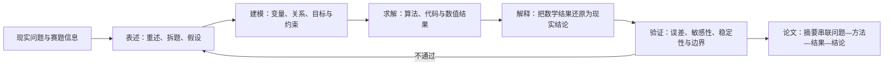

# 竞赛真题研究

国赛、美赛真题、优秀论文拆解与数据集。

## 竞赛备战与组队策略

> [!summary] 一句话结论
> 数学建模竞赛不是“建模、编程、写作三个人各做各的”，而是三人共同完成 **理解问题 → 建立可解释模型 → 可靠求解 → 解释与检验 → 形成合规论文** 的闭环；赛前分工的目的，是提高并行效率，而不是制造知识孤岛。

### 来源与使用边界

- **课程来源**：`D:\BaiduNetdiskDownload\【零基础教程】数学建模算法 编程 写作和获奖指南全流程培训120课\002 1.2 数学建模各模块备战及组队策略.mp4`
- **视频时长**：29:25
- **整理日期**：2026-07-27
- **整理方法**：本地语音转写 + 幻灯片关键帧复核；未联网检索课程解说或第三方答案。
- **证据标记**：
  - “课程主张”表示讲师在视频中的观点，不等于竞赛官方规则。
  - “架构师修正”表示结合本知识库复习、复现和协作需求做出的改进建议。
  - 机器转写对个别人名、书名和口语存在误识别，因此本笔记保留可确认的策略，不记录无法可靠核对的专有名词。

### 视频结构与时间轴

| 时间 | 课程内容 | 复习时应抓住什么 |
|---|---|---|
| 00:00–02:47 | 模型假设、建立模型、是否需要自创算法 | 假设用于划定模型边界；先检索成熟方法，自创模型必须给出必要性和验证 |
| 02:47–04:59 | 从现实问题到数学解，再回到现实解释 | 建模闭环不是“跑出数值”，还包含解释和验证 |
| 04:59–07:10 | 竞赛论文的固定模块 | 题目、摘要、重述、假设、分析、符号、建模、求解、评价、参考文献 |
| 07:10–10:45 | 各模块如何备战；题目写法 | 标题只是入口；核心能力是把完整工作压缩成清晰叙事 |
| 10:45–15:56 | 摘要、假设、问题分析、符号、建模、求解、评价 | 每个模块都应提前形成模板、检查表和案例库 |
| 15:56–20:35 | 队友、分工、学习顺序、论文阅读、模拟训练 | 技能覆盖、稳定协作、定期复盘比“临时抱大腿”可靠 |
| 20:35–24:43 | 团队关系与人员组合 | 课程含明显性别刻板印象；应改写为能力、可靠性和沟通风格的组合 |
| 24:43–26:46 | 队长职责 | 队长负责组织、后勤、冲突决策、规则核验和赛后复盘 |
| 26:46–29:25 | 比赛中的协作方式 | 先共同选题和形成总方案，再并行；建模、代码、论文必须同步反馈 |

### 建模与论文的统一闭环

课程将全过程概括为“表述—求解—解释—验证”。对本知识库而言，应再补上两条约束：

1. **可追溯**：论文中的关键数字必须能追到代码输出、数据版本和参数。
2. **可复现**：另一位队员应能根据说明重新运行核心结果，不能只由原作者“在自己电脑上跑通”。

### 各模块的复习卡

| 模块   | 核心问题                 | 赛前应准备的资产                    | 常见失败                     |
| ---- | -------------------- | --------------------------- | ------------------------ |
| 模型假设 | 为了可解，忽略了什么；这些忽略何时会失效 | 假设分类表：环境稳定、数据可信、主体理性、边界不变等  | 写“方便计算”但不说明合理性；假设与后文模型无关 |
| 问题重述 | 我们究竟要解决哪些子问题         | 用自己的语言重写输入、任务、输出和限制         | 原样复制题目；没有体现任务之间的依赖       |
| 问题分析 | 每个子问题为什么用这个思路        | “任务—数据—模型—输出—验证”五联表、流程图     | 只报算法名；先定模型再硬套题目          |
| 符号说明 | 读者能否无歧义理解公式          | 统一变量名、上下标、单位、集合和维度规范        | 同符号多义；代码变量与论文变量完全脱节      |
| 模型建立 | 现实关系如何变成数学关系         | 每个算法的原理、适用条件、输入输出、关键公式和限制   | 公式堆砌；没有从假设推到目标与约束        |
| 模型求解 | 如何稳定得到结果             | 最小可运行代码、参数入口、环境说明、基准样例      | 只粘贴代码；硬编码；没有检查目标方向和单位    |
| 结果解释 | 数值对现实意味着什么           | 图表模板、对比基线、决策语言模板            | 只报数值；图表没有结论；夸大因果关系       |
| 模型检验 | 结果是否可信、在何处失效         | 误差、交叉验证、敏感性、稳健性、极端情形检查表     | 把“模型优缺点”当检验；只写优点不做实验     |
| 摘要   | 能否独立交代问题、方法、结果和价值    | 四句骨架：任务 → 方法 → 关键结果 → 检验/结论 | 只写背景；只列模型名；没有定量结果        |
| 参考文献 | 方法和数据能否追溯            | 统一引用格式、来源台账                 | 正文不引用；数据来源缺失；格式前后不一致     |

### 对课程关键主张的分析

#### 1. “竞赛论文流程相对固定”——基本正确，但不能机械套模板

**课程主张（00:27–00:46）**：不同赛题的论文流程比较固定。
**判断**：固定的是交付逻辑，不是算法组合。摘要、假设、分析、模型、结果和检验构成稳定骨架；题型不同，证据强度和章节比例必须变化。预测题应强化外推误差，优化题应强化约束、可行性和基线，机理题应强化守恒关系和参数依据。

#### 2. “优先使用成熟模型，谨慎自创算法”——适合作为默认策略

**课程主张（01:38–02:45）**：先查阅已有研究，成熟模型无法满足任务时再构造新方法。
**判断**：这能降低概念错误和时间风险，但引用成熟模型不等于照搬。至少要回答：

- 当前数据与模型适用条件是否一致？
- 为什么该模型优于一个简单基线？
- 做了哪些针对赛题的修改？
- 新增结构是否通过消融、对比或敏感性分析获得支持？

#### 3. “摘要影响第一印象”——正确；“摘要几乎决定奖项”——表述过强

**课程主张（05:00–05:50）**：评审非常重视摘要。
**判断**：摘要应视为论文的高密度索引，但奖项仍依赖全文的一致性、模型合理性、结果可信度和规范性。复习时可使用：

> 针对【任务】，基于【关键假设/数据】，建立【核心模型】；通过【求解与检验】得到【定量结果】；结果表明【结论及适用边界】。

最终摘要必须写入真实结果，不能在尚未求解时填入空泛结论。

#### 4. “每个模型都整理成算法库”——方向正确，知识资产必须以调用为中心

**课程主张（14:20–15:40）**：赛前整理模型资料、代码和优缺点，比赛时直接匹配。
**架构师修正**：每个模型最少保存六项，而不是只存一段代码：

1. 解决什么问题；
2. 适用条件与禁用条件；
3. 输入、输出和单位；
4. 核心步骤与关键公式；
5. 最小可运行实现及验证样例；
6. 常见错误、检验方式和论文表达。

这也是 [[数学建模 Hub]] 与各算法 Hub 的复习卡应持续维护的标准。

#### 5. “算法 → 编程 → 写作 → 排版”——适合入门排序，不适合完全串行

**课程主张（18:00–19:00）**：每天约两小时，按算法、编程、写作、排版顺序学习。
**架构师修正**：学习应采用短闭环：学一个算法，就完成一次实现、一次结果解释和一段论文表达。若等全部算法学完才练写作，比赛时会出现“会算但不会论证”。

推荐的两小时训练单元：

| 时长 | 任务 | 当天必须留下的成果 |
|---:|---|---|
| 25 分钟 | 阅读一篇优秀论文的摘要、问题分析和核心建模段 | 3 条可复用写法 + 1 条质疑 |
| 45 分钟 | 学习一个模型的原理和适用边界 | 一张算法复习卡 |
| 30 分钟 | 跑通或改写最小代码 | 可重跑输出 + 参数说明 |
| 20 分钟 | 写问题分析或结果解释 | 150–300 字可复用段落 |

### 组队：用能力覆盖替代性别组合

视频在 20:35–24:43 使用“两男一女 100 分”等说法，并把编程、建模、写作能力与性别绑定。这部分属于讲师个人经验和幽默化表达，存在明显刻板印象，**不应作为组队规则**。

可靠的队伍应按以下五个维度选择：

| 维度 | 验收问题 |
|---|---|
| 可靠性 | 能否按时交付；遇到困难是否提前报告 |
| 核心技能 | 建模、编程、写作是否至少各有一名主负责人 |
| 交叉能力 | 每个关键岗位是否有一名可接手的备份 |
| 沟通方式 | 能否用文档、图和最小样例解释自己的工作 |
| 压力协作 | 分歧时能否比较证据和风险，而不是争夺话语权 |

推荐采用“T 型分工”：

- **建模主责**：拆题、假设、模型结构和检验设计；备份写作。
- **编程主责**：数据、算法实现、实验和图表；备份建模。
- **论文主责**：论证结构、摘要、排版和规范；备份数据与结果解释。
- **三人共同负责**：选题、总方案、关键假设、最终结论和提交检查。

### 队长职责：不是“最强的人”，而是闭环负责人

根据 24:43–26:46 的课程内容并补全为可执行职责：

#### 赛前

- 制定训练节奏，组织论文拆解、算法讲解和模拟赛。
- 确认场地、网络、供电、休息、餐饮和备用设备。
- 建立共享目录、文件命名、Git 分支/提交和结果交接规则。
- 确认每个核心岗位均有备份，避免单点故障。

#### 赛中

- 主持选题和阶段决策；分歧时记录候选方案、证据、代价和截止时间。
- 维护任务板和论文主线，确保代码结果及时反馈到论文。
- 在阶段检查点核对模型假设、数据、结果和叙事是否一致。
- 在提交前冻结版本，逐项核对竞赛规则、文件名、格式、匿名要求和附件。

#### 赛后

- 整理代码、数据、图表、论文和运行说明，保留最终可复现版本。
- 复盘做对了什么、哪里返工、哪些决策缺证据、下次如何改进。
- 将长期有价值的模型卡、工作流和教训更新到知识库，而不是保存聊天记录。

### 比赛中的协作顺序

> [!important] 核心原则
> 先共同形成一套能覆盖主要子问题的总方案，再并行推进。不要刚看到第一问就让编程手开写，也不要等所有结果完成后才开始论文。

#### 阶段 1：共同读题与选题

1. 三人分别标注任务、数据、约束、输出和不确定点。
2. 对每道候选题按“理解程度、数据可得性、模型储备、实现风险、写作空间”评分。
3. 为前两名候选题各写一页粗方案，至少覆盖大多数子问题。
4. 到预设截止时间做选择，记录放弃另一题的原因。

#### 阶段 2：建立共同骨架

- 画出子问题依赖图和数据流。
- 确定统一符号、变量单位、文件接口和核心假设。
- 为每个子问题定义交付物：公式、代码输出、图表、检验、论文段落。
- 三人互相复述方案；任何一人说不清主线，说明还不应完全分工。

#### 阶段 3：并行但持续同步

- 建模主责输出公式、伪代码、适用条件和检验要求。
- 编程主责以小样例先验证，再跑完整数据；输出结构化结果表和图。
- 论文主责同步撰写重述、假设、分析和方法框架，不等待最终结果。
- 每 2–4 小时进行短同步：输入是否变化、结果能否解释、论文是否与代码一致、下一风险是什么。

#### 阶段 4：验证与提交

- 用简单基线、极端情形、敏感性或重复运行检查核心结论。
- 随机抽取论文中的关键数字，反向追到具体代码输出。
- 由非原作者交叉运行核心代码。
- 提交前只修正高风险问题，不在最后时段更换整套模型。

### 赛前训练闭环

#### 每周

- 精读至少一篇优秀论文，重点拆解摘要、问题分析、建模链路和检验。
- 完成一个模型的“复习卡 + 最小代码 + 论文表达”。
- 三人互讲一次；听者必须能复述输入、步骤、输出和限制。

#### 每两周

- 做一次固定时长的小题训练。
- 交换岗位，让备份角色真正动手。
- 检查知识库中的模型卡能否在 10 分钟内被找到和调用。

#### 每月

- 完成一次全流程模拟赛。
- 邀请老师或其他队伍只看摘要、问题分析、核心结果和检验，记录他们无法理解之处。
- 复盘返工原因：选题、数据、模型、代码、图表、写作、排版还是协作。

### 复习用极简卡

> [!tip] 五句话记住本课
> 1. 假设决定模型的适用边界，不能只为方便计算。
> 2. 问题分析先拆任务，再匹配模型，不要只罗列算法名。
> 3. 代码跑出结果后，必须解释、检验并能追溯。
> 4. 分工是主责加备份，选题、主线和最终结论由三人共同负责。
> 5. 赛前最有效的资产不是代码数量，而是可调用、可验证、能写进论文的模型闭环。

### 与知识库的连接

- 模型选择与调用：[[数学建模 Hub]]
- 论文模块与论证：[[论文写作 Hub]]
- 结果可信度：[[模型检验 Hub]]
- 编程实现：[[Python Hub]]、[[MATLAB Hub]]
- 真实论文对照：[[2021-C题-本地解答与四篇国奖论文对照复盘]]

返回 [[04-Research/Readme|Research Index]]，跨主题浏览 [[Topic Index]]。
