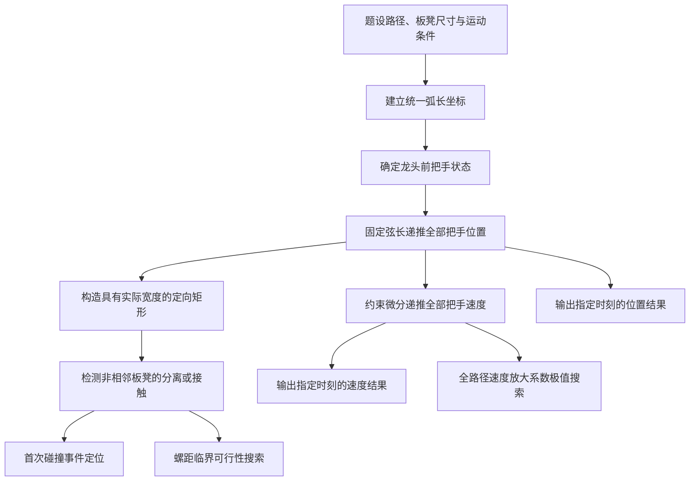

# 基于弧长参数化与刚性链约束的板凳龙盘入、碰撞及调头优化

> [!success] 写作状态
> 易读增强版正文、12 张图及逐图解释、参考文献、复现附录和完整代码附录均已完成。最终 Word、PDF 与支撑材料 ZIP 位于 `Paper/Final`；本 Markdown 继续作为正文与代码附录的可维护源文件。

## 摘要

针对板凳龙沿等距螺线盘入、有限空间调头及全队限速问题，本文建立以弧长参数化为路径层、以固定弦长递推为结构层的统一平面刚体运动学模型。该框架先由龙头的弧长位置确定其坐标，再沿链方向选择固定距离方程的最近有效根，递推全部 $224$ 个把手的位置；对定长约束求导后得到速度递推关系，并以具有实际长宽的定向矩形描述板凳实体。

对于问题一，采用阿基米德螺线弧长反演和链式约束递推，完成 $0$ 至 $300\ \mathrm{s}$、共 $301\times224$ 个把手状态的计算，全链最大弦长误差为 $6.763\times10^{-13}\ \mathrm{m}$。对于问题二，先恢复具有真实长宽的板凳矩形，再连续定位分离裕量首次变为零的时刻，得到龙头板凳与第 $8$ 节龙身板凳在 $412.473838\ \mathrm{s}$ 首次接触。对于问题三，在完整盘入路径上而非只在终点检查碰撞，求得临界螺距 $0.450337393\ \mathrm{m}$；考虑六位小数下的严格可行性，建议报告 $0.450338\ \mathrm{m}$。

对于问题四，在固定调头空间边界切点的条件下，构造盘入螺线—双圆弧—中心对称盘出螺线的统一弧长路径，得到两段圆弧半径分别为 $3.005418\ \mathrm{m}$ 和 $1.502709\ \mathrm{m}$，总弧长为 $13.621245\ \mathrm{m}$；并证明在端点、端切向和两圆外切条件不变时，仅重新分配两圆半径不能缩短该路径。对于问题五，在完整路径上搜索全队速度放大系数，得到 $K_{\max}=1.604793$，从而确定安全的龙头恒定速度为 $1.246266\ \mathrm{m/s}$。

最后，通过符号推导、中心差分、约束残差、临界值双侧扰动、全域与尾部扫描以及 $35$ 项自动测试交叉验证模型。结果表明，该方法能够在统一框架下处理长刚性链的构型递推、实体碰撞、路径拼接和连续限速，并明确给出数值结论的适用边界。

**关键词：** 阿基米德螺线；刚性链递推；碰撞检测；调头路径；连续极值

## 1 问题重述

### 1.1 问题背景

板凳龙由多节具有确定长度和宽度的板凳首尾连接而成，各节板凳通过把手孔形成一条长链。表演过程中，龙头沿给定路径运动，并通过把手间的几何约束带动后续各节板凳。盘入阶段中，龙头沿等距螺线向中心运动；随着盘入程度加深，内外层板凳之间的距离不断缩小，可能发生实体接触。为使板凳龙能够在有限空间内完成盘入、调头和盘出，还需设计连续光滑的调头路径，并控制各把手的运动速度。

本题需要在统一的平面几何与运动学框架下，依次解决全队位置和速度计算、首次碰撞定位、最小可行螺距确定、调头路径构造以及龙头最大允许速度五类问题。除给出数值答案外，还需按指定格式输出各时刻、各把手的坐标和速度。

![[Paper/Figures/problem_geometry_overview.png]]

**图 1　板凳实体、把手链与五个问题的几何关系**

图 1 给出了阅读全文所需的三个基本对象。板凳的实际长度大于两把手孔距，且具有 $0.30\ \mathrm{m}$ 宽度，因此“把手位置正确”不等于“板凳不会碰撞”；$224$ 个把手按连接次序决定 $223$ 节板凳，计算必须从龙头逐点传向龙尾；五问则依次在同一条运动链上增加位置速度、实体碰撞、螺距设计、调头路径和全队限速要求。后文所有公式都围绕这三层关系展开。

### 1.2 问题一：螺线盘入过程中的位置与速度

当螺距为 $0.55\ \mathrm{m}$、龙头前把手以 $1\ \mathrm{m/s}$ 的恒定速度沿盘入螺线运动时，建立龙头运动时间与螺线位置之间的关系，并依据相邻把手的固定距离递推整条板凳龙。计算 $0$ 至 $300\ \mathrm{s}$ 内各整数时刻所有把手的位置和速度，同时提取题目指定时刻与指定把手的结果，并写入给定表格。

### 1.3 问题二：盘入过程中的首次碰撞

在问题一的运动条件下，板凳龙不能无限盘入。需要考虑板凳的实际长度和宽度，建立非相邻板凳之间的实体碰撞判据，确定盘入过程中首次发生接触的时刻、接触板凳对及此时全体把手的位置和速度，并完成指定结果文件。

### 1.4 问题三：避免碰撞的最小螺距

若希望龙头沿螺线盘入后到达半径为 $4.5\ \mathrm{m}$ 的调头区域边界，则螺距必须保证此前整条板凳龙始终不发生碰撞。需要把螺距作为待定参数，考察从初始状态到调头区域边界的完整盘入路径，求出满足全程无碰撞条件的最小螺距。

### 1.5 问题四：双圆弧调头路径与全队运动

取盘入螺线的螺距为 $1.7\ \mathrm{m}$，在直径为 $9\ \mathrm{m}$ 的调头空间内，用两段彼此相切且与盘入、盘出螺线相切的圆弧构造调头曲线，其中前一段圆弧半径为后一段的两倍。在明确边界切点条件的基础上，确定圆弧几何参数和调头路径，并计算调头前后 $-100$ 至 $100\ \mathrm{s}$ 内各整数时刻所有把手的位置与速度。

### 1.6 问题五：把手限速下的最大龙头速度

沿问题四确定的调头路径运动时，要求所有把手的速度均不超过 $2\ \mathrm{m/s}$。需要研究龙头速度变化对全链速度的影响，在完整运动路径上搜索最不利状态，求出满足限速要求的最大龙头恒定速度。

## 2 问题分析

### 2.1 总体分析

五个问题表面上分别涉及轨迹计算、碰撞检测、参数优化和速度控制，但其共同核心是：已知龙头前把手的路径状态后，如何依据相邻把手间的固定弦长约束，稳定地恢复整条板凳龙的几何状态和速度状态。因此，本文采用“路径层—链式约束层—物理判定层—外层搜索层”的统一框架。

首先，用弧长坐标描述龙头在螺线或分段调头路径上的位置，使恒速运动可以直接转化为弧长随时间的线性变化。其次，对每一个后继把手建立固定距离方程，并沿路径方向依次选择最近的有效根，从而得到全部把手的位置；再对固定距离约束关于时间求导，递推各把手的速度。随后，根据实际板长和板宽把每节板凳表示为定向矩形，使用分离轴判据计算非相邻板凳之间的接触状态。最后，把碰撞时刻、螺距和速度上限分别作为外层未知量，通过连续事件定位、临界可行性搜索和连续极值搜索完成问题二、三、五。

问题之间具有明确的递进关系：问题一建立全链位置—速度求解器；问题二在其上增加实体碰撞判定；问题三进一步把螺距作为外层参数并检验完整盘入路径；问题四将单一螺线推广为螺线—圆弧—圆弧—螺线的分段光滑路径；问题五则复用问题四的路径与速度递推，求解全局限速约束。



**图 2　五个问题的统一建模流程**

图 2 将五问置于同一条计算链中：弧长坐标和固定弦长递推是共享底座，位置结果直接支撑问题一，实体矩形与接触检测支撑问题二、三，统一分段路径和速度递推支撑问题四、五。该图说明后续各问并非相互独立地重复建模，而是在同一套几何状态上逐层增加碰撞、参数可行性和速度极值约束；因此任一基础递推误差都会沿箭头传播到后续结论，必须先通过问题一的残差与速度交叉验证。

### 2.2 问题一分析

问题一的首要难点是龙头以恒定线速度而非恒定角速度沿阿基米德螺线运动，因此需要先建立螺线弧长与极角之间的关系，再根据给定时间反演龙头的极角。后续把手并不都以相同角速度运动，其位置应由相邻把手间距决定。对每个把手求解固定弦长方程时，螺线的多圈结构可能产生多个数学根，必须结合板凳龙的连接顺序选择沿链方向最近的外侧根，避免出现跳圈或把手次序颠倒。

得到位置后，对相邻把手的定长约束求时间导数，可建立速度的逐点递推关系。该方法直接保持链式约束，比单纯对离散坐标作数值差分更适合作为正式求解方法；数值差分则用于独立验证。由此可在同一套递推中得到题目要求的全时段位置、速度及关键子表。

### 2.3 问题二分析

问题二不能只考察把手连线或板凳中心线是否相交，因为板凳具有不可忽略的宽度，中心线尚未相交时实体边缘就可能接触。为此，应由每节板凳的前后把手确定中心方向，并结合实际板长和板宽构造定向矩形；共享把手的相邻板凳在连接处必然接触，应从自碰撞候选中排除。

在给定时刻，可先用轴对齐包围盒筛除显然分离的板凳对，再用分离轴定理计算候选定向矩形的分离余量[1]。首次碰撞属于连续时间事件，整数秒扫描只能提供包围区间，不能直接作为最终时刻。因此先扫描寻找余量由正变为非正的最早时间段，再用确定性的区间收缩方法定位首次接触时刻，并检查临界时刻前后的余量符号，以确认事件方向和首次性。

### 2.4 问题三分析

问题三本质上是以“完整盘入过程无碰撞”为约束的单参数临界搜索。对于任一候选螺距，问题一、二的求解器可以生成各路径状态及相应的板凳分离余量。应在龙头从初始点运动到调头区域边界的整个区间内取最小余量，而不能只检查到达边界时的单一构型，否则可能漏掉途中更早发生的碰撞。

据此，将全路径最小分离余量定义为螺距的可行性函数：余量为正表示全程可行，余量为零对应临界接触，余量为负表示途中发生重叠。内层搜索给定螺距下最危险的路径状态，外层再搜索可行性发生变化的螺距阈值。最终还需在临界值两侧施加小扰动，并复核潜在板凳对，以避免离散采样和局部极值造成误判。

### 2.5 问题四分析

问题四把龙头路径由单一螺线推广为分段光滑曲线。关键在于同时满足盘入螺线、两段反向圆弧和盘出螺线之间的位置连续与切向连续，并明确圆弧的起止点是否固定。本文按调头圆弧从半径 $4.5\ \mathrm{m}$ 的盘入边界点开始、在中心对称的盘出边界点结束这一闭合边界条件构造路径；因此所得最短性结论只在该条件下成立。

为避免在不同曲线段上分别处理时间和速度，仍以龙头进入调头路径的时刻为基准，建立贯穿盘入螺线、两段圆弧和盘出螺线的统一弧长坐标。后继把手可能位于不同曲线段，固定弦长方程的求根必须跨段进行，并始终选择沿链方向的第一个有效根。完成全链递推后，再检查各连接点两侧的位置与单位切向极限，并对题目要求的完整时间网格输出结果。

### 2.6 问题五分析

在路径和瞬时构型确定后，固定弦长约束的速度递推对龙头速度呈线性关系。因此，可先令龙头以单位速度运动，计算任一龙头弧长位置处所有把手的速度放大倍数，再以其中的最大值描述该构型对龙头速度的约束。

问题五需要在完整路径上寻找速度放大倍数的全局最大值。只检查整数时刻可能遗漏窄而尖的局部峰值，故先用全域网格发现候选区间，再对所有局部峰值进行连续细化，并复核区间两端及远端路径。全局最大放大倍数确定后，利用线性缩放关系即可得到满足所有把手限速要求的最大龙头恒定速度。

## 3 模型假设

为把题目描述转化为可计算的平面几何运动模型，作如下假设。以下内容均为建模简化而非额外的题设事实，每条假设同时给出采用依据和适用边界。

1. **板凳为刚体，相邻把手之间的距离保持不变。**  
   题目给出了板凳长度和把手孔位置，因此可将同一板凳上的两个把手中心视为固定距离约束。该假设忽略板凳材料的弹性形变、连接间隙及制造误差；若研究真实结构受力，应在刚体运动学之外增加柔性连接或多体动力学模型。

2. **龙头前把手严格沿题目规定的螺线或调头路径运动。**  
   龙头轨迹是驱动整条板凳龙运动的已知输入，后续把手由链式几何约束确定。该假设不考虑操作者造成的横向偏移和路径跟踪误差；若存在实际轨迹数据，可将规定路径替换为测量轨迹，后续递推框架仍可使用。

3. **问题一、二和四中龙头按题设速度作匀速运动，问题五中的待求龙头速度也取恒定值。**  
   匀速条件使龙头行进距离能够直接表示为时间的线性函数。问题三只判断几何可行性，与行进快慢无关。若龙头变速，只需重新给出龙头弧长函数 $s_0(t)$；在路径不变的条件下，位置递推方法无需改变。

4. **板凳在水平面内用具有实际长度和 $0.30\ \mathrm{m}$ 宽度的定向矩形表示。**  
   该表示保留了决定实体碰撞的主要平面尺寸，能够避免只检查中心线而漏判边缘接触。模型忽略板凳圆角、厚度、孔径造成的局部轮廓变化和竖直方向翘曲，因此碰撞结论属于平面几何包络下的判定。

5. **共享把手的相邻板凳不作为自碰撞对象。**  
   相邻板凳在公共把手处的接触属于正常铰接关系，并不表示盘入失败。因此碰撞检测仅考察编号不相邻的板凳对；若实际连接件限制了相邻板凳的夹角，还需另加铰接角度约束。

6. **问题四的调头圆弧从半径 $4.5\ \mathrm{m}$ 的盘入边界点开始，并在其中心对称的盘出边界点结束。**  
   该假设把调头曲线限定在题设调头空间内，并使两段圆弧的位置、切向和相切边界条件闭合。若允许切点沿螺线移动，则需要进一步说明调头空间内的螺线段是否计入路径长度；因此本文关于调头曲线长度的结论只在固定边界切点条件下成立。

7. **板凳龙始终保持平面连接，不发生脱落、断裂或上下越层。**  
   题目给出的信息足以研究平面运动学，但没有提供质量、摩擦、材料强度和连接件受力参数。本文因而不讨论驱动力、惯性力和结构强度，所得结果不能直接外推为实际表演中的动力学安全证明。

数值舍入、求根容差和离散扫描误差不作为模型假设，而在模型检验部分单独给出可复核的残差、扰动和收敛证据。

## 4 符号说明

以螺线中心为坐标原点 $O$，水平向右和竖直向上分别为 $x$ 轴、$y$ 轴正方向。把手点和板凳分别编号：$\boldsymbol P_i$ 表示第 $i$ 个把手点，$i=0,\ldots,223$；$B_i$ 表示连接 $\boldsymbol P_i$ 与 $\boldsymbol P_{i+1}$ 的第 $i$ 节板凳，$i=0,\ldots,222$。其中 $\boldsymbol P_0$ 为龙头前把手，$B_0$ 为龙头板凳。

**表 1　主要符号及含义**

| 符号 | 含义 | 单位 |
|---|---|---|
| $O$ | 螺线中心及平面直角坐标原点 | — |
| $\boldsymbol P_i=(x_i,y_i)^\mathsf T$ | 第 $i$ 个把手点的位置，$i=0,\ldots,223$ | m |
| $B_i$ | 连接 $\boldsymbol P_i$ 与 $\boldsymbol P_{i+1}$ 的第 $i$ 节板凳 | — |
| $d_i$ | $\boldsymbol P_{i-1}$ 与 $\boldsymbol P_i$ 之间的固定把手距离，$i=1,\ldots,223$ | m |
| $L_i$ | 板凳 $B_i$ 的实际长度 | m |
| $W$ | 板凳宽度，$W=0.30$ | m |
| $p$ | 阿基米德螺线的螺距 | m |
| $b=p/(2\pi)$ | 螺线参数 | m/rad |
| $\theta_i$ | 把手 $\boldsymbol P_i$ 位于螺线时的极角参数 | rad |
| $\boldsymbol r(\theta)$ | 极角为 $\theta$ 时的螺线位置函数 | m |
| $s_i$ | 把手 $\boldsymbol P_i$ 在统一路径上的弧长坐标 | m |
| $\boldsymbol q(s)$ | 弧长坐标 $s$ 对应的路径位置函数 | m |
| $\boldsymbol\tau(s)$ | 路径在 $s$ 处沿行进方向的单位切向量 | — |
| $\boldsymbol v_i$，$v_i$ | 把手 $\boldsymbol P_i$ 的速度向量及其大小 | m/s |
| $m_{ij}$ | 非相邻板凳 $B_i$ 与 $B_j$ 的分离余量；正、零、负分别表示分离、接触、重叠 | m |
| $t^\ast$ | 盘入过程中首次发生实体接触的时刻 | s |
| $\Phi(p)$ | 螺距为 $p$ 时，完整盘入路径上的最小板凳分离余量 | m |
| $R_1,R_2$ | 两段调头圆弧的半径 | m |
| $s_0$ | 龙头前把手在统一路径上的弧长坐标 | m |
| $K(s_0)$ | 龙头位于 $s_0$ 且以单位速度运动时，全体把手中的最大速度放大系数 | — |
| $v_{0,\max}$ | 满足全部把手限速条件的最大龙头恒定速度 | m/s |

未在表 1 中列出的局部变量，将在相应问题中首次出现时定义。全文长度统一使用 $\mathrm{m}$，时间使用 $\mathrm{s}$，角度使用 $\mathrm{rad}$，速度使用 $\mathrm{m/s}$。

## 5 问题一：螺线盘入运动学

问题一要求计算 $0$ 至 $300\ \mathrm{s}$ 内全部 $224$ 个把手的位置和速度。本节先由弧长反演确定龙头前把手的状态，再用固定弦长约束从龙头向龙尾递推位置，并通过约束微分递推速度。最终共求解 $301\times224=67424$ 个把手状态，完整六位小数结果写入 `result1.xlsx`。

**本问先看结论：** 龙头按行进弧长定位，后续把手按“固定孔距的最近外侧根”逐点定位；速度不是简单复制龙头的 $1\ \mathrm{m/s}$，而是由刚性板凳两端的轴向相对速度为零递推得到。这样才能同时保持路径、孔距和连接次序。

为把题意稳定地转化为计算问题，先区分“路径变量”和“结构约束”。螺线参数 $\theta_i$ 决定第 $i$ 个把手位于路径何处；固定距离 $d_i$ 决定相邻把手如何连接。龙头的 $\theta_0(t)$ 由已行进弧长确定，后续 $\theta_1,\ldots,\theta_{223}$ 则由固定弦长逐个求出。问题一的输入、状态和输出关系如下。

| 建模要素 | 本题中的具体含义 |
|---|---|
| 已知路径 | 螺距 $p=0.55\ \mathrm{m}$ 的阿基米德螺线 |
| 已知驱动 | 龙头前把手从 $\theta_A=32\pi$ 出发，以 $1\ \mathrm{m/s}$ 向内运动 |
| 状态变量 | 各把手的极角 $\theta_i(t)$ 及角速度 $\dot\theta_i(t)$ |
| 结构约束 | 龙头板两孔距 $2.86\ \mathrm{m}$，其余板凳两孔距 $1.65\ \mathrm{m}$ |
| 计算顺序 | 先求龙头，再沿板凳连接顺序递推至龙尾 |
| 正式输出 | $301$ 个整数时刻下 $224$ 个把手的位置和速度 |

这一处理保留了“龙头沿指定曲线运动”和“板凳为刚性连接”两类题设信息，同时避免把整条板凳龙错误地当作同速平移的质点列。

### 5.1 龙头轨迹与弧长反演

问题一的螺距为 $p=0.55\ \mathrm{m}$，故 $b=p/(2\pi)$。将 A 点取为正 $x$ 轴上的第 16 圈起点，则初始极角为 $\theta_A=32\pi$，初始半径为 $16p=8.8\ \mathrm{m}$。阿基米德螺线的位置函数为

$$
\boldsymbol r(\theta)
=b\theta
\begin{bmatrix}
\cos\theta\\
\sin\theta
\end{bmatrix},
\qquad
b=\frac{p}{2\pi}.
\tag{1}
$$

沿螺线的弧长微元满足

$$
\mathrm ds
=\sqrt{(b\theta)^2+b^2}\,\mathrm d\theta
=b\sqrt{1+\theta^2}\,\mathrm d\theta.
$$

取弧长原函数

$$
F(\theta)
=\frac b2\left[
\theta\sqrt{1+\theta^2}
+\operatorname{arsinh}\theta
\right].
\tag{2}
$$

式（2）中的 $\operatorname{arsinh}\theta=\ln(\theta+\sqrt{1+\theta^2})$。$F(\theta)$ 表示从螺线参数 $0$ 到 $\theta$ 的累计弧长，而不是极径；因此两个参数之间的实际行进距离应由 $F$ 的差给出。该区分很重要：若直接用半径差或极角差代替行进距离，龙头的恒速条件将不能成立。

龙头前把手以 $v_0=1\ \mathrm{m/s}$ 顺时针向内运动，故 $\theta_0(t)$ 随时间递减，并满足

$$
F(\theta_A)-F\!\left(\theta_0(t)\right)=v_0t.
\tag{3}
$$

由于 $F'(\theta)=b\sqrt{1+\theta^2}>0$，式（3）在 $[0,\theta_A]$ 内存在唯一根。本文采用二分法反演 $\theta_0(t)$，当区间宽度不超过 $10^{-15}\max(1,|\theta_0|)$ 时停止，从而避免牛顿法对初值的依赖。由式（3）求导可得

$$
\dot\theta_0(t)
=-\frac{v_0}{b\sqrt{1+\theta_0^2(t)}}.
\tag{4}
$$

再将式（4）代入 $\boldsymbol v_0=\boldsymbol r'(\theta_0)\dot\theta_0$，即可得到龙头前把手的速度向量。初始时刻计算得到 $\boldsymbol P_0(0)=(8.8,0)^\mathsf T\ \mathrm{m}$，且速度方向主要沿负 $y$ 方向，与题图所示盘入方向一致。

### 5.2 固定弦长位置递推

相邻把手之间保持不变的是同一板凳上两个孔中心的欧氏距离，而不是两点之间的螺线弧长。由板长和孔中心到板端的距离可得

![[Paper/Figures/q1_fixed_chord_velocity_explainer.png]]

**图 3　固定弦长最近根与速度投影关系**

图 3(a) 把式（6）的几何含义画成“以前一把手为圆心、孔距为半径的圆与螺线求交”。多圈螺线可能给出多个交点，只有沿连接方向遇到的第一个交点才保持板凳连续，较远交点会造成跳圈。图 3(b) 说明速度递推的物理含义：板凳可以转动，但其两端沿板凳轴向的相对速度必须为零；将前一把手速度投影到该约束上，就能求出后一把手沿自身路径切向的速度。

$$
d_i=
\begin{cases}
2.86, & i=1,\\
1.65, & i=2,\ldots,223,
\end{cases}
\qquad \mathrm{m}.
\tag{5}
$$

已知前一把手的极角 $\theta_{i-1}$ 后，后继把手位于螺线外侧，因此 $\theta_i>\theta_{i-1}$。固定弦长约束为

$$
\left\|
\boldsymbol r(\theta_i)-\boldsymbol r(\theta_{i-1})
\right\|^2=d_i^2.
\tag{6}
$$

将式（1）代入式（6），得到关于 $\theta_i$ 的非线性方程

$$
G_i(\theta_i)
=b^2\!\left[
\theta_i^2+\theta_{i-1}^2
-2\theta_i\theta_{i-1}
\cos(\theta_i-\theta_{i-1})
\right]-d_i^2=0.
\tag{7}
$$

式（7）本质上是极坐标下的余弦定理：前两项分别对应两个把手到原点距离的平方，余弦项反映两条极径的夹角，减去 $d_i^2$ 后得到距离约束残差。求根的目标不是使两点弧长相差 $d_i$，而是使连接两孔中心的直线弦长严格等于板凳孔距。

由于螺线具有多圈结构，同一距离圆可能与螺线相交多次。若选择较远的根，后继把手可能跨越螺线圈层，破坏板凳龙的连接次序。因此本文规定

$$
\theta_i=
\min\left\{
\theta>\theta_{i-1}:G_i(\theta)=0
\right\},
\tag{8}
$$

即选取严格大于 $\theta_{i-1}$ 的第一个根。数值求解时，先用局部弧长近似

$$
\Delta\theta_i^{(0)}
=\frac{d_i}{b\sqrt{1+\theta_{i-1}^2}}
$$

估计搜索尺度，再逐步扩大上界，锁定首次符号变化区间后使用二分法求根。搜索区间限制在半圈以内，若未找到根则立即报错，避免程序静默跳到其他圈层；二分停止准则与龙头弧长反演相同。

![[Paper/Figures/q1_three_benches_validation.png]]

**图 4　三节板凳的固定弦长递推及残差验证**

图 4 左侧展示 $t=0$ 时三节板凳与四个把手的局部几何，右侧给出 $0$ 至 $300\ \mathrm{s}$ 的弦长残差。该小规模构型用于在扩展到完整链之前检验根选择和距离约束。

### 5.3 约束微分速度递推

记相邻把手的连接向量为

$$
\Delta\boldsymbol r_i
=\boldsymbol r(\theta_i)-\boldsymbol r(\theta_{i-1}).
$$

由式（6）可写成

$$
\Delta\boldsymbol r_i^\mathsf T
\Delta\boldsymbol r_i=d_i^2.
$$

对时间求导，并利用 $d_i$ 为常数，得到

$$
\Delta\boldsymbol r_i^\mathsf T
\left(\boldsymbol v_i-\boldsymbol v_{i-1}\right)=0.
\tag{9}
$$

又有 $\boldsymbol v_i=\boldsymbol r'(\theta_i)\dot\theta_i$，故后继把手的角速度可由前一把手递推：

$$
\dot\theta_i
=
\frac{
\Delta\boldsymbol r_i^\mathsf T\boldsymbol v_{i-1}
}{
\Delta\boldsymbol r_i^\mathsf T\boldsymbol r'(\theta_i)
},
\qquad
\boldsymbol v_i=\boldsymbol r'(\theta_i)\dot\theta_i.
\tag{10}
$$

式（10）直接保持固定弦长约束，是本文的正式速度计算方法。若分母接近零，意味着板凳连接方向与后继把手的路径切向近似正交，速度递推可能出现几何奇异。程序以

$$
\left|
\Delta\boldsymbol r_i^\mathsf T\boldsymbol r'(\theta_i)
\right|
\le 10^{-14}
\max\!\left(
1,\|\Delta\boldsymbol r_i\|
\|\boldsymbol r'(\theta_i)\|
\right)
$$

作为异常判据；问题一全部计算中未触发该异常。

每个整数时刻的求解流程如下：

```text
输入：时刻 t、螺距 p、龙头速度 v0、223 个固定距离 di
1. 由式（3）反演 θ0(t)，计算 P0 和 v0
2. 对 i = 1,...,223：
   a. 搜索式（7）的最近外侧根 θi
   b. 由式（1）计算 Pi
   c. 由式（10）计算 θi 的变化率和速度 vi
3. 检查极角顺序、弦长残差、约束导数残差和非有限值
4. 验证通过后，将位置和速度按 6 位小数写入结果表
输出：224 个把手的位置与速度
```

对每个时刻，位置和速度均只需从龙头向龙尾各递推一次；除一维求根的迭代次数外，计算量随把手数近似线性增长。程序内部始终保存双精度未舍入状态，只有在全部约束检查通过后才生成六位小数工作簿，因而后续板凳碰撞计算不会使用已经舍入的坐标。

### 5.4 逐秒位置与速度结果

在给定参数下，程序完成了 $t=0,1,\ldots,300\ \mathrm{s}$ 共 $301$ 个时刻的全链求解。表 2 和表 3 列出题目要求的关键把手与关键时刻；完整结果见 [[Paper/Outputs/result1.xlsx]]。

**表 2　问题一关键把手的位置**

| 节点/坐标 | 0 s | 60 s | 120 s | 180 s | 240 s | 300 s |
|---|---:|---:|---:|---:|---:|---:|
| 龙头 x（m） | 8.800000 | 5.799209 | -4.084887 | -2.963609 | 2.594494 | 4.420274 |
| 龙头 y（m） | 0.000000 | -5.771092 | -6.304479 | 6.094780 | -5.356743 | 2.320429 |
| 第 1 节龙身 x（m） | 8.363824 | 7.456758 | -1.445473 | -5.237118 | 4.821221 | 2.459489 |
| 第 1 节龙身 y（m） | 2.826544 | -3.440399 | -7.405883 | 4.359627 | -3.561949 | 4.402476 |
| 第 51 节龙身 x（m） | -9.518732 | -8.686317 | -5.543150 | 2.890455 | 5.980011 | -6.301346 |
| 第 51 节龙身 y（m） | 1.341137 | 2.540108 | 6.377946 | 7.249289 | -3.827758 | 0.465829 |
| 第 101 节龙身 x（m） | 2.913983 | 5.687116 | 5.361939 | 1.898794 | -4.917371 | -6.237722 |
| 第 101 节龙身 y（m） | -9.918311 | -8.001384 | -7.557638 | -8.471614 | -6.379874 | 3.936008 |
| 第 151 节龙身 x（m） | 10.861726 | 6.682311 | 2.388757 | 1.005154 | 2.965378 | 7.040740 |
| 第 151 节龙身 y（m） | 1.828753 | 8.134544 | 9.727411 | 9.424751 | 8.399721 | 4.393013 |
| 第 201 节龙身 x（m） | 4.555102 | -6.619664 | -10.627211 | -9.287720 | -7.457151 | -7.458662 |
| 第 201 节龙身 y（m） | 10.725118 | 9.025570 | 1.359847 | -4.246673 | -6.180726 | -5.263384 |
| 龙尾（后）x（m） | -5.305444 | 7.364557 | 10.974348 | 7.383896 | 3.241051 | 1.785033 |
| 龙尾（后）y（m） | -10.676584 | -8.797992 | 0.843473 | 7.492370 | 9.469336 | 9.301164 |

**表 3　问题一关键把手的速度**

| 节点 | 0 s | 60 s | 120 s | 180 s | 240 s | 300 s |
|---|---:|---:|---:|---:|---:|---:|
| 龙头（m/s） | 1.000000 | 1.000000 | 1.000000 | 1.000000 | 1.000000 | 1.000000 |
| 第 1 节龙身（m/s） | 0.999971 | 0.999961 | 0.999945 | 0.999917 | 0.999859 | 0.999709 |
| 第 51 节龙身（m/s） | 0.999742 | 0.999662 | 0.999538 | 0.999331 | 0.998941 | 0.998065 |
| 第 101 节龙身（m/s） | 0.999575 | 0.999453 | 0.999269 | 0.998971 | 0.998435 | 0.997302 |
| 第 151 节龙身（m/s） | 0.999448 | 0.999299 | 0.999078 | 0.998727 | 0.998115 | 0.996861 |
| 第 201 节龙身（m/s） | 0.999348 | 0.999180 | 0.998935 | 0.998551 | 0.997894 | 0.996574 |
| 龙尾（后）（m/s） | 0.999311 | 0.999136 | 0.998883 | 0.998489 | 0.997816 | 0.996478 |

表 2 反映的不是各把手绕原点保持固定相位的整体旋转。随着龙头向内盘入，靠近龙头的把手先进入较小半径，而龙尾仍停留在外层螺线，因此同一时刻整条龙跨越多个圈层。坐标正负号随极角变化周期性交替，不能据此判断运动是否反向；运动方向应由 $\theta_i$ 的递减关系和速度切向共同判断。

由表 3 可见，龙头保持 $1\ \mathrm{m/s}$，其余把手速度随盘入逐渐出现小幅差异。到 $300\ \mathrm{s}$，龙尾后把手速度为 $0.996478\ \mathrm{m/s}$，与龙头相差约 $0.3522\%$。这一差异来自固定弦长约束在不同切线方向上的速度投影，而不是摩擦、质量或动力传递损失。固定板凳长度只要求相邻把手的相对速度在板凳轴向上的投影为零，并不要求速度向量或速度大小完全相同。

`result1.xlsx` 保留原模板的 `位置`、`速度` 两个工作表及原有表头结构，分别覆盖 `A1:KP449` 和 `A1:KP225`。几何和速度检验使用未舍入数值，仅在写入工作簿时保留六位小数；原始模板未被覆盖。

### 5.5 模型检验与误差分析

为避免“程序给出数值”直接等同于“模型正确”，本文从符号推导、局部数值和完整链回归三个层次进行检验。

1. **弧长与方向检验。** 在 $0$、$60$、$120$、$180$、$240$、$300\ \mathrm{s}$，式（3）的弧长平衡误差不超过 $10^{-10}\ \mathrm{m}$；$\theta_0(t)$ 在全部整数时刻严格递减，且始终满足 $\|\boldsymbol P_0\|=b\theta_0$。
2. **根选择与弦长检验。** 全部状态均满足 $\theta_0<\theta_1<\cdots<\theta_{223}$，最小相邻极角差为 $0.138575656985\ \mathrm{rad}$，未出现跳圈、逆序或求根失败。完整链的最大弦长绝对误差为 $6.763\times10^{-13}\ \mathrm{m}$。
3. **速度公式交叉验证。** 使用 SymPy 1.14.0[2] 对固定弦长约束进行精确符号求导，所得递推式与式（10）恒等；再以 $h=10^{-3}\ \mathrm{s}$ 的中心差分检查三节板凳模型，解析速度与差分速度的最大向量误差为 $6.680\times10^{-9}\ \mathrm{m/s}$。
4. **约束导数与全域检查。** $301$ 个时刻、$223$ 条固定弦的最大约束导数残差为 $9.714\times10^{-16}\ \mathrm{m^2/s}$；全时域速度范围为 $[0.996477539766,1.000000000000]\ \mathrm{m/s}$，未出现非有限值。
5. **测试与文件回归。** 在 Python 3.12.5 环境下，轨迹、位置、速度、符号推导和完整链共 $15$ 项自动测试全部通过。派生工作簿重新打开后，工作表尺寸、表头、关键首尾单元格和六位小数显示均与求解器输出一致。

![[Paper/Figures/q1_three_benches_velocity_validation.png]]

**图 5　解析速度、中心差分误差与约束导数残差**

图 5 中速度误差和约束导数残差仅用于验证数值实现的一致性，不能解释为实际板凳尺寸、测量或表演控制能够达到同等精度。综上，问题一的位置、速度递推及结果文件通过当前阶段检验，可作为问题二碰撞模型的运动学输入。

## 6 问题二：实体碰撞与盘入终止时刻

问题二沿用问题一的把手运动学，但判定对象从没有面积的把手点升级为具有实际长宽的板凳。建模时需要依次回答三个问题：如何从相邻把手恢复板凳矩形；如何用一个带符号的量区分分离、接触和重叠；如何在连续时间上定位这个量首次变为零的时刻。

**本问先看结论：** 不能用把手点或中心线代替板凳实体。将每节板凳恢复为定向矩形后，最早事件发生在 $412.473838\ \mathrm{s}$，接触对象为龙头板凳和第 $8$ 节龙身板凳。

| 层次 | 输入 | 输出 | 在本问中的作用 |
|---|---|---|---|
| 运动学层 | 任意时刻 $t$ | $224$ 个把手位置和速度 | 复用问题一求解器 |
| 实体几何层 | 相邻把手和板凳尺寸 | $223$ 个有向矩形 | 恢复板宽与两端板头 |
| 碰撞判定层 | 任意两个非相邻矩形 | 有符号分离裕量 $m_{ij}$ | 把接触转化为零点 |
| 事件搜索层 | 全队最小裕量 $m(t)$ | 首次接触时刻 $t^\ast$ | 生成问题二最终状态 |

### 6.1 从把手链到板凳实体

问题一只约束相邻把手间的距离，尚不能判断具有宽度的板凳是否发生碰撞。为此，将第 $i$ 条板凳表示为以 $\boldsymbol P_i$、$\boldsymbol P_{i+1}$ 为两把手中心的有向矩形。龙头板长为 $L_0=3.41\ \mathrm{m}$，其余板长为 $L_i=2.20\ \mathrm{m}$，板宽统一为 $W=0.30\ \mathrm{m}$。定义板凳的轴向单位向量、法向单位向量和中心为

![[Paper/Figures/q2_sat_geometry_explainer.png]]

**图 6　从把手线段到实体矩形及分离轴判定**

图 6(a) 表明板凳在两把手之外各有 $0.275\ \mathrm{m}$ 外伸，且具有实际宽度，故只看中心线会漏判边缘接触。图 6(b) 展示分离状态：只要在四个候选轴中的任意一个轴上，两矩形的投影区间存在正间隙，两板凳就一定分离。图 6(c) 展示临界事件：四个轴都不能分开两矩形时，最大轴间隙降至零；继续运动后变为负值，即进入实体重叠。

$$
\boldsymbol u_i=
\frac{\boldsymbol P_{i+1}-\boldsymbol P_i}
{\|\boldsymbol P_{i+1}-\boldsymbol P_i\|},
\qquad
\boldsymbol n_i=(-u_{iy},u_{ix}),
\qquad
\boldsymbol c_i=\frac{\boldsymbol P_i+\boldsymbol P_{i+1}}2 .
\tag{11}
$$

把手孔关于板凳中心对称，因此式（11）既保留了问题一的把手约束，也恢复了板凳两端超出把手孔的实体长度。相邻板凳在共同把手附近存在结构连接，不把这一机械连接判作自碰撞；故仅检查 $j\ge i+2$ 的非相邻板凳对。

具体地，第 $i$ 条板凳四个顶点可写成

$$
\boldsymbol c_i
\sigma_1\frac{L_i}{2}\boldsymbol u_i
\sigma_2\frac{W}{2}\boldsymbol n_i,
\qquad
\sigma_1,\sigma_2\in\{-1,1\}.
$$

因为龙头板凳两孔距为 $2.86\ \mathrm{m}=3.41-2\times0.275$，其余板凳两孔距为
$1.65\ \mathrm{m}=2.20-2\times0.275$，矩形沿轴向比两孔连线两端各多出
$0.275\ \mathrm{m}$。这部分板头正是中心线或孔距模型容易漏掉的碰撞区域。

### 6.2 基于分离轴定理的有符号间隙

对任意单位轴 $\boldsymbol a$，第 $i$ 条板凳在该轴上的投影半径为

$$
\rho_i(\boldsymbol a)
=\frac{L_i}{2}\left|\boldsymbol u_i^\mathsf T\boldsymbol a\right|
+\frac{W}{2}\left|\boldsymbol n_i^\mathsf T\boldsymbol a\right|.
\tag{12}
$$

两个矩形只需检查
$\mathcal A_{ij}=\{\boldsymbol u_i,\boldsymbol n_i,\boldsymbol u_j,\boldsymbol n_j\}$
四条候选分离轴。定义轴向间隙

$$
g_{ij}(\boldsymbol a)
=\left|(\boldsymbol c_j-\boldsymbol c_i)^\mathsf T\boldsymbol a\right|
-\rho_i(\boldsymbol a)-\rho_j(\boldsymbol a),
\tag{13}
$$

以及板凳对的分离裕量

$$
m_{ij}(t)=\max_{\boldsymbol a\in\mathcal A_{ij}}
g_{ij}(\boldsymbol a).
\tag{14}
$$

若 $m_{ij}>0$，则至少存在一条分离轴，两板凳分离；若 $m_{ij}=0$，二者首次接触；若 $m_{ij}<0$，四条轴上均无间隙，矩形相交。由此定义整条板凳龙的最小碰撞裕量和首次接触时刻

$$
m(t)=\min_{\substack{0\le i<j\le222\\j\ge i+2}}m_{ij}(t),
\qquad
t^\ast=\inf\{t\ge0:m(t)\le0\}.
\tag{15}
$$

这里有两层极值：对同一板凳对取四条轴间隙的最大值，是因为只要存在一条正间隙轴，两矩形就能分离；再对全部板凳对取最小值，是为了找出全队最危险的一对。$223$ 条板凳共有
$\binom{223}{2}-222=24531$ 个非相邻组合，正式的全局裕量计算逐一执行四轴判定，不以中心距离近似替代。

轴对齐包围盒只用于 $0.25\ \mathrm{s}$ 独立密扫中的快速“是否存在碰撞”检查：先剔除横向或纵向投影显然不重叠的矩形，再对候选对执行式（12）—（14）。临界时刻二分及最小裕量报告仍检查全部 $24531$ 个非相邻组合，因此加速筛选不会改变正式裕量值。

### 6.3 连续事件定位

在每次时间评价中，程序先由问题一的未舍入状态重建完整把手链，再生成 $223$ 个矩形并计算式（15）。事件定位采用“粗扫描锁定首个符号区间—二分细化—独立密扫复核”的流程：

```text
输入：问题一运动学、板凳长宽、扫描区间 [0,1000] s
1. 对整数时刻 t=0,1,... 计算全局裕量 m(t)
2. 找到首个满足 m(t-1)>0、m(t)≤0 的区间 [t-1,t]
3. 令 low=t-1、high=t
4. 当 high-low>10^-12 s 时：
   a. middle=(low+high)/2
   b. 重新求解 middle 时刻的 224 个把手和 24531 个板凳对
   c. 若 m(middle)≤0，则令 high=middle；否则令 low=middle
5. 用 0.25 s 独立网格和 AABB+SAT 再检查首次采样碰撞对
输出：接触根、最后安全下界、碰撞对及临界全链状态
```

整数扫描得到首个符号变化区间 $[412,413]\ \mathrm{s}$，二分直到区间宽度小于
$10^{-12}\ \mathrm{s}$。独立密扫表明 $412.25\ \mathrm{s}$ 时仍安全，
$412.50\ \mathrm{s}$ 时已经相交，且激活板凳对与二分结果相同。图 7 的全局裕量曲线在临界区间附近连续穿过零轴，没有出现同一采样间隔内“先碰撞、后分离”的迹象。

计算得到首次接触时刻为

$$
\boxed{t^\ast=412.473837682115\ \mathrm{s}},
$$

首次接触发生在龙头板凳与第 8 条龙身板凳之间。按通常四舍五入保留六位小数为 $412.473838\ \mathrm{s}$；若题意要求给出“尚未发生碰撞”的最后时刻，则应向下截断为

$$
\boxed{t_{\mathrm{safe}}=412.473837\ \mathrm{s}}.
$$

此时全局最小分离裕量仍为 $1.795\times10^{-8}\ \mathrm{m}>0$。

### 6.4 终止时刻的关键状态

**表 4　首次接触时刻的关键把手位置与速度**

| 把手节点 | $x$（m） | $y$（m） | 速度（m/s） |
|---|---:|---:|---:|
| 龙头 | 1.209931 | 1.942784 | 1.000000 |
| 第 1 节龙身 | -1.643792 | 1.753399 | 0.991551 |
| 第 51 节龙身 | 1.281201 | 4.326588 | 0.976858 |
| 第 101 节龙身 | -0.536246 | -5.880138 | 0.974550 |
| 第 151 节龙身 | 0.968840 | -6.957479 | 0.973608 |
| 第 201 节龙身 | -7.893161 | -1.230764 | 0.973096 |
| 龙尾（后） | 0.956217 | 8.322736 | 0.972938 |

表 4 显示，碰撞发生时龙头仍保持题设速度，而速度沿连接链逐渐下降，龙尾后把手约为
$0.972938\ \mathrm{m/s}$。但碰撞并不是由“速度较快的板凳追上较慢板凳”这一维追赶造成的，而是螺线内外圈层间距随盘入减小，使龙头板凳的实体端部接近较外层的第 8 条龙身板凳。换言之，决定终止时刻的是二维姿态和板宽，而不是单独比较速度大小。

全部 $224$ 个把手的终止状态已写入 [[Paper/Outputs/result2.xlsx]]。写入时保留六位小数，碰撞定位和约束检验仍使用未舍入数值。

### 6.5 碰撞模型验证

在 $t^\ast-10^{-6}\ \mathrm{s}$、$t^\ast$、$t^\ast+10^{-6}\ \mathrm{s}$ 三个时刻，激活板凳对的分离裕量依次为
$2.632\times10^{-8}$、近似 $0$、$-2.632\times10^{-8}\ \mathrm{m}$，符号按预期由正变负。临界完整链的最大弦长误差为 $3.122\times10^{-13}\ \mathrm{m}$，最大固定弦约束导数残差为 $5.274\times10^{-16}\ \mathrm{m^2/s}$，速度范围为 $[0.972938146780,1.000000000000]\ \mathrm{m/s}$。这说明碰撞事件定位并未破坏问题一的运动学约束。

![[Paper/Figures/q2_first_collision_validation.png]]

**图 7　首次接触板凳对及临界时刻前后的分离裕量**

图 7 中的微米级时间扰动只用于确认连续事件根的两侧符号，不代表实际演出能够按该精度控制。问题二的实质是：固定把手链给出运动状态，实体矩形和分离轴定理把“看起来接近”转化为可复核的零裕量事件。

当前模型把板凳视为无圆角、无厚度的平面矩形，因此所得 $t^\ast$ 是题设理想几何下的接触时刻。实际表演若需制定安全停止时间，还应给板宽、孔位和路径控制误差预留安全裕度；不能直接把 $10^{-12}\ \mathrm{s}$ 的数值求根容差解释成实际可控精度。

## 7 问题三：全路径约束下的最小可行螺距

问题三不再把运动参数视为已知，而是反求能够保证全程无碰撞的最小螺距。螺距变化会同时改变螺线圈间距、初始第 16 圈的半径、各把手构型和碰撞位置，因此不能简单用“板宽小于圈间距”代替完整板凳龙计算。本文把螺距作为外层设计变量，把问题二的全队分离裕量作为内层约束。

**本问先看结论：** 临界接触发生在龙头半径 $4.572603\ \mathrm{m}$ 处，早于 $4.5\ \mathrm{m}$ 调头边界；因此只检查终点会得到错误答案。完整路径搜索给出临界螺距 $0.450337393\ \mathrm{m}$，六位小数应向可行侧取 $0.450338\ \mathrm{m}$。

| 模型角色 | 数学量 | 题意 |
|---|---|---|
| 设计变量 | $p$ | 待选择的螺线螺距 |
| 路径变量 | $\theta\in[\theta_b(p),32\pi]$ | 龙头从第 16 圈盘入到调头边界的所有状态 |
| 状态约束 | $m_{ij}(\theta,p)\ge0$ | 任意非相邻板凳不得接触或重叠 |
| 可行性函数 | $\Phi(p)$ | 给定螺距在完整路径上的最差分离裕量 |
| 优化目标 | $\min p$ | 在满足全程无碰撞的条件下尽量紧凑 |

![[Paper/Figures/q3_full_path_search_explainer.png]]

**图 8　完整路径约束与内外两层临界搜索**

图 8(a) 直接比较临界接触位置与调头边界：板凳龙在到达终点之前已经经历更危险的构型，所以可行性必须取完整路径上的最小分离裕量。图 8(b) 给出搜索结构：内层在给定螺距下寻找最危险的路径位置，得到 $\Phi(p)$；外层再对 $\Phi(p)=0$ 二分，负值表示途中重叠，正值表示全程分离。两层搜索分别回答“哪里最危险”和“多大螺距才刚好可行”。

### 7.1 可行性不能只在调头边界判断

设待求螺距为 $p$，则 $b=p/(2\pi)$。龙头从初始极角 $\theta_s=32\pi$ 沿盘入螺线运动，到达半径 $4.5\ \mathrm{m}$ 的调头区域边界时，其极角为

$$
\theta_b(p)=\frac{4.5}{b}=\frac{9\pi}{p}.
\tag{16}
$$

仅检查 $\theta=\theta_b$ 不能保证此前没有碰撞。沿用问题二的实体矩形和分离裕量，定义给定螺距在完整盘入路径上的最差裕量

$$
\Phi(p)=
\min_{\theta\in[\theta_b(p),\,32\pi]}
\ \min_{\substack{0\le i<j\le222\\j\ge i+2}}
m_{ij}(\theta,p).
\tag{17}
$$

$\Phi(p)\ge0$ 表示板凳龙从初始位置到调头边界始终无碰撞；$\Phi(p)<0$ 表示途中已经相交。因此最小可行螺距为

$$
p^\ast=\inf\{p:\Phi(p)\ge0\}.
\tag{18}
$$

式（17）中的内层最小值确定某一构型下最危险的板凳对，外层对路径参数再取最小值，确定整个盘入过程中的最危险时刻。因此 $\Phi(p)$ 同时包含“哪一对先接触”和“在什么时候接触”两个未知量。只有当它非负时，才能说明从起点到边界的所有中间构型均满足实体无碰撞约束。

### 7.2 内外嵌套的临界搜索

直接对 $p$、$\theta$ 和全部板凳对做连续联合优化代价较高。程序先通过全队路径扫描识别临界邻域的主动约束为板凳对 $(0,19)$，再对这一板凳对执行高精度双层搜索；最后重新放开板凳对限制，做全队独立复核。这样既保留了全局检查，也避免在外层每次二分时重复细化全部 $24531$ 对。

```text
输入：候选螺距区间 [0.45,0.46] m、起点 θ=32π、边界半径 4.5 m
1. 全队粗扫描临界邻域，识别主动板凳对 (0,19)
2. 对固定螺距 p：
   a. 计算边界参数 θb(p)=9π/p
   b. 将 [θb(p),32π] 等分为 160 段
   c. 计算主动板凳对在各节点的 SAT 裕量
   d. 用最小采样点两侧区间包围局部极小，再以黄金分割细化
3. 外层在 [0.45,0.46] m 二分：
   a. 若路径最小裕量为负，提升下界
   b. 若路径最小裕量非负，降低上界
   c. 直到螺距区间宽度不超过 10^-12 m
4. 在最终螺距上用 480 个路径区间和全部非相邻板凳对复核
输出：临界螺距、临界极角、接触半径、主动板凳对和安全六位值
```

在二分区间内，$p=0.45\ \mathrm{m}$ 的路径最小裕量为负，
$p=0.46\ \mathrm{m}$ 的路径最小裕量为正，构成有效的不可行—可行夹逼。本文只在这一已经验证主动约束稳定的临界区间内使用二分，不假设 $\Phi(p)$ 在所有可能螺距上都光滑或由同一板凳对控制。内层使用适用于单峰区间的一维黄金分割搜索[3]，其与外层螺距搜索的相对容差均为 $10^{-12}$。

搜索结果为

$$
\boxed{p^\ast=0.450337393027\ \mathrm{m}}.
$$

临界接触板凳对为龙头板凳与第 19 条龙身板凳，发生于

$$
\theta^\ast=63.797752634545\ \mathrm{rad},\qquad
r^\ast=4.572603257399\ \mathrm{m}.
$$

由于 $r^\ast>4.5\ \mathrm{m}$，首次接触发生在龙头抵达调头边界之前，直接证明了“只验边界状态”会漏判。

### 7.3 数值报告与安全取值

在 $p^\ast$ 处，全局最小裕量为 $2.294\times10^{-13}\ \mathrm{m}$，数值上可视为零。将螺距减少或增加 $10^{-6}\ \mathrm{m}$，相应最小裕量分别为
$-9.981\times10^{-7}$ 和 $9.981\times10^{-7}\ \mathrm{m}$，临界点两侧的可行性符号清楚。

需要特别注意，$p^\ast$ 按通常规则四舍五入为 $0.450337\ \mathrm{m}$ 时，最小裕量为
$-3.923\times10^{-7}\ \mathrm{m}$，已经轻微不可行。若答案要求保留六位小数且必须保证可行，应向上取值：

$$
\boxed{p_{\mathrm{safe}}=0.450338\ \mathrm{m}}.
$$

此时最小裕量为 $6.058\times10^{-7}\ \mathrm{m}>0$。详细参数和双侧扰动结果见 [[Paper/Outputs/problem3_result.json]]。

![[Paper/Figures/q3_minimum_pitch_validation.png]]

**图 9　全路径最小裕量、临界接触位置与安全六位小数螺距**

临界接触半径比调头边界大
$4.572603257399-4.5=0.072603257399\ \mathrm{m}$。这意味着龙头尚未进入调头区域，龙头板凳与第 19 条龙身板凳就已经成为约束；若只把边界构型代入碰撞模型，得到的螺距将偏小。图 9 左图用于识别这一空间位置，右图则展示螺距跨过临界值时最小裕量如何由负变正。

$\pm10^{-6}\ \mathrm{m}$ 螺距扰动造成约 $\pm9.981\times10^{-7}\ \mathrm{m}$ 的裕量变化，说明临界邻域中结果对螺距近似一比一敏感。安全六位值的正裕量只有
$6.058\times10^{-7}\ \mathrm{m}$，它只保证理想矩形模型在数值意义上可行，并没有包含制造误差或操控误差。若用于真实表演设计，应在 $0.450338\ \mathrm{m}$ 之上另加工程安全余量。

问题三由此形成“设计变量—全路径约束—临界求根—安全取值”的完整优化链。板长、板宽或调头半径改变时，只需重新计算式（17），无需更换模型结构。

## 8 问题四：固定边界切点下的双圆弧调头

问题四同时包含几何设计和整链运动两个层次。先在半径 $4.5\ \mathrm{m}$ 的调头空间内构造与盘入、盘出螺线相切的 S 形双圆弧，再把这条分段路径统一参数化，计算龙头穿过调头区时全部把手的位置与速度。若没有统一路径坐标，跨越“螺线—圆弧”连接点的板凳会需要大量分类讨论，速度公式也容易在分段处失去一致性。

**本问先看结论：** 固定入口 $A$、出口 $B$ 及两端切向后，外切条件先确定半径和 $R_1+R_2$；结合 $R_1:R_2=2:1$ 得 $R_1=3.005418\ \mathrm{m}$、$R_2=1.502709\ \mathrm{m}$，双圆弧总长为 $13.621245\ \mathrm{m}$。整条路径用同一个弧长坐标表示，跨段把手不需另立运动方程。

| 子任务 | 未知量 | 约束 | 输出 |
|---|---|---|---|
| 调头几何 | 两圆圆心、半径、连接点、圆心角 | 端点相切、两圆外切、半径比 $2:1$、位于调头空间内 | 双圆弧及总长度 |
| 路径统一 | 分段位置函数 $\boldsymbol q(s)$、切向 $\boldsymbol\tau(s)$ | 三处连接位置与切向连续 | 可供整链复用的路径接口 |
| 整链运动 | $s_1,\ldots,s_{223}$ 及其变化率 | 相邻把手固定弦长、选择最近后向根 | $-100$ 至 $100\ \mathrm{s}$ 的位置与速度 |

![[Paper/Figures/q4_turning_geometry_explainer.png]]

**图 10　双圆弧几何、统一弧长坐标与跨段最近根**

图 10(a) 把入口 $A$、圆弧连接点 $J$、出口 $B$ 及两个圆心放在同一几何图中：端点切向决定圆心只能位于相应法线上，两圆外切再决定公共连接点。图 10(b) 用一条单调增加的弧长轴串联盘入螺线、两段圆弧和盘出螺线，使位置函数和切向在 $A,J,B$ 处连续。图 10(c) 说明即使相邻把手分处不同路径段，仍可从前一把手沿 $s$ 减小方向扫描固定距离圆遇到的第一个根，算法结构与问题一保持一致。

### 8.1 盘入、盘出螺线的边界状态

问题四规定螺距为 $p=1.7\ \mathrm{m}$，故 $b=p/(2\pi)$。盘入螺线与半径 $4.5\ \mathrm{m}$ 调头区域的交点极角为

$$
\theta_A=\frac{4.5}{b}=16.631961107240.
$$

将盘入交点记为 $A$，中心对称的盘出交点记为 $B$，则

$$
\boldsymbol A=(-2.711855863707,-3.591077522761),\qquad
\boldsymbol B=-\boldsymbol A.
\tag{19}
$$

盘入方向的单位切向量及其左法向量分别为

$$
\boldsymbol t=(-0.760410481681,0.649442760642),\qquad
\boldsymbol n=(-t_y,t_x).
\tag{20}
$$

式（20）不是由连接圆反求得到，而是直接来自螺线导数。对
$\boldsymbol r(\theta)=b\theta(\cos\theta,\sin\theta)$ 求导后，盘入方向因
$\theta$ 递减而取 $-\boldsymbol r'(\theta_A)$；归一化即得 $\boldsymbol t$。盘出螺线是盘入螺线关于原点的中心对称，且沿盘出方向运动，因此出口 $B$ 处的前进切向与入口 $A$ 处相同。这样，两段圆弧必须同时满足四项边界信息：两个端点和两个端点切向。

本文把 $A$、$B$ 及两端螺线切向固定为调头曲线的边界条件。这一点决定了后文“最短”的适用范围：结论针对固定边界切点和固定端点切向的双圆弧族，不扩展为允许端点沿螺线任意移动时的全局最短路径。

### 8.2 相切双圆弧的几何构造

第一段圆弧右转，第二段圆弧左转。设半径分别为 $R_1$、$R_2$，圆心为

$$
\boldsymbol C_1=\boldsymbol A-R_1\boldsymbol n,\qquad
\boldsymbol C_2=\boldsymbol B+R_2\boldsymbol n.
\tag{21}
$$

两圆外切时，令 $S=R_1+R_2$、$\boldsymbol d=\boldsymbol B-\boldsymbol A$，则
$\boldsymbol C_2-\boldsymbol C_1=\boldsymbol d+S\boldsymbol n$ 且
$\|\boldsymbol C_2-\boldsymbol C_1\|=S$。平方并约去 $S^2$ 得

$$
S=-\frac{\|\boldsymbol d\|^2}
{2\boldsymbol d^\mathsf T\boldsymbol n}
=4.508126501684\ \mathrm{m}.
\tag{22}
$$

按题设 $R_1:R_2=2:1$，得到

$$
\boxed{R_1=3.005417667789\ \mathrm{m}},\qquad
\boxed{R_2=1.502708833895\ \mathrm{m}}.
\tag{23}
$$

两段圆弧的转角均为
$\alpha=3.021486841981\ \mathrm{rad}$，因而

$$
L_1=\alpha R_1=9.080829937881\ \mathrm{m},\qquad
L_2=\alpha R_2=4.540414968940\ \mathrm{m},
$$

$$
\boxed{L=L_1+L_2=13.621244906821\ \mathrm{m}}.
\tag{24}
$$

两圆弧连接点为

$$
\boldsymbol J=(0.903951954569,1.197025840920).
$$

在固定 $\boldsymbol A$、$\boldsymbol B$ 和端点切向的条件下，外切关系强制确定 $S=R_1+R_2$，两圆弧也具有相同转角 $\alpha$。因此对任何满足相同几何边界条件的半径分配，
$L=\alpha(R_1+R_2)=\alpha S$，重新分配两个半径并不能缩短总弧长。题设的 $2:1$ 比例由此唯一确定具体半径和连接点。若允许 $A$、$B$ 沿螺线移动，还会引入两侧螺线行程变化，现有条件不足以推出无条件全局最优；本文不作超出题设的最优性宣称。

为避免只依赖符号推导，程序另取
$R_1/S=0.2,0.4,0.5,2/3,0.8$ 五种正半径分配，均得到相同的
$L=\alpha S$。这项复核说明题设的 $2:1$ 比例决定的是两圆各自半径和中间切点，而不是在固定端点条件下进一步降低总长的自由变量。

### 8.3 统一弧长坐标与整条板凳龙求解

为避免在螺线与圆弧的交界处分别编写运动方程，建立统一路径弧长坐标 $s$：

- $s<0$：盘入螺线，且 $\boldsymbol q(0)=\boldsymbol A$；
- $0\le s\le L_1$：第一段圆弧；
- $L_1<s\le L$：第二段圆弧；
- $s>L$：盘出螺线。

令 $H_p(\theta)$ 表示式（2）在 $p=1.7\ \mathrm{m}$ 时的螺线弧长原函数，
$\varphi_{10}$、$\varphi_{20}$ 分别为两圆弧起始半径的极角。则统一位置函数可具体写为

$$
\boldsymbol q(s)=
\begin{cases}
\boldsymbol r(\theta_-(s)),&
s\le0,\quad H_p(\theta_-)=H_p(\theta_A)-s,\\[2mm]
\boldsymbol C_1+R_1
\begin{bmatrix}
\cos(\varphi_{10}-s/R_1)\\
\sin(\varphi_{10}-s/R_1)
\end{bmatrix},&
0<s\le L_1,\\[4mm]
\boldsymbol C_2+R_2
\begin{bmatrix}
\cos(\varphi_{20}+(s-L_1)/R_2)\\
\sin(\varphi_{20}+(s-L_1)/R_2)
\end{bmatrix},&
L_1<s\le L,\\[4mm]
-\boldsymbol r(\theta_+(s)),&
s>L,\quad H_p(\theta_+)=H_p(\theta_A)+s-L.
\end{cases}
$$

第一、第四段的 $\theta_\pm(s)$ 仍由单调弧长函数反演；两段圆弧则直接用“弧长除以半径等于转角”计算。分别对四段求导并按前进方向归一化即可得到
$\boldsymbol\tau(s)$。在 $s=0,L_1,L$ 处代入左右两侧表达式，位置均相等，切向也分别等于设计切向或公共圆弧切向，故路径达到 $G^1$ 几何连续。

路径按前进方向参数化，使 $\|\boldsymbol q'(s)\|=1$，记单位切向量为
$\boldsymbol\tau(s)=\boldsymbol q'(s)$。以龙头在 $t=0$ 到达 $A$ 为时间原点，龙头速度为 $1\ \mathrm{m/s}$ 时有 $s_0(t)=t$。其余把手依次在龙头后方寻找离前一把手最近的根：

$$
s_i<s_{i-1},\qquad
\|\boldsymbol q(s_i)-\boldsymbol q(s_{i-1})\|=d_i .
\tag{25}
$$

数值实现从弧长下界 $d_i$ 开始，以不超过 $0.05\ \mathrm{m}$ 的步长向后扫描第一个变号区间，再用二分法细化至 $10^{-14}\ \mathrm{m}$。选择“第一个根”可以防止把手跨越多圈后落到错误的路径分支。

对式（25）求时间导数，令
$\Delta\boldsymbol q_i=\boldsymbol q(s_i)-\boldsymbol q(s_{i-1})$，可得

$$
\dot s_i=
\frac{\Delta\boldsymbol q_i^\mathsf T\boldsymbol v_{i-1}}
{\Delta\boldsymbol q_i^\mathsf T\boldsymbol\tau(s_i)},
\qquad
\boldsymbol v_i=\boldsymbol\tau(s_i)\dot s_i.
\tag{26}
$$

该递推式同时适用于螺线、圆弧以及跨段相邻把手；路径类型只通过
$\boldsymbol q(s)$ 和 $\boldsymbol\tau(s)$ 进入计算。

完整时刻的求解流程为：

```text
输入：龙头时刻 t、统一路径 q(s)、223 个把手距离
1. 令 s0=t，计算龙头位置 q(s0) 和单位切向 τ(s0)
2. 对 i=1,...,223：
   a. 从弧长差 Δs=di 开始，以不超过 0.05 m 的步长向后扫描
   b. 锁定 ||q(si-1-Δs)-q(si-1)||^2-di^2 的第一个变号区间
   c. 二分得到最近后向根 si，误差阈值 10^-14 m
   d. 用式（26）递推 si 的变化率及把手速度
3. 检查路径段归属、s0>s1>...>s223、弦长和约束导数残差
4. 对 201 个整数时刻重复上述过程并写入 result4.xlsx
输出：201×224 个把手位置和速度
```

以弧长差 $\Delta s=d_i$ 为扫描起点，是因为任意两点之间的弦长不超过对应路径弧长；真实根不可能出现在更小的弧长差处。小步扫描负责保留“最近根”，二分法负责给出确定的误差界，两者分别解决根分支和数值收敛问题。

### 8.4 调头过程的关键位置

**表 5　调头前后关键时刻的把手位置**

| 把手坐标 | -100 s | -50 s | 0 s | 50 s | 100 s |
|---|---:|---:|---:|---:|---:|
| 龙头 $x$（m） | 7.778034 | 6.608301 | -2.711856 | 1.332696 | -3.157229 |
| 龙头 $y$（m） | 3.717164 | 1.898865 | -3.591078 | 6.175324 | 7.548511 |
| 第 1 节龙身 $x$（m） | 6.209273 | 5.366911 | -0.063534 | 3.862265 | -0.346890 |
| 第 1 节龙身 $y$（m） | 6.108521 | 4.475403 | -4.670888 | 4.840828 | 8.079166 |
| 第 51 节龙身 $x$（m） | -10.608038 | -3.629945 | 2.459962 | -1.671385 | 2.095033 |
| 第 51 节龙身 $y$（m） | 2.831491 | -8.963800 | -7.778145 | -6.076713 | 4.033787 |
| 第 101 节龙身 $x$（m） | -11.922761 | 10.125787 | 3.008493 | -7.591816 | -7.288774 |
| 第 101 节龙身 $y$（m） | -4.802378 | -5.972247 | 10.108539 | 5.175487 | 2.063875 |
| 第 151 节龙身 $x$（m） | -14.351032 | 12.974784 | -7.002789 | -4.605165 | 9.462513 |
| 第 151 节龙身 $y$（m） | -1.980993 | -3.810357 | 10.337482 | -10.386988 | -3.540357 |
| 第 201 节龙身 $x$（m） | -11.952942 | 10.522509 | -6.872842 | 0.336952 | 8.524374 |
| 第 201 节龙身 $y$（m） | 10.566998 | -10.807425 | 12.382609 | -13.177610 | 8.606933 |
| 龙尾（后）$x$（m） | -1.011059 | 0.189809 | -1.933627 | 5.859094 | -10.980157 |
| 龙尾（后）$y$（m） | -16.527573 | 15.720588 | -14.713128 | 12.612894 | -6.770006 |

表 5 应结合路径阶段阅读。$t=-100,-50\ \mathrm{s}$ 时龙头尚在盘入螺线；$t=0$ 时龙头刚到入口 $A$，但其余把手仍全部位于入口之前；$t=50,100\ \mathrm{s}$ 时龙头已经沿盘出螺线离开调头区，而较后的龙身与龙尾仍依次穿过双圆弧和盘入螺线。因此同一时刻不同把手可能处于四种路径段，统一弧长模型正是为处理这种“整链跨段”状态而建立。

### 8.5 调头过程的关键速度

**表 6　调头前后关键时刻的把手速度**

| 把手节点 | -100 s | -50 s | 0 s | 50 s | 100 s |
|---|---:|---:|---:|---:|---:|
| 龙头（m/s） | 1.000000 | 1.000000 | 1.000000 | 1.000000 | 1.000000 |
| 第 1 节龙身（m/s） | 0.999904 | 0.999762 | 0.998687 | 1.000363 | 1.000124 |
| 第 51 节龙身（m/s） | 0.999346 | 0.998642 | 0.995134 | 0.949935 | 1.003966 |
| 第 101 节龙身（m/s） | 0.999091 | 0.998248 | 0.994448 | 0.948482 | 1.096263 |
| 第 151 节龙身（m/s） | 0.998944 | 0.998047 | 0.994156 | 0.948038 | 1.095306 |
| 第 201 节龙身（m/s） | 0.998849 | 0.997925 | 0.993994 | 0.947823 | 1.094933 |
| 龙尾（后）（m/s） | 0.998817 | 0.997885 | 0.993944 | 0.947760 | 1.094833 |

表 6 表明，调头前远离曲率突变区域时，各把手速度均接近龙头速度；进入双圆弧后，速度投影关系开始产生明显压缩或放大。$t=50\ \mathrm{s}$ 时后部关键把手速度约为
$0.948\ \mathrm{m/s}$，而到 $t=100\ \mathrm{s}$ 又上升到约
$1.095\ \mathrm{m/s}$。速度变化的符号取决于板凳连线与前后路径切向的夹角，并不只由所在圆弧半径大小决定。表中仅给五个题定时刻，真正的连续最大速度将在问题五单独搜索。

完整的 $201$ 个整数时刻、$224$ 个把手状态见
[[Paper/Outputs/result4.xlsx]]。

### 8.6 调头路径与全链验证

盘入螺线—第一圆弧、两圆弧以及第二圆弧—盘出螺线三个连接处的位置和切向均连续，两段圆弧均位于半径 $4.5\ \mathrm{m}$ 的调头区域内。对 $t=-100,-99,\ldots,100\ \mathrm{s}$ 的完整链回归检查得到：

1. 最大弦长绝对误差为 $5.036\times10^{-13}\ \mathrm{m}$；
2. 最大固定弦约束导数残差为 $8.882\times10^{-16}\ \mathrm{m^2/s}$；
3. 相邻把手最小路径弧长间隔为 $1.650684716653\ \mathrm{m}$，未出现根分支倒置；
4. 整数时刻速度范围为 $[0.540428995583,1.422195262637]\ \mathrm{m/s}$；
5. 整数时刻矩形最小分离裕量为 $0.289464960496\ \mathrm{m}$，出现在 $t=31\ \mathrm{s}$ 的龙头板凳与第 17 条龙身板凳之间。

第 5 项只是整数时间网格上的无碰撞复核，不等价于连续时间的全局最小碰撞裕量。它可证明结果表内各时刻安全，但不能代替更密的连续事件搜索。

![[Paper/Figures/q4_turning_path_validation.png]]

**图 11　双圆弧调头路径、连接连续性与完整板凳龙关键状态**

图 11 的路径图用于检查三处接点是否出现位置跳跃或尖角，速度图用于观察不同把手经过曲率变化区时的放大和衰减。数值结果与图形共同说明：统一弧长参数化不仅简化了分段路径表达，也使同一套固定弦长和速度递推能够无缝复用于螺线、圆弧及跨段连接。

## 9 问题五：连续速度约束下的最大龙头速度

问题五的约束对象不是龙头，而是整条板凳龙的 $224$ 个把手。即使龙头恒速，不同把手经过螺线与圆弧连接区时也可能被几何约束放大，因此应先找出单位龙头速度下全路径、全把手的最大响应，再反推允许的龙头速度。该思路把一个带 $224$ 组速度不等式的参数搜索化为一个无量纲放大系数问题。

**本问先看结论：** 连续路径上的最大速度放大系数为 $1.604793$，故龙头安全恒定速度为 $1.246266\ \mathrm{m/s}$。若只读问题四的整数秒结果，会误给出 $1.406277\ \mathrm{m/s}$，代回连续模型后全队峰值将超限约 $12.84\%$。

| 要素 | 定义 |
|---|---|
| 已知路径 | 问题四固定的螺线—双圆弧—螺线路径 |
| 决策变量 | 龙头恒定速度 $v_0$ |
| 状态索引 | 龙头弧长位置 $s_0$ 与把手编号 $i=0,\ldots,223$ |
| 约束 | 对所有 $s_0$ 和 $i$，均有 $v_i(s_0;v_0)\le2\ \mathrm{m/s}$ |
| 中间量 | 单位龙头速度下的速度比 $k_i(s_0)$ 与上包络 $K(s_0)$ |
| 最终目标 | 在满足全部速度约束时最大化 $v_0$ |

### 9.1 速度关于龙头速度的线性缩放

问题四的路径和某一龙头弧长位置 $s_0$ 固定后，式（26）对速度是线性的。令龙头速度为 $v_0$，则第 $i$ 个把手的速度大小可写为

$$
v_i(s_0;v_0)=v_0\,k_i(s_0),
\tag{27}
$$

其中 $k_i(s_0)$ 是龙头单位速度下的速度放大系数。定义

$$
K(s_0)=\max_{0\le i\le223}k_i(s_0),\qquad
K_{\max}=\max_{s_0}K(s_0).
\tag{28}
$$

若所有把手速度均不得超过 $2\ \mathrm{m/s}$，最大允许龙头速度即为

$$
v_{0,\max}=\frac{2}{K_{\max}}.
\tag{29}
$$

线性关系可由式（26）递推证明。固定 $s_0$ 后，各把手位置、连接向量和路径切向只由几何决定。若
$\boldsymbol v_{i-1}$ 随 $v_0$ 成比例，则式（26）的分子随 $v_0$ 成比例，分母保持不变，所以
$\dot s_i$ 和 $\boldsymbol v_i$ 也随 $v_0$ 成比例。龙头显然满足这一性质，故由数学归纳法可知全部把手均满足式（27）。

该变换把“对多个龙头速度反复仿真并逐次判断是否超限”的问题化为一次单位速度下的连续极值搜索。$K(s_0)$ 是 $224$ 条速度比曲线的上包络，其激活把手可能随 $s_0$ 改变，因此不能预先只监测某一个固定把手。

### 9.2 连续峰值搜索

搜索区间以调头入口为 $s_0=0$。$[0,400]\ \mathrm{m}$ 覆盖龙头进入调头曲线、整条龙逐步通过双圆弧以及全链进入盘出螺线的主要过渡过程。由于 $K(s_0)$ 是多条曲线的上包络，可能存在多个局部峰值，程序不直接从单一初值启动局部优化，而先执行全域候选发现。

```text
输入：问题四路径、速度上限 2 m/s、搜索区间 [0,400] m
1. 令龙头速度为 1 m/s，以 0.1 m 网格求解 4001 个完整链状态
2. 对每个 s0 计算 224 个速度比并取 K(s0)
3. 保留所有不低于左右相邻网格点的局部极大候选
4. 对最高候选的 [s0-0.1,s0+0.1] 区间用黄金分割细化
5. 在最优点 ±0.06 m 内以 0.001 m 密扫，并做多尺度双侧扰动
6. 扫描 [-200,0] m 与 [400,800] m 两侧尾部，检查主区间外峰值
7. 计算 vmax=2/Kmax，并将安全六位值重新代回 224 把手模型
输出：连续峰值位置、主动把手、最大龙头速度和约束复核
```

黄金分割的横坐标相对容差取 $10^{-11}$，最终区间宽度为
$1.275\times10^{-10}\ \mathrm{m}$。由于上包络在主动把手切换处可能不可微，黄金分割结果还必须接受局部密扫与
$\pm10^{-3}$、$\pm10^{-4}$、$\pm10^{-5}\ \mathrm{m}$ 双侧扰动检查，而不能只以局部优化器的停止状态作为正确性证据。

盘入前的 $[-200,0]\ \mathrm{m}$ 尾部扫描得到最大放大系数 $1$；盘出后的
$[400,800]\ \mathrm{m}$ 尾部扫描最大值为 $1.003429324731$，显著低于调头附近的峰值。结合螺线远离调头区后曲率逐渐减小、速度比趋近于 $1$，可排除两端远场出现更大峰值。

连续搜索得到

$$
\boxed{K_{\max}=1.604793378967},
\qquad
\boxed{s_0^\ast=14.479969626472\ \mathrm{m}}.
$$

峰值时龙头已经进入盘出螺线，而第 3 至第 7 个龙身把手仍位于第一段圆弧；这些把手的放大系数在数值容差内共同构成峰顶。由式（29）得到

$$
\boxed{v_{0,\max}=1.246266358157\ \mathrm{m/s}}.
$$

按六位小数取安全报告值为

$$
\boxed{v_{0,\mathrm{safe}}=1.246266\ \mathrm{m/s}}.
$$

在该速度下，全链最大速度为
$1.999999425231\ \mathrm{m/s}<2\ \mathrm{m/s}$；精确临界速度下峰值时刻为
$t^\ast=s_0^\ast/v_{0,\max}=11.618679692101\ \mathrm{s}$。

**表 7　问题五连续速度极值的核心结果**

| 指标 | 结果 |
|---|---:|
| 最大速度放大系数 $K_{\max}$ | 1.604793378967 |
| 峰值龙头弧长位置 $s_0^\ast$（m） | 14.479969626472 |
| 峰值时刻 $t^\ast$（s） | 11.618679692101 |
| 临界龙头速度（m/s） | 1.246266358157 |
| 安全六位小数龙头速度（m/s） | 1.246266 |
| 安全值对应全链最大速度（m/s） | 1.999999425231 |

峰值的几何原因可由式（26）的分母解释。当龙头已经进入盘出螺线，而前几节龙身仍停留在第一段圆弧时，相邻把手连接向量与后继把手切向之间的投影减小；为保持板凳弦长不变，后继把手需要更大的弧长速度补偿。此时并未达到程序设置的奇异阈值，但多个相邻把手的速度比快速上升，并在
$P_3$ 至 $P_7$ 间发生主动约束切换，形成窄峰。因而最大速度并不发生在曲率最大的点本身，而发生在整条刚性链跨越不同路径段的特定构型。

### 9.3 为什么不能只检查整数时刻

若只使用问题四的整数时刻结果，观察到的最大放大系数为
$1.422195262637$，会误算
$v_{0,\max}=1.406276657321\ \mathrm{m/s}$。将这一速度代回连续模型，真实峰值将达到
$2.256783468665\ \mathrm{m/s}$，比速度上限高约 $12.84\%$。原因是调头段不同曲率路径之间的固定弦约束形成了窄而尖的速度放大峰，峰值位于非整数时刻。故问题五必须在连续路径坐标上搜索，而不能直接从问题四结果表中取最大值。

这里的对照给出了一个可失败的基线：如果只按题目要求输出的整数秒表格判断，所得方案会实际违反速度上限。连续优化并不是为了增加计算复杂度，而是由速度约束的“任意时刻均成立”这一题意直接要求。

### 9.4 极值与速度递推验证

将临界龙头速度代回整条链后，计算得到全链最大速度
$2.0000000000000004\ \mathrm{m/s}$，其超出 $2$ 的部分处于双精度舍入量级。峰值状态的最大弦长误差为
$3.664\times10^{-13}\ \mathrm{m}$，最大约束导数残差为
$8.882\times10^{-16}\ \mathrm{m^2/s}$。以 $10^{-5}\ \mathrm{s}$ 量级中心差分复核激活把手速度，最大向量误差为
$1.938\times10^{-10}\ \mathrm{m/s}$。局部密扫与黄金分割结果一致，六个双侧扰动点的放大系数均不超过中心峰值。

详细搜索区间、局部候选、扰动值和尾部扫描结果见
[[Paper/Outputs/problem5_result.json]]。

![[Paper/Figures/q5_speed_limit_validation.png]]

**图 12　连续速度放大系数、非整数尖峰与安全龙头速度**

图 12 左侧用于确认主峰相对于 $400\ \mathrm{m}$ 搜索域的全局显著性，右侧放大图用于观察非整数峰值、主动把手切换和双侧扰动。尾部扫描与螺线远场曲率趋小的几何性质共同表明，远离调头区后速度比重新接近 $1$。

本问的 $1.246266\ \mathrm{m/s}$ 是理想平面刚体、准确路径和准确尺寸下的安全六位数值。它没有包含真人操控波动、板凳连接间隙和路径跟踪误差，若用于实际表演速度控制，还应引入不确定性区间并在 $2\ \mathrm{m/s}$ 限制下保留额外安全系数。

至此，问题一至问题五形成了一条连续的建模链：问题一建立固定弦运动学，问题二叠加板凳实体碰撞，问题三在全路径上反求最小可行螺距，问题四用统一弧长坐标连接螺线与双圆弧，问题五再对该路径进行连续速度极值控制。各问共享同一把手编号、板凳尺寸、路径方向、最近根规则和速度递推定义，避免了分题求解时常见的参数漂移；每个最终数值也分别对应工作簿、JSON、验证图和自动测试，可由支撑材料重新生成。

## 10 统一模型检验与数值稳定性分析

前五问已经分别给出局部检验，本节从统一视角检查整条证据链。检验不以“图形看起来合理”为标准，而是针对可能导致错误答案的具体失败模式设置：弧长反演可能选错方向，固定弦求根可能跨圈，速度递推可能接近奇异，碰撞与螺距临界值可能取错符号侧，双圆弧可能在接点不连续，离散时间网格也可能漏掉速度尖峰。

### 10.1 检验框架

**表 8　五问模型的主要失败模式与检验方法**

| 模型环节 | 可能的错误 | 采用的检验 | 验证结果 |
|---|---|---|---|
| 螺线弧长反演 | 极角方向错误或弧长不守恒 | 检查式（3）平衡、$\theta_0$ 单调性和 $\|\boldsymbol P_0\|=b\theta_0$ | 关键时刻弧长误差不超过 $10^{-10}\ \mathrm{m}$，极角严格递减 |
| 固定弦位置递推 | 后继把手跳到远端根或发生次序倒置 | 小规模手算、最近根断言、全链弦长残差和参数顺序 | 问题一全链最大弦长误差 $6.763\times10^{-13}\ \mathrm{m}$，无逆序 |
| 速度递推 | 符号推导错误或分母接近奇异 | SymPy 精确推导、中心差分、约束导数残差 | 问题一差分误差 $6.680\times10^{-9}\ \mathrm{m/s}$，约束导数残差不超过 $9.714\times10^{-16}\ \mathrm{m^2/s}$ |
| 实体碰撞 | 中心线模型漏碰撞或 SAT 符号相反 | 分离、接触、重叠解析样例；临界时刻双侧扰动 | 问题二临界前后裕量由正变负，碰撞对稳定为 $(0,8)$ |
| 最小螺距 | 只检查边界或锁定错误板凳对 | 完整路径内层极小、螺距双侧扰动、480 段全队扫描 | 临界接触发生于 $r=4.572603\ \mathrm{m}>4.5\ \mathrm{m}$，全队扫描仍识别 $(0,19)$ |
| 双圆弧路径 | 接点位置连续但切向不连续 | 三个接点左右位置和单位切向检查、圆内约束检查 | 三处均达到 $G^1$ 连续，两段圆弧位于调头空间内 |
| 一般路径整链 | 跨路径段时求错根或速度不满足约束 | 201 个时刻的最近根、弦长和约束导数回归 | 最大弦长误差 $5.036\times10^{-13}\ \mathrm{m}$，无根分支倒置 |
| 连续速度极值 | 整数时刻漏掉窄峰或局部优化停在次峰 | 多尺度网格、全部局部候选、黄金分割、局部密扫、双侧扰动与尾部扫描 | 连续峰值稳定为 $K_{\max}=1.604793378967$ |

表 8 中各项检验回答的问题不同。弦长残差很小，只能说明刚性链方程在计算精度内成立；临界量双侧异号才说明求得的是正确方向的边界；网格和尾部检查则用于排除搜索范围或离散步长造成的漏解。不能用其中一项替代其他项目。

### 10.2 几何约束与速度递推的一致性

问题一和问题四虽然路径不同，但共享同一个固定弦长机理。对任意相邻把手，定义位置残差和速度约束残差为

$$
\varepsilon_i^{(d)}
=\left|\|\boldsymbol P_i-\boldsymbol P_{i-1}\|-d_i\right|,
$$

$$
\varepsilon_i^{(v)}
=\left|
(\boldsymbol P_i-\boldsymbol P_{i-1})^\mathsf T
(\boldsymbol v_i-\boldsymbol v_{i-1})
\right|.
$$

前者检验位置解是否满足刚性距离，后者检验该距离的一阶时间导数是否为零。两类残差均使用未舍入坐标计算，结果汇总如下。

**表 9　不同阶段的完整链约束残差**

| 计算阶段 | 状态范围 | 最大 $\varepsilon^{(d)}$（m） | 最大 $\varepsilon^{(v)}$（m²/s） |
|---|---|---:|---:|
| 问题一逐秒盘入 | $301\times224$ 个把手状态 | $6.763\times10^{-13}$ | $9.714\times10^{-16}$ |
| 问题二首次接触构型 | 临界时刻 $224$ 个把手 | $3.122\times10^{-13}$ | $5.274\times10^{-16}$ |
| 问题四逐秒调头 | $201\times224$ 个把手状态 | $5.036\times10^{-13}$ | $8.882\times10^{-16}$ |
| 问题五速度峰值构型 | 临界速度下 $224$ 个把手 | $3.664\times10^{-13}$ | $8.882\times10^{-16}$ |

四个阶段的距离残差均处于 $10^{-13}\ \mathrm{m}$ 量级，且约束导数残差均处于
$10^{-15}\ \mathrm{m^2/s}$ 量级。问题一使用 SymPy 对速度递推进行精确符号求解，并以
$h=10^{-3}\ \mathrm{s}$ 中心差分复核；问题五又在峰值构型附近用
$10^{-5}\ \mathrm{m}$ 的弧长扰动复核一般路径速度，最大向量误差为
$1.938\times10^{-10}\ \mathrm{m/s}$。符号推导、螺线差分和分段路径差分三种证据相互独立，均支持式（10）和式（26）的实现。

这些小残差表示数值求解器内部一致，并不表示板凳加工尺寸和现场测量能够达到相同精度。论文结果保留六位小数，是题目输出要求；模型验证使用更多有效位，是为了防止舍入误差干扰碰撞和极值判断。

### 10.3 临界值的双侧扰动

临界时刻、临界螺距和速度峰值都属于边界问题。若只报告优化器返回的中心值，无法判断结果是否位于正确的约束边界。本文在每个临界值两侧施加小扰动，结果见表 10。

**表 10　三个临界量的双侧扰动结果**

| 临界量 | 负向扰动 | 临界值 | 正向扰动 | 判定 |
|---|---:|---:|---:|---|
| 问题二时间 $t$ | $m(t^\ast-10^{-6})=2.632\times10^{-8}\ \mathrm{m}$ | $m(t^\ast)\approx0$ | $m(t^\ast+10^{-6})=-2.632\times10^{-8}\ \mathrm{m}$ | 由分离进入重叠 |
| 问题三螺距 $p$ | $\Phi(p^\ast-10^{-6})=-9.981\times10^{-7}\ \mathrm{m}$ | $\Phi(p^\ast)=2.294\times10^{-13}\ \mathrm{m}$ | $\Phi(p^\ast+10^{-6})=9.981\times10^{-7}\ \mathrm{m}$ | 由不可行进入可行 |
| 问题五峰值位置 $s_0$ | $K(s_0^\ast-10^{-3})=1.604790938325$ | $K(s_0^\ast)=1.604793378967$ | $K(s_0^\ast+10^{-3})=1.604790943121$ | 中心点为局部最大 |

问题二和问题三的约束函数在临界点两侧按题意改变符号，说明根的方向正确。问题五的两侧值均低于中心值，且
$10^{-4}$、$10^{-5}\ \mathrm{m}$ 两组更小扰动得到相同结论；主动把手虽然在
$P_3$ 至 $P_7$ 之间切换，但上包络峰值保持稳定。

六位小数的报告方式也接受约束复核。问题二向下截断的
$412.473837\ \mathrm{s}$ 仍有 $1.795\times10^{-8}\ \mathrm{m}$ 正裕量；问题三普通四舍五入得到的
$0.450337\ \mathrm{m}$ 已有 $-3.923\times10^{-7}\ \mathrm{m}$ 负裕量，因此改用向上安全值
$0.450338\ \mathrm{m}$；问题五六位小数值 $1.246266\ \mathrm{m/s}$ 对应最大把手速度
$1.999999425231\ \mathrm{m/s}$，仍未越过上限。

### 10.4 网格收敛与连续极值

问题五的网格结果并不随步长单调变化，原因是尖峰很窄，某一网格是否恰好落在峰顶附近比网格点数量本身更重要。

**表 11　问题五不同网格步长下观察到的最大速度比**

| 网格步长（m） | 网格最大速度比 | 峰值网格位置（m） | 激活把手 |
|---:|---:|---:|---:|
| 1.0 | 1.422195262637 | 14.0 | $P_1$ |
| 0.5 | 1.603835757767 | 14.5 | $P_3$ |
| 0.2 | 1.587984270011 | 14.4 | $P_5$ |
| 0.1 | 1.603835757767 | 14.5 | $P_3$ |
| 连续细化 | 1.604793378967 | 14.479969626472 | $P_3$–$P_7$ |

表 11 说明，单纯把步长从 $0.5$ 改为 $0.2\ \mathrm{m}$ 甚至会观察到更低的最大值，因为
$0.2\ \mathrm{m}$ 网格错开了真实峰顶。故网格只用于发现候选区间，最终值必须由连续局部搜索确定。连续细化共迭代 44 次，最终括号宽度为
$1.275\times10^{-10}\ \mathrm{m}$；随后 $0.001\ \mathrm{m}$ 局部密扫在当前显示精度下复现同一峰值。

在主搜索区间外，$[-200,0]\ \mathrm{m}$ 的最大速度比为 $1$，
$[400,800]\ \mathrm{m}$ 的最大速度比为 $1.003429324731$，均显著低于主峰。问题三的
480 段全队路径扫描得到的最小采样裕量为 $1.668\times10^{-6}\ \mathrm{m}$，激活板凳对仍为
$(0,19)$。该采样值不用于替代黄金分割得到的零裕量根，而用于独立确认全队范围内没有其他板凳对成为更强约束。

### 10.5 失败基线与反例检查

比“残差很小”更有说服力的检验，是展示简化方法会在哪些地方给出错误结论。

1. **只检查把手或中心线。** 板凳两孔外侧各有 $0.275\ \mathrm{m}$ 板头，且实体宽度为
   $0.30\ \mathrm{m}$。忽略实体矩形不能保证板凳边缘无接触，因此问题二必须使用实际长宽。
2. **只检查问题三的调头边界。** 临界接触发生在半径
   $4.572603257399\ \mathrm{m}$ 处，比调头边界早
   $0.072603257399\ \mathrm{m}$；边界单点判定会漏掉途中碰撞。
3. **直接四舍五入临界螺距。** $0.450337\ \mathrm{m}$ 落在轻微重叠侧，说明约束边界上的数值不能脱离可行性重新检查。
4. **只读取问题四的整数时刻速度。** 该基线会给出
   $1.406276657321\ \mathrm{m/s}$ 的错误龙头速度；代回连续模型后最大把手速度达到
   $2.256783468665\ \mathrm{m/s}$，超限约 $12.84\%$。
5. **用割线或牛顿法直接寻找一般路径最近根。** 外层螺线上的残差可能非常平坦，快速迭代会停滞或跨过首根；改用小步扫描锁定首个变号区间和确定性二分后，问题四全部
   $201$ 个输出时刻均稳定通过。

这些反例说明，本文采用实体矩形、全路径可行性、连续峰值搜索和确定性最近根并非为了增加算法复杂度，而是分别对应题意中会改变最终答案的关键风险。

### 10.6 软件回归与结果文件复核

计算环境为 Python 3.12.5，主要依赖包括 NumPy 2.4.3[4]、Matplotlib 3.10.8[5] 和
SymPy 1.14.0[2]。完整自动测试共 35 项，覆盖螺线几何、弧长反演、最近根、速度递推、SAT 碰撞、最小螺距、分段路径、连续速度极值和问题四全部 201 个官方输出时刻。

三个派生工作簿均从官方模板副本写入，原始模板未被覆盖。`result1.xlsx`、`result2.xlsx` 和
`result4.xlsx` 在写入后重新打开，检查工作表名称、尺寸、表头、关键首尾单元格和六位小数显示。问题三与问题五的完整高精度参数分别保存在
[[Paper/Outputs/problem3_result.json]] 和 [[Paper/Outputs/problem5_result.json]]，避免只从论文舍入值反推计算状态。

综上，现有证据能够支持题设理想几何模型下的五问数值结论。验证结果主要证明公式实现、求根方向、搜索范围和输出文件的一致性；对实际尺寸误差、操控偏差和三维力学的稳健性仍需在模型评价中单独讨论。

## 11 模型评价、局限与推广

### 11.1 模型的主要优点

1. **五问采用同一几何内核。** 把手编号、固定孔距、板凳实体尺寸、最近根规则和速度约束在五问中保持一致。问题四仅把螺线位置函数推广为一般弧长路径
   $\boldsymbol q(s)$，没有重新建立一套不兼容的运动模型。
2. **题意约束被转化为可计算的有符号量。** 固定弦长残差、SAT 分离裕量、全路径可行性函数
   $\Phi(p)$ 和速度上包络 $K(s_0)$ 均具有明确的正负或极值含义，便于定位边界和设置失败检验。
3. **最近根规则具有确定性。** 螺线多圈和分段路径都可能产生多个弦长根。本文先锁定第一个变号区间，再用二分法细化，从算法层面保持板凳连接次序，而不是事后删除异常点。
4. **临界问题按连续变量求解。** 碰撞时刻、最小螺距和最大速度均未直接从整数表格取值；问题五的失败基线进一步量化了离散采样可能造成的
   $12.84\%$ 超限。
5. **结果具有可追溯证据链。** 论文中的关键数值可对应入口脚本、未舍入 JSON、派生 Excel、验证图和自动测试。原始赛题与模板保持只读，第三方可以按相同参数重新生成结果。

### 11.2 模型的适用边界与局限

1. **平面刚体假设。** 板凳被视为无厚度、无圆角且尺寸准确的平面矩形，连接孔没有间隙，运动过程中不存在竖直翘起、弹性变形和碰撞反作用。因此碰撞结论属于理想几何接触，不是结构强度或现场安全证明。
2. **问题二的首次性是高精度数值结论。** 整数粗扫描、$0.25\ \mathrm{s}$ 独立密扫和临界双侧扰动共同支持
   $412.473837682115\ \mathrm{s}$，但当前实现没有使用区间算术对每个连续时间子区间给出严格的“绝无更早短时接触”证书。
3. **问题三采用主动约束识别后细化。** 临界邻域中板凳对 $(0,19)$ 经全队扫描确认，但
   480 段扫描仍是离散的全局复核。若要求数学意义上的连续全局证明，需要对全部板凳对进行区间下界或分支定界。
4. **问题四的长度结论具有边界条件。** “重新分配半径不能缩短”只对固定入口
   $A$、出口 $B$、端点切向及两圆外切成立。若允许切点沿螺线移动，目标函数必须同时计入变化的螺线段，现有结论不能直接外推为无条件全局最短。
5. **问题四碰撞复核只覆盖题定整数时刻。** $201$ 个输出状态的最小分离裕量为正，但这不等价于调头全过程连续时间的最小碰撞裕量。问题五已经对速度做连续搜索，碰撞安全若作为独立要求也应采用同等级别的连续事件检测。
6. **速度模型不含动力学与控制误差。** 本文计算的是路径约束产生的运动学速度，不包含质量、惯量、摩擦、加速度上限和真人响应延迟。安全六位速度只满足理想模型中的瞬时速度上限。
7. **搜索域的无穷远排除依赖几何趋势。** 问题五通过两侧尾部扫描和螺线远场曲率趋小的性质排除更大峰值，但尚未给出对
   $|s_0|\to\infty$ 的严格解析上界。

这些局限并不否定题设范围内的答案，而是说明哪些结论来自题目给定的理想化条件，哪些结论在用于实际工程或更严格证明前需要升级。

### 11.3 可执行的改进方向

1. **加入尺寸和路径误差。** 将板长、板宽、孔位和龙头路径偏差设为区间或随机变量，计算碰撞时刻、最小螺距和最大速度的置信下界；实际方案使用给定可靠度下的安全值，而不是理想几何临界值。
2. **连续碰撞认证。** 对时间或极角区间建立矩形投影间隙的区间下界，采用自适应区间细分、保守推进或分支定界；只有当整个区间下界为正时才判定无碰撞，从而为问题二和问题三提供连续全局证书。
3. **优化可移动切点的调头路径。** 将盘入切点极角、盘出切点极角和两圆半径同时设为决策变量，以“圆内螺线段加双圆弧总长度”为目标，并加入调头空间、位置连续、切向连续和整链无碰撞约束。这样才能比较固定边界方案与更一般双圆弧方案。
4. **增加动力学和控制约束。** 在速度上限之外引入龙头加速度、各把手向心加速度、曲率变化率和驱动平滑性，使结果从几何可行扩展为更接近表演控制的速度规划。
5. **提高大规模碰撞搜索效率。** 当前全局裕量需要检查 $24531$ 个非相邻板凳对。可使用扫描线、空间哈希或层次包围盒维护近邻候选，再对候选执行 SAT，并保留全量小规模回归作为正确性基线。
6. **建立参数化方案图。** 系统改变板宽、板长、调头半径和速度上限，绘制“最小可行螺距—调头长度—最大龙头速度”的关系，为不同规模板凳龙提供可直接查询的设计图谱。

### 11.4 模型的推广价值

本文的核心不是阿基米德螺线本身，而是“给定一条弧长参数化路径，求解固定弦长刚性链的构型与速度”。只要能够提供
$\boldsymbol q(s)$ 和单位切向 $\boldsymbol\tau(s)$，式（25）和式（26）即可用于直线、圆弧、样条曲线或其光滑拼接路径。碰撞层只需把板凳矩形替换为相应刚体外形，临界参数和速度限制仍可沿用“有符号裕量—连续搜索”的框架。

因此，该方法可推广到舞龙队形设计、串联移动平台、蛇形机器人路径跟随、狭窄空间长链运输以及多节刚体的动画轨迹生成。推广时仍需根据对象补充动力学、三维姿态、关节角限制和安全裕度，不能把本题的平面刚体参数原样照搬。

综合来看，模型在题设理想条件下具有统一、确定、可复现和能处理连续临界事件的优点；其主要不足集中在实际不确定性、严格连续碰撞认证和问题四更一般边界优化。后续若以竞赛论文提交，正文应保留这些边界说明，并把完整代码、运行顺序和支撑文件清单放入附录。

## 12 参考文献

[1] GOTTSCHALK S, LIN M C, MANOCHA D. OBBTree: A hierarchical structure for rapid interference detection[C]//Proceedings of the 23rd Annual Conference on Computer Graphics and Interactive Techniques. New York: Association for Computing Machinery, 1996: 171-180. DOI: 10.1145/237170.237244.

[2] MEURER A, SMITH C P, PAPROCKI M, et al. SymPy: symbolic computing in Python[J]. PeerJ Computer Science, 2017, 3: e103. DOI: 10.7717/peerj-cs.103.

[3] KIEFER J. Sequential minimax search for a maximum[J]. Proceedings of the American Mathematical Society, 1953, 4(3): 502-506. DOI: 10.1090/S0002-9939-1953-0055639-3.

[4] HARRIS C R, MILLMAN K J, VAN DER WALT S J, et al. Array programming with NumPy[J]. Nature, 2020, 585: 357-362. DOI: 10.1038/s41586-020-2649-2.

[5] HUNTER J D. Matplotlib: A 2D graphics environment[J]. Computing in Science & Engineering, 2007, 9(3): 90-95. DOI: 10.1109/MCSE.2007.55.

## 13 附录与支撑材料

### 13.1 支撑材料文件清单

为保证论文结论能够从原始模板和代码重新生成，支撑材料采用相对路径组织。正式压缩包包含以下内容。

| 路径 | 内容 | 用途 |
|---|---|---|
| `README.md` | 环境、运行顺序、结果位置和验证命令 | 支撑材料总入口 |
| `Code/src/` | 螺线几何、刚性链、碰撞、螺距、调头路径和限速模块 | 五问共享的核心实现 |
| `Code/solve_problem1.py` 至 `solve_problem5.py` | 五个问题的入口脚本 | 生成论文核心数值和正式结果文件 |
| `Code/plot_*.py` | 七个绘图脚本 | 重建六张验证图与五张解释图 |
| `Code/tests/` | 35 项自动测试 | 检查几何、求根、速度、碰撞和连续极值 |
| `Code/requirements.txt` | Python 依赖版本 | 重建运行环境 |
| `Data/Raw/result1.xlsx`、`result2.xlsx`、`result4.xlsx` | 官方空白结果模板的只读副本 | 生成三个派生结果工作簿 |
| `Paper/Outputs/` | 三个 Excel 结果和两个 JSON 高精度结果 | 论文正式数值交付 |
| `Paper/Figures/` | 十一张正文图的 PNG 与矢量 PDF | 论文图表与独立检查 |

压缩包不包含个人姓名、学校、赛区、账号、绝对路径、缓存目录或本机虚拟环境。赛题原文和论文格式规范保留在项目 `Data/Raw` 中用于本地追溯，不重复装入支撑材料压缩包。

### 13.2 运行环境与复现顺序

计算环境为 Python 3.12.5，核心依赖为 NumPy 2.4.3、Matplotlib 3.10.8 和 SymPy 1.14.0。解压支撑材料后，在压缩包根目录依次执行：

```powershell
python -m pip install -r Code/requirements.txt
python -m unittest discover -s Code/tests -p "test_*.py" -v
python Code/solve_problem1.py
python Code/solve_problem2.py
python Code/solve_problem3.py --json-output Paper/Outputs/problem3_result.json
python Code/solve_problem4.py
python Code/solve_problem5.py --json-output Paper/Outputs/problem5_result.json
```

随后可运行七个 `Code/plot_*.py` 脚本重新生成全部解释图和验证图。全部入口脚本均以支撑材料根目录为工作目录，数据和输出使用包内相对路径，不依赖原作者电脑上的绝对路径。

### 13.3 结果核对与失败判据

复现完成后至少核对以下项目：

1. 自动测试应显示 `Ran 35 tests` 和 `OK`；
2. `result1.xlsx` 应包含 `位置`、`速度` 两个工作表，使用区域分别为 `A1:KP449`、`A1:KP225`；
3. `result2.xlsx` 的 `Sheet1` 使用区域应为 `A1:D225`；
4. `result4.xlsx` 应包含 `位置`、`速度` 两个工作表，使用区域分别为 `A1:GT449`、`A1:GT225`；
5. 问题二首次接触时刻应为 $412.473837682115\ \mathrm{s}$，碰撞对为龙头板凳与第 8 节龙身板凳；
6. 问题三最小螺距应为 $0.450337393027\ \mathrm{m}$，严格可行的六位报告值为 $0.450338\ \mathrm{m}$；
7. 问题四双圆弧半径应为 $3.005417667789\ \mathrm{m}$、$1.502708833895\ \mathrm{m}$；
8. 问题五最大龙头恒定速度应为 $1.246266358157\ \mathrm{m/s}$，安全六位值为 $1.246266\ \mathrm{m/s}$。

若出现测试失败、工作表尺寸变化、非有限数值、弦长残差超过 $10^{-9}\ \mathrm{m}$、临界值双侧裕量同号或图表与 JSON 数值不一致，则本次复现不通过，不应直接采用生成结果。

### 13.4 完整源代码

最终 Word/PDF 在本节之后按“核心模块—五问入口—绘图脚本—自动测试—依赖清单”的顺序附上支撑材料中的全部 31 个文本源文件，共 5403 行。为避免 Obsidian 中同时维护两份代码，本 Markdown 以项目 `Code/` 目录为唯一代码源；最终文档和 ZIP 均由该目录同一时刻的文件自动生成。
