# 基于完整圆柱视线判据与分层优化的烟幕干扰弹协同投放策略

**摘要：**针对无人机投放烟幕干扰弹遮蔽来袭导弹视线的问题，本文建立“运动学—视线几何—区间测度—分层优化”模型。依据匀速直线、平抛和匀速下沉规律推导各对象轨迹，并将真目标建模为半径 7 m、高 10 m 的完整圆柱，以烟幕中心到导弹—圆柱全部边界视线段的最大距离作为严格判据。问题一的固定策略有效遮蔽 1.391643 s，中心视线近似高估 0.043439 s。问题二采用可行参数化、多种子差分进化、完整圆柱重排与坐标精化，FY1 单弹数值最优时长为 4.587672 s，较基准提高 229.66%。问题三以三弹有效区间并集为目标，连续覆盖 6.401396 s，第三弹在严格判据下无新增时长。问题四利用三机子问题的可分解结构构造数值上界，三个互不重叠区间合计 11.632853 s。问题五建立机—弹—目标分配与连续时序的混合模型，经“路径种子—原子候选—机内组合—机队枚举”求得 9 枚有效弹方案，M1、M2、M3 分别遮蔽 13.000935、10.637703、6.687083 s，总计 30.325721 s。周向加密、多起点、端点二分、42 项测试及 2000 轮执行误差压力测试共同验证模型；单弹测试均值 4.154196 s，87.4% 的样本达到名义时长的 80%。结果表明，提高航向与起爆时序精度、减少同目标重复覆盖并分解离散—连续决策，可显著提升烟幕资源效率。

**关键词：**完整圆柱遮蔽；视线段距离；差分进化；区间并集；混合优化；蒙特卡洛仿真

**AI 辅助声明：**本文为 2026 年对 2025 年赛题的赛后复现。模型推导、程序实现、图表和文字由 OpenAI Codex 实质性辅助生成，并经用户逐问题人工复核。关键交互、采纳情况和人工复核边界见支撑材料《AI 工具使用详情》。

<!-- PAGEBREAK -->

## 1 问题重述

### 1.1 背景与已知条件

三枚导弹 M1、M2、M3 以 300 m/s 分别沿初始位置指向坐标原点处的假目标飞行。五架无人机 FY1—FY5 在接令后可瞬时确定航向，并以 70—140 m/s 等高度匀速直线飞行。干扰弹离机后做平抛运动；起爆后瞬时形成半径 10 m 的有效烟幕球，烟幕中心以 3 m/s 下沉，有效时间为 20 s。真目标是底面圆心为 (0,200,0) m、半径 7 m、高 10 m 的圆柱。同一无人机相邻两枚弹的投放时刻至少相隔 1 s。

图 1 给出总体坐标关系。导弹、无人机和目标相距数千至数万米，而烟幕有效半径只有 10 m，因此很小的航向或起爆时刻偏差都可能使烟幕离开视线束。题目的核心不是简单判断“烟幕是否靠近目标”，而是寻找烟幕球同时遮挡来袭导弹观察完整真目标的时间区间。

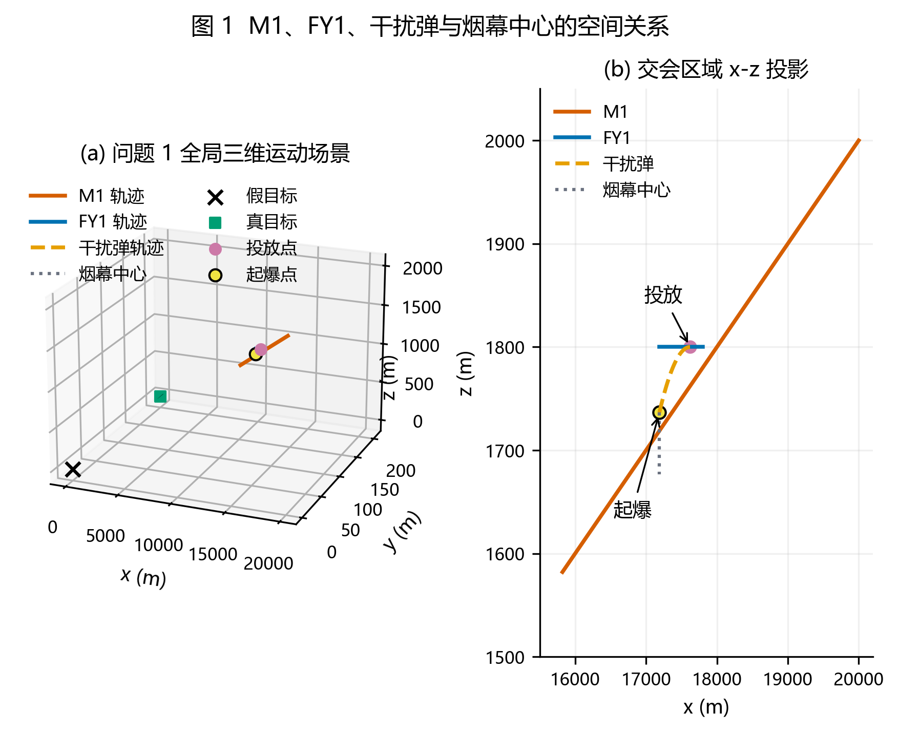

### 1.2 五个问题的输出要求

问题一在给定 FY1 航向、速度、投放时刻和引信延迟时，计算其对 M1 的有效遮蔽时长，用于校验几何判据与数值程序。问题二允许调整 FY1 的航向、速度和单枚弹时序，以最大化对 M1 的遮蔽时长。问题三要求 FY1 在同一固定航迹上连续投放三枚弹，兼顾单弹时长和区间衔接。问题四将平台扩展为 FY1—FY3 各投一弹干扰 M1。问题五进一步同时考虑五架无人机、三枚导弹、每机至多三弹和离散目标分配。

五问的输入规模逐步增加，但共用相同的物理运动、完整圆柱判据和区间计时函数。因此，本文不为每一问重新构造无关模型，而是先建立可测试的统一底座，再逐级扩展连续决策、排程、协同和混合分配。

### 1.3 统一研究路线

如图 2 所示，本文先把题意转成可计算的运动轨迹，再把“遮蔽”转成线段距离不等式，把有效时刻恢复为连续区间，最后按各问结构选择求解策略。问题一的输出既是几何程序的基准，也是问题二的对照；问题二得到的单弹最优航迹成为问题四 FY1 子问题的种子；问题三验证的连续覆盖航迹又进入问题五的候选库。这样形成真实的输入—输出递进，而不是把五问机械并列。

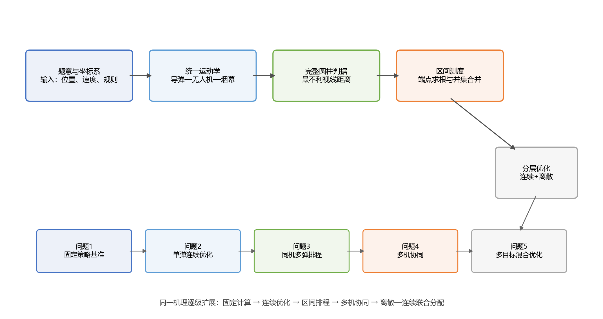

## 2 问题分析

### 2.1 问题一：从文字口径到可证伪的几何判据

固定策略没有优化变量，真正困难在于定义“有效遮蔽”。若把真目标只看成中心点，烟幕遮住中心视线时，圆柱边缘仍可能暴露；若把视线当成无限直线，导弹背后或目标后方的烟幕又会被错误计入。故应使用导弹到目标边界点的有限线段，并以全部边界视线均穿过烟幕球作为严格判据。

求解顺序为：计算导弹、无人机、投放点、起爆点和烟幕轨迹；求烟幕中心到每条视线段的距离；取所有边界点中的最大距离；在其不超过 10 m 时判为有效；最后对距离阈值的交点二分求根。该问还可用导弹—烟幕中心的解析球面交点独立检查区间右端点。

### 2.2 问题二：非光滑连续优化

决策变量为航向、速度、投放时刻和引信延迟。目标函数是有效时间集合的测度：参数轻微变化可能使区间出现、消失或合并，因此函数含大片 0 值平台和阈值折点，梯度法难以直接使用。差分进化能够在有界连续空间中进行群体搜索[5]，适合承担全局探索；但中心视线计算快而判据偏松，完整圆柱计算准而成本高，故采用“代理搜索—严格重排—局部精化”的多保真流程。

### 2.3 问题三：共享航迹下的区间排程

三枚弹共享 FY1 的航向和速度，不能各自复制问题二的最优解；三段有效时间还可能重叠，时长也不能直接相加。因此问题三本质上是“共享连续航迹+三个投放/起爆时序+区间并集”的非光滑排程。模型既要扩大每枚弹的独立覆盖，又要压缩同一目标上的重叠损失，并满足相邻投放至少间隔 1 s。

### 2.4 问题四：先判结构，再决定是否联合搜索

FY1、FY2、FY3 的航向、速度和单弹时序互不耦合，唯一耦合来自三个有效区间的并集。由集合测度次可加性，联合时长不超过三个单机最大时长之和。若分别优化所得区间互不重叠，就达到由三个单机数值最优值构成的可分解上界，无需直接承受 12 维零值平台搜索。故本问应先证明上界与等号条件，再用数值结果检查条件是否满足。

### 2.5 问题五：离散分配与连续时序的混合优化

问题五含 5 架无人机的固定航迹、最多 15 枚弹的投放与引信、每枚弹的目标编号以及同机投放间隔。直接搜索时，离散目标改变不会提供连续方向，严格判据又使多数随机个体收益为 0。为此先对 15 个“无人机—导弹”组合寻找非零路径，再在固定路径上建立单弹候选库，之后枚举机内可行组合和五机代表方案。所有输出都满足原约束，因而给出可行数值下界；候选筛选可能漏掉组合协同解，故不宣称解析全局最优。

## 3 模型假设

表 1 同时给出假设、采用原因和失效影响。假设不是为了方便而孤立罗列，每一项都对应后续公式中的具体简化。

| 假设 | 合理性与必要性 | 影响及失效情形 |
|---|---|---|
| 导弹为点状探测器，沿初始位置指向假目标做 300 m/s 匀速直线运动 | 题面给定速度与目标，未提供制导转弯规律 | 若中途机动，需把导弹轨迹改为分段或动力学方程 |
| 无人机瞬时转向后保持等高度匀速直线飞行 | 与题面“确定方向后等高度匀速直线飞行”一致 | 若存在转弯半径或响应时间，需增加控制约束 |
| 干扰弹继承投放瞬间水平速度，竖直初速度为 0，仅受重力作用 | 题面未给空气阻力，平抛是最小充分模型 | 风阻会改变起爆点，应改为含阻力的微分方程 |
| 烟幕有效域为无风、均匀、半径固定的球体，中心仅以 3 m/s 下沉 | 题面明确半径、寿命和下沉速度 | 风场或浓度衰减会使球体变为时变椭球或概率域 |
| 正式判据要求完整圆柱全部边界视线均与烟幕球相交 | 真实使用题面给出的半径与高度，避免中心点近似漏边 | 若题意只要求部分轮廓遮挡，本判据会偏保守 |
| 启发式算法结果均视为经复算的高质量数值解 | 非光滑混合问题难以给出解析全局证明 | 结论用“数值最优/可行下界”，不用“全局最优” |

前四项来自题面运动机制，第五项是本文的判据选择，第六项限定结论强度。若放松前四项，统一框架仍可保留，只需替换轨迹函数和烟幕有效域；若改变第五项，所有数值必须重新计算。

## 4 符号说明

| 符号 | 含义 | 单位或范围 |
|---|---|---:|
| $\boldsymbol M_j(t)$ | 第 $j$ 枚导弹在时刻 $t$ 的位置 | m |
| $\boldsymbol F_k(t)$ | 第 $k$ 架无人机在时刻 $t$ 的位置 | m |
| $\boldsymbol D_i,\boldsymbol B_i$ | 第 $i$ 枚弹的投放点与起爆点 | m |
| $t_{d,i},\tau_i,t_{b,i}$ | 投放时刻、引信延迟、起爆时刻 | s |
| $\phi_k,v_k$ | 第 $k$ 架无人机航向角与速度 | rad，m/s |
| $\boldsymbol C_i(t)$ | 第 $i$ 个烟幕中心位置 | m |
| $\Omega$ | 真目标完整圆柱边界点集 | — |
| $d(\boldsymbol C,[\boldsymbol A,\boldsymbol P])$ | 点到有限线段的欧氏距离 | m |
| $D_i(t)$ | 第 $i$ 个烟幕对完整圆柱的最不利视线距离 | m |
| $E_i$ | 第 $i$ 枚弹的有效遮蔽时间集合 | s |
| $\mu(E)$ | 时间集合 $E$ 的测度 | s |
| $x_{ikm}$ | 弹是否分配给导弹的二元变量 | 0 或 1 |
| $J$ | 当前问题的总有效遮蔽目标 | s |

下标 $j\in\{1,2,3\}$ 表示导弹，$k\in\{1,\ldots,5\}$ 表示无人机，$i$ 表示干扰弹。向量采用粗体，集合采用大写字母，角度计算统一使用弧度，结果表再转换为度。

## 5 模型建立与求解

### 5.1 问题一：完整圆柱视线遮蔽基准模型

#### 5.1.1 概念层：为什么采用有限视线束

本文把遮蔽定义为“导弹观察完整圆柱时，所有目标边界点的视线段均进入烟幕有效球”。这一模型比中心点视线严格，但比对无限直线求距更符合光线从导弹到目标的实际传播范围。点到线段投影与三维距离计算可参考计算几何中的标准处理[8]。

问题一的作用不仅是给出 1 个数值，还要验证五问共用的三层底座：轨迹是否连续、视线段距离是否正确、阈值交点是否稳定。只要这三层通过，后续优化就可调用同一函数。

#### 5.1.2 公式层：运动学方程

设第 $j$ 枚导弹初始位置为 $\boldsymbol M_{j0}$，假目标为原点。导弹速度方向为 $-\boldsymbol M_{j0}/\|\boldsymbol M_{j0}\|_2$，所以

$$
\boldsymbol M_j(t)=\boldsymbol M_{j0}-300t\frac{\boldsymbol M_{j0}}{\|\boldsymbol M_{j0}\|_2}.
$$

令 $\boldsymbol M_j(t)=\boldsymbol 0$，导弹到达假目标的时刻为

$$
t_{\mathrm{arr},j}=\frac{\|\boldsymbol M_{j0}\|_2}{300}.
$$

无人机初始位置为 $\boldsymbol F_{k0}$，航向角 $\phi_k$ 从正 $x$ 轴逆时针计，速度为 $v_k$，则

$$
\boldsymbol F_k(t)=\boldsymbol F_{k0}+v_kt(\cos\phi_k,\sin\phi_k,0).
$$

一枚弹在 $t_d$ 投放，引信延迟为 $\tau$，起爆时刻 $t_b=t_d+\tau$。由平抛运动得到

$$
\boldsymbol D=\boldsymbol F_k(t_d),\qquad \boldsymbol B=\boldsymbol F_k(t_b)-\frac{1}{2}g\tau^2\boldsymbol e_z.
$$

起爆后烟幕不再继承水平速度，仅以 3 m/s 下沉，因此

$$
\boldsymbol C(t)=\boldsymbol B-3(t-t_b)\boldsymbol e_z,\qquad t_b\le t\le \min(t_b+20,t_{\mathrm{arr},j}).
$$

式（1）—式（5）把题目给出的文字运动规则全部转成显式轨迹。特别地，起爆点的水平坐标由 $t_b$ 决定，竖直下降量只由 $\tau$ 决定；约束 $B_z\ge0$ 可排除地下起爆。

#### 5.1.3 推导层：完整圆柱判据的十步推导

第一步，固定时刻 $t$、导弹位置 $\boldsymbol M(t)$ 和目标边界点 $\boldsymbol P$，视线段写为

$$
\boldsymbol L(\lambda;t,\boldsymbol P)=\boldsymbol M(t)+\lambda[\boldsymbol P-\boldsymbol M(t)],\qquad 0\le\lambda\le1.
$$

第二步，烟幕中心到该视线段的平方距离是关于 $\lambda$ 的一元二次函数。对其求导并令导数为 0，可得无限直线上的投影参数

$$
\lambda^*=\frac{[\boldsymbol C(t)-\boldsymbol M(t)]\cdot[\boldsymbol P-\boldsymbol M(t)]}{\|\boldsymbol P-\boldsymbol M(t)\|_2^2}.
$$

第三步，视线是有限线段，故将投影截断为 $\widehat\lambda=\min(1,\max(0,\lambda^*))$。点到线段距离为

$$
d(t,\boldsymbol P)=\|\boldsymbol C(t)-\boldsymbol L(\widehat\lambda;t,\boldsymbol P)\|_2.
$$

第四步，真目标边界由侧面、顶盖和底盖组成。其连续点集可参数化为

$$
\Omega=\{(7\cos\theta,200+7\sin\theta,z)\}\cup\{(r\cos\theta,200+r\sin\theta,z_c)\},
$$

其中 $0\le\theta<2\pi$、$0\le z\le10$、$0\le r\le7$、$z_c\in\{0,10\}$。

第五步，对同一烟幕取全部边界视线距离的最大值：

$$
D(t)=\max_{\boldsymbol P\in\Omega}d(t,\boldsymbol P).
$$

第六步，若 $D(t)\le10$ m，则每一条边界视线都与半径 10 m 的烟幕球相交；若 $D(t)>10$ m，则至少存在一个圆柱边界点仍暴露。因此“最大值不超过半径”恰好表达完整遮蔽。图 3 展示中心视线、边界视线与烟幕球的区别。

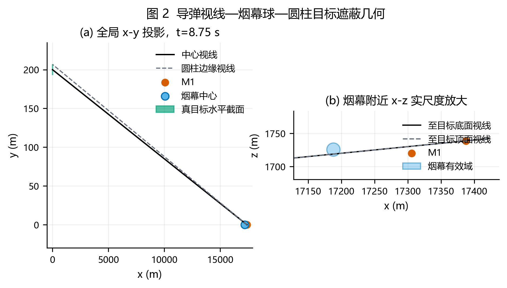

第七步，把烟幕寿命和导弹到达时刻同时纳入时间窗，单弹有效集合为

$$
E=\{t:t_b\le t\le\min(t_b+20,t_{\mathrm{arr}}),\ D(t)\le10\}.
$$

第八步，以固定步长扫描 $D(t)-10$，寻找相邻采样点符号变化；第九步，在每个变号小区间内二分求根，直到时间误差小于 $10^{-7}$ s；第十步，将所有闭区间按起点排序，合并重叠或相接区间。若合并结果为 $[a_q,b_q]$，则

$$
\mu(E)=\sum_q(b_q-a_q).
$$

这十步依次由物理运动、投影定理、有限线段约束、目标几何、最坏情形、集合定义、扫描、求根和测度组成，没有用公式数量替代论证链条。

#### 5.1.4 求解层：固定参数代入与独立复核

M1 初始位置为 (20000,0,2000) m，FY1 初始位置为 (17800,0,1800) m。问题一给定 FY1 朝假目标方向以 120 m/s 飞行，1.5 s 投放，3.6 s 后起爆。M1 的单位方向和到达时间为

$$
\boldsymbol u_{M1}=-\frac{(20000,0,2000)}{\sqrt{20000^2+2000^2}},\qquad t_{\mathrm{arr},1}=67.000000\ \mathrm{s}.
$$

投放点与起爆点为

$$
\boldsymbol D=(17620,0,1800),\qquad \boldsymbol B=(17188,0,1736.496)\ \mathrm{m}.
$$

程序先以完整圆柱离散点计算 $D(t)$，再对两个阈值交点二分求根。为独立检查右端点，还解导弹与烟幕中心的球面交点方程

$$
\|\boldsymbol M_1(t)-\boldsymbol C(t)\|_2^2=10^2.
$$

解析球面右交点为 9.448088 s，与完整圆柱区间右端一致；左端由圆柱边缘视线决定，不能用中心球面交点代替。

#### 5.1.5 解读层：结果、对照与边界

| 判据 | 有效区间 / s | 时长 / s |
|---|---|---:|
| 完整圆柱主判据 | [8.056445,9.448088] | **1.391643** |
| 目标中心视线对照 | [8.013006,9.448088] | 1.435082 |

如图 4 所示，中心视线提前进入烟幕球，而圆柱最不利边界视线要到 8.056445 s 才全部进入。中心点近似高估 0.043439 s，约占严格结果的 3.12%。这证明真目标半径与高度不是可忽略信息，也说明后续可用中心视线做低成本代理，但最终必须以完整圆柱复算。

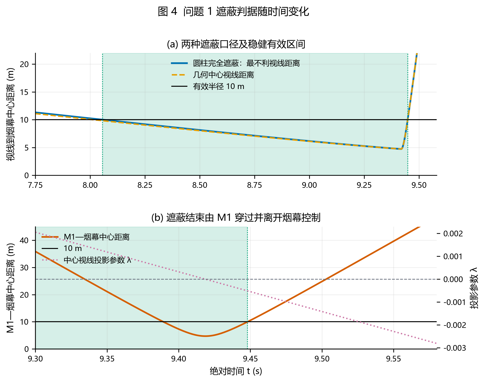

问题一输出的轨迹函数、严格距离函数和区间求根器将原样进入问题二，只新增决策变量和优化算法。

AI辅助标注：问题 1 的轨迹推导、完整圆柱判据、程序、图表与文字由 OpenAI Codex 辅助生成；用户已完成人工复核。

### 5.2 问题二：FY1 单弹连续优化模型

#### 5.2.1 概念层：代理目标与严格目标的分工

问题二沿用问题一的完整圆柱模型。候选方法包括均匀网格、局部梯度法和群体全局搜索。四维均匀网格会随分辨率指数增长；目标函数由区间出现和消失构成，局部梯度不稳定；差分进化只需目标函数值并能跨越非光滑区域[5]，因此用于全局探索。其后再用确定性坐标搜索精化，符合“全局探索+局部利用”的数值优化思路[7]。

#### 5.2.2 公式层：变量、目标与可行参数化

原始策略变量为

$$
\boldsymbol q=(\phi,v,t_d,\tau),\qquad -\pi\le\phi\le\pi,\ 70\le v\le140,\ t_d\ge0,\ \tau\ge0.
$$

直接搜索可能产生负投放时刻或地下起爆。令 $t_b$ 作为搜索变量，并引入 $r\in[0,1]$：

$$
\tau=r\min\left(t_b,\sqrt{\frac{2H_0}{g}}\right),\qquad t_d=t_b-\tau.
$$

这样任何内部变量 $(\phi,v,t_b,r)$ 都自动满足非负投放和起爆前不落地。目标函数为严格有效集合的测度：

$$
J_2(\boldsymbol q)=\mu(E(\boldsymbol q)).
$$

差分进化在第 $g$ 代构造变异向量并交叉：

$$
\boldsymbol y=\boldsymbol x_a+F(\boldsymbol x_b-\boldsymbol x_c),\qquad \boldsymbol u=\operatorname{cross}(\boldsymbol x,\boldsymbol y;CR).
$$

若 $J_2(\boldsymbol u)\ge J_2(\boldsymbol x)$ 则保留试验个体。本文取变异因子 $F=0.78$、交叉概率 $CR=0.88$，并显式修复边界。

#### 5.2.3 推导层：为何采用三阶段求解

严格完整圆柱目标一次需要同时处理大量时间点和边界视线；若直接在所有差分进化个体上高精度计算，成本过高。首先用目标中心视线时长进行三组随机种子搜索，快速定位可能遮蔽的时空区域；其次把各组末代种群按完整圆柱粗分辨率重排，排除“中心有效、边缘暴露”的候选；最后对排名靠前者做坐标精化和 1440 周向点复算。

该流程不是用代理结果替代正式结果。代理只决定搜索方向，所有报告参数、区间和时长均来自严格判据。图 5 显示航向—起爆时刻剖面存在狭窄高收益盆地，大量参数组合的严格时长为 0，进一步说明分层搜索的必要性。

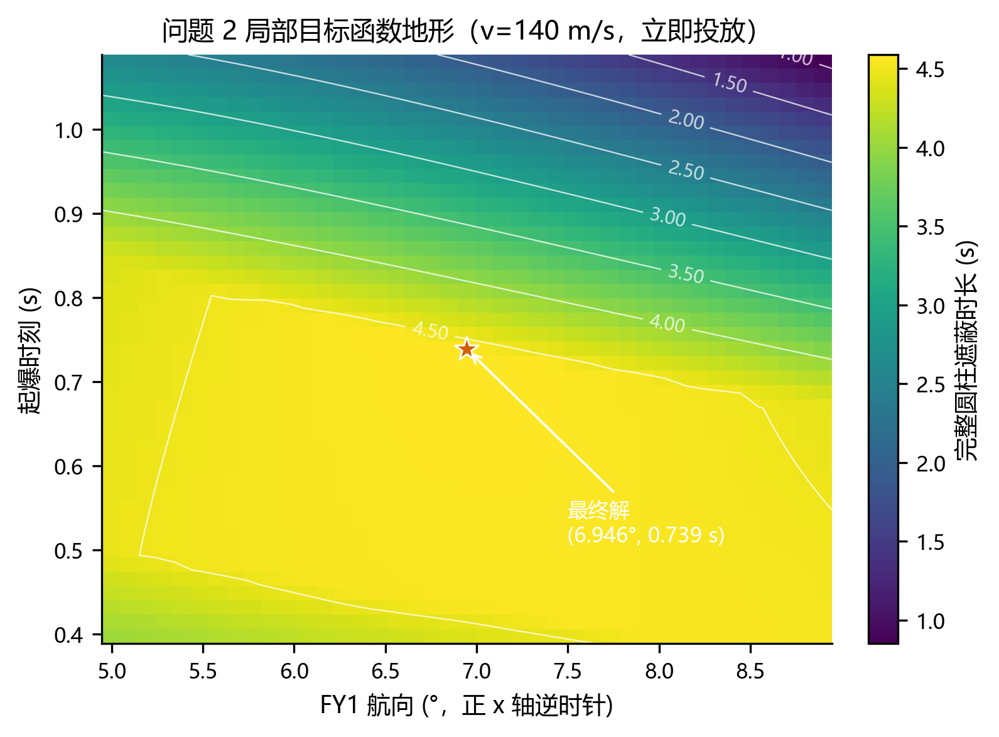

#### 5.2.4 求解层：参数、收敛与结果

正式搜索使用随机种子 20250731、20250732 和 7；每组 96 个个体、180 代。缩减配置 72 个个体、120 代多次停在约 3.954 s 的次优盆地，故不能作为正式配置。三组代理搜索后均找到约 4.832 s 的中心视线候选，经严格重排与坐标精化得到：

| 参数 | 最优数值 |
|---|---:|
| 航向角 | 6.946063° |
| 速度 | 140.000000 m/s |
| 投放时刻 | 0.000000 s |
| 引信延迟 / 起爆时刻 | 0.739042 s |
| 投放点 | (17800.000,0.000,1800.000) m |
| 起爆点 | (17902.706,12.513,1797.324) m |
| 有效区间 | [0.739073,5.326745] s |
| **有效时长** | **4.587672 s** |

图 6 中三条收敛曲线最终进入同一收益区间，说明正式规模对随机种子的依赖较小；代理最优仍高于严格结果，说明完整圆柱复算不可省略。

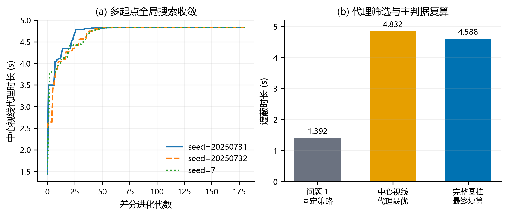

#### 5.2.5 解读层：物理意义与对问题三的贡献

与问题一相比，时长增加 3.196029 s，达到基准的 3.2966 倍。速度取上界，表示 FY1 越快把起爆点送入导弹—目标视线附近越有利；投放时刻取 0，表示延迟释放只会压缩早期机会。航向不是精确沿 $x$ 轴，因为真目标中心位于 $y=200$ m，烟幕必须补偿视线束的横向偏移。

图 7 显示航向偏差约 1.5° 时快速复算降至约 4.086 s，引信延迟超过最优值后也快速下降。速度达到 140 m/s 后受题设上界截断，不能把“边界最优”误写为无限增速仍有利。问题三将以该单弹策略作为基线，但因三弹共享航迹，不能把 4.587672 s 直接乘以 3。

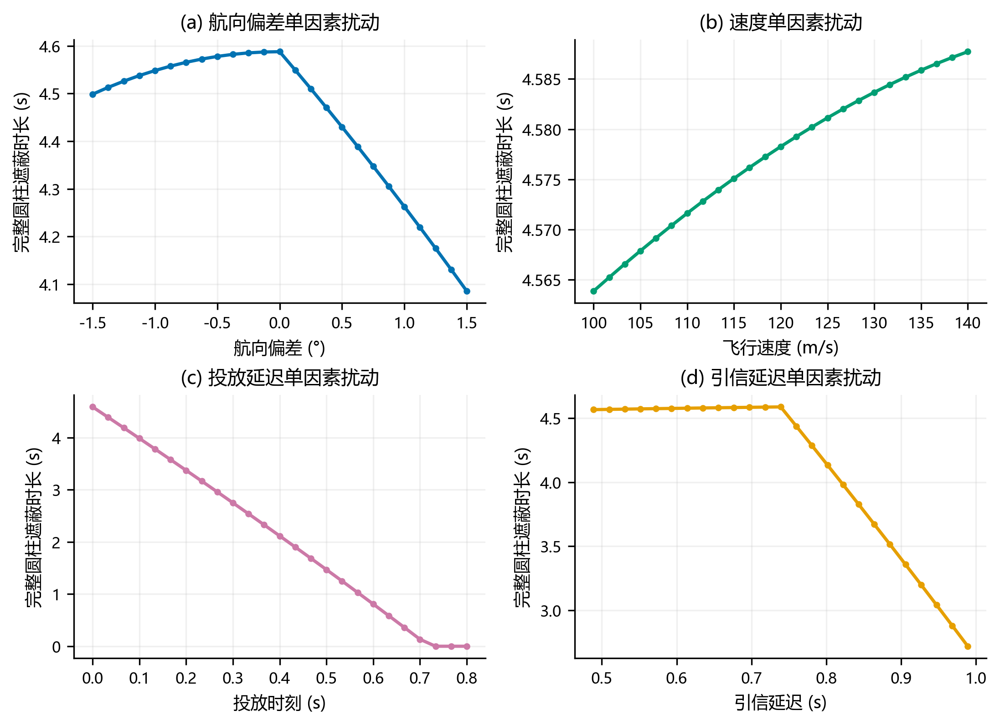

AI辅助标注：问题 2 的可行参数化、差分进化程序、完整圆柱复算、图表与文字由 OpenAI Codex 辅助生成；用户已完成人工复核。

### 5.3 问题三：FY1 三弹区间排程模型

#### 5.3.1 概念层：从单弹最优转向联合覆盖

三枚弹由同一架 FY1 投放，必须共享航向和速度。若三枚弹各自独立采用问题二的策略，就违反固定航迹约束；若只最大化三个单弹时长之和，又会重复计算重叠部分。故本问采用“共享航迹+独立时序+区间并集”模型。

#### 5.3.2 公式层：约束与联合目标

三枚弹按投放时刻排序，并满足

$$
t_{d,2}-t_{d,1}\ge1,\qquad t_{d,3}-t_{d,2}\ge1.
$$

决策向量包含共享的 $(\phi,v)$ 和三组 $(t_{d,i},\tau_i)$。联合目标是

$$
J_3=\mu(E_1\cup E_2\cup E_3).
$$

容斥关系揭示收益与重叠损失：

$$
\mu(E_1\cup E_2\cup E_3)=\sum_i\mu(E_i)-\sum_{i<j}\mu(E_i\cap E_j)+\mu(E_1\cap E_2\cap E_3).
$$

程序实际使用排序合并计算并集，容斥式用于解释为何三个单弹时长不能直接相加。

#### 5.3.3 推导层：可行编码与退化解

为始终满足 1 s 间隔，将第二、三枚投放时刻写成前一时刻加 1 s 再加非负附加间隔。三组中心视线代理搜索先寻找共享航迹，完整圆柱直接搜索再修正边缘暴露，最后对航向、速度和六个时序变量逐坐标精化。

第三枚弹可能出现零新增时长。该现象并不违反题意：题目要求制定三枚弹投放策略，但没有规定每枚弹都必须产生正时长。若强制每枚均有效，就增加了原题没有给出的约束，只会使原目标不增。本文在等价最优解族中采用“最早可行投放、立即起爆”的次级规则，并如实报告其零边际贡献。

#### 5.3.4 求解层：连续覆盖结果

共同航向为 9.236484°，速度为 103.596493 m/s，三枚弹分别在 0、1、2 s 投放。前两枚严格区间为 [4.824835,7.401397] s 和 [1.000001,4.824884] s，第三枚无严格有效区间。因此

$$
E_1\cup E_2\cup E_3=[1.000001,7.401397]\ \mathrm{s},\qquad J_3=6.401396\ \mathrm{s}.
$$

如图 8 所示，前两枚弹仅重叠 4.843×10⁻⁵ s，在 0.001 s 报告精度下可视为首尾无缝衔接。

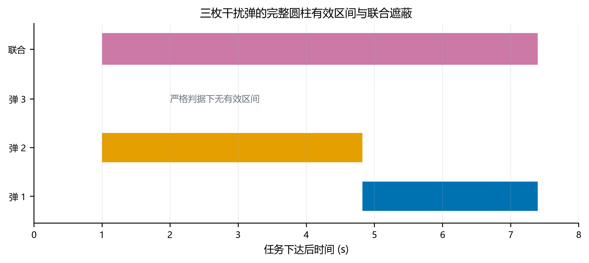

图 9 显示不同随机种子最终进入同一收益区间；图 10 则表明第二枚投放时刻主要负责填补第一枚之前的空窗，一旦偏离 1 s 边界，就会产生缺口或重叠损失。

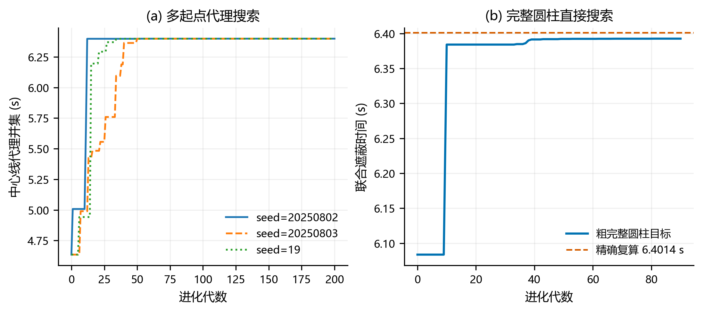

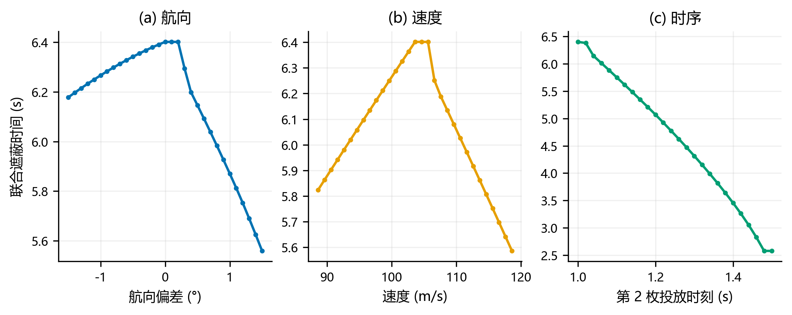

#### 5.3.5 解读层：区间衔接优先于弹数堆叠

问题三相对问题二增加 1.813724 s，但没有达到三倍单弹时长。原因是共享航迹限制了每枚弹的空间位置，且连续覆盖要求前后区间精准衔接。结论可概括为：在同一目标上，新增弹药只有形成新时间区间才有价值；落在既有区间内的烟幕即使单独有效，也不会增加并集时长。该原则将进入问题五的机内候选筛选。

AI辅助标注：问题 3 的区间并集模型、搜索程序、第三弹退化诊断和图表由 OpenAI Codex 辅助生成；用户已确认保留零新增时长的真实结果。

### 5.4 问题四：三机单弹可分解协同模型

#### 5.4.1 概念层：利用独立子问题结构

FY1、FY2、FY3 各投一弹干扰 M1，每架无人机有独立航向、速度、投放和引信。若直接搜索 12 维参数，会在零值平台上浪费大量计算。由于各机间没有资源和航迹约束，先求三个单机最好值，再检查区间重叠，是更符合问题结构的策略。

#### 5.4.2 公式层：联合目标与上界

设三机有效集合为 $E_k(\boldsymbol q_k)$，联合目标为

$$
J_4=\mu\left(E_1(\boldsymbol q_1)\cup E_2(\boldsymbol q_2)\cup E_3(\boldsymbol q_3)\right).
$$

若第 $k$ 架无人机单独可达到的最大数值时长为 $U_k$，由测度次可加性有

$$
J_4\le\sum_{k=1}^{3}\mu(E_k)\le\sum_{k=1}^{3}U_k.
$$

第一处等号要求三个区间互不重叠，第二处等号要求各机达到自己的单机最好数值。

#### 5.4.3 推导层：跨越严格目标的零值平台

FY2、FY3 的初始位置离 M1—目标视线较远，随机严格目标几乎总为 0。为区分“离非零盆地近的 0”和“远离非零盆地的 0”，先最小化烟幕寿命内的中心视线接近度：

$$
P_k(\boldsymbol q_k)=\min_t d\left(\boldsymbol C_k(t),[\boldsymbol M_1(t),\boldsymbol T_c]\right).
$$

接近度只用于产生种子。随后依次做中心视线时长搜索、完整圆柱重排、坐标精化和高分辨率复算，最终计时仍完全由严格判据决定。

#### 5.4.4 求解层：三机结果与上界闭合

| 无人机 | 航向角 | 速度/(m/s) | 投放时刻/s | 引信延迟/s | 有效区间/s | 时长/s |
|---|---:|---:|---:|---:|---|---:|
| FY1 | 6.945852° | 140.000000 | 0.000000 | 0.739046 | [0.739113,5.326785] | 4.587672 |
| FY2 | 280.191921° | 119.746503 | 5.612726 | 5.869072 | [11.482244,15.409344] | 3.927100 |
| FY3 | 78.248916° | 132.669175 | 21.390227 | 2.422909 | [23.813432,26.931513] | 3.118081 |

图 11 显示三架无人机分别从不同方向把烟幕送入 M1 视线；图 12 显示三段严格有效区间互不重叠。因此

$$
J_4=4.587672+3.927100+3.118081=11.632853\ \mathrm{s}.
$$

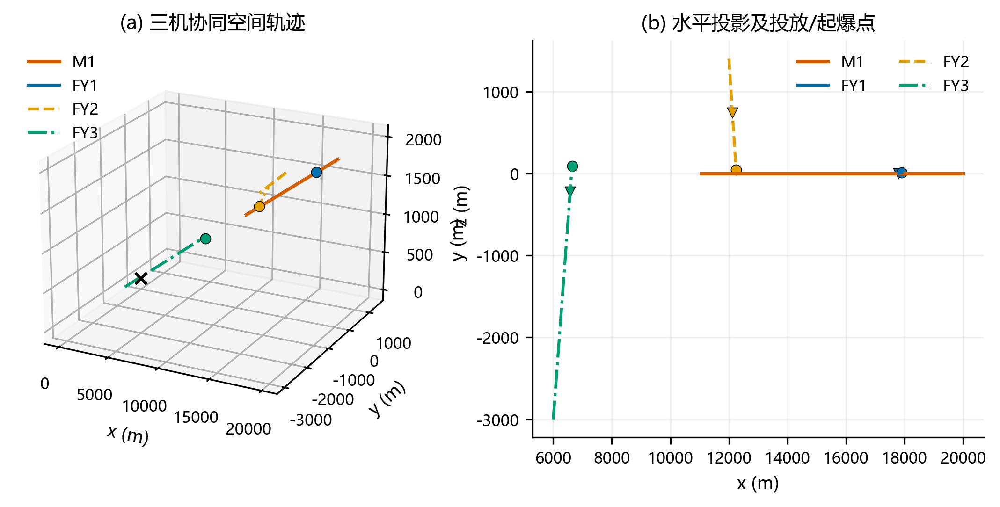

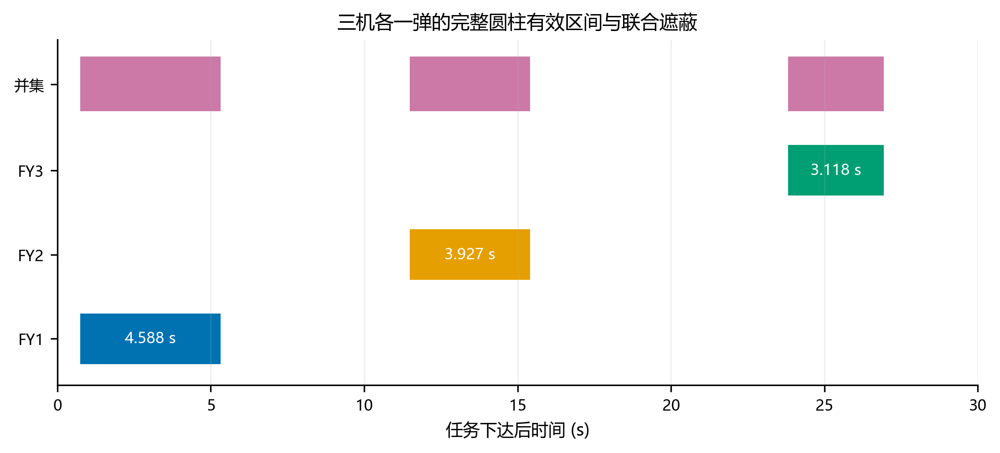

图 13 将三个单机收敛过程与上界累加放在一起，所得联合时长达到三个单机数值最好值之和。需要强调，$U_k$ 本身由多起点数值搜索获得，所以这是“数值上界闭合”，不是解析全局最优证明。

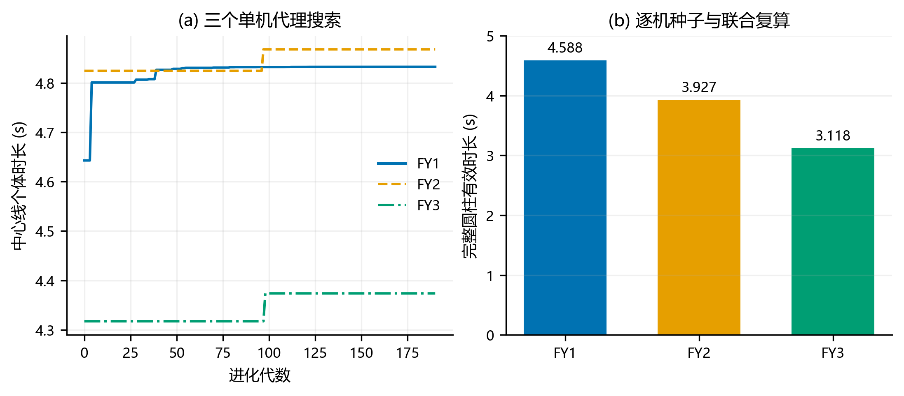

#### 5.4.5 解读层：空间分工转化为时间错峰

FY1 负责 0.74—5.33 s 的早期遮蔽，FY2 在约 11.48 s 后补充中期，FY3 在约 23.81 s 后提供后期遮蔽。三机独立航迹最终形成时间错峰，使“各自最好”和“联合最好”没有重叠冲突。若增加第四架无人机或改变初始位置导致区间重叠，就必须重新联合协调，而不能继续简单相加。

AI辅助标注：问题 4 的可分解上界、逐机优化、结果表与图表由 OpenAI Codex 辅助生成；用户已完成人工复核。

### 5.5 问题五：五机三导弹离散—连续混合模型

#### 5.5.1 概念层：分配、航迹和时序同时决策

问题五同时包含离散目标分配和连续航迹时序。候选方法包括一次性高维启发式搜索、混合整数非线性规划和分层候选枚举。完整圆柱区间目标缺乏光滑解析形式，难以直接交给通用精确求解器；一次性启发式又容易被零值平台淹没。因此采用可行编码与候选库，将全空间压缩为可复算的代表方案。

#### 5.5.2 公式层：二元分配与联合目标

令 $x_{ikm}\in\{0,1\}$ 表示无人机 $i$ 的第 $k$ 枚弹是否分配给导弹 $m$。每枚弹至多服务一个目标，每架无人机至多投三枚：

$$
\sum_{m=1}^{3}x_{ikm}\le1,\qquad \sum_{k=1}^{3}\sum_{m=1}^{3}x_{ikm}\le3.
$$

若 $E_{ikm}$ 是该弹对导弹 $m$ 的严格有效区间，则

$$
E_m=\bigcup_{i,k:x_{ikm}=1}E_{ikm},\qquad J_5=\sum_{m=1}^{3}\mu(E_m).
$$

同一无人机所有弹共享 $(\phi_i,v_i)$，相邻投放满足 $t_{d,i,k+1}-t_{d,i,k}\ge1$。完整混合目标可概括为

$$
\max_{\boldsymbol x,\boldsymbol q}J_5\quad \text{s.t.}\quad \mathcal C_{\mathrm{assign}},\ \mathcal C_{\mathrm{route}},\ \mathcal C_{\mathrm{gap}},\ \mathcal C_{\mathrm{physical}}.
$$

其中四类约束依次表示目标分配、同机固定航迹、投放间隔和全部物理可行条件。

#### 5.5.3 推导层：四层候选库

第一层，对 5×3=15 个“无人机—导弹”组合分别用连续接近度寻找非零路径，再用中心视线和完整圆柱时长优化。第二层，在固定航迹上改变投放与引信，生成记录目标编号、时序和严格区间的原子候选。第三层，对每架无人机枚举 1—3 枚、间隔不少于 1 s 的机内组合，并按各目标区间并集收益删除被支配方案。第四层，枚举五架无人机代表组合，要求 M1、M2、M3 均获得正覆盖，最大化总并集时长。

FY1 候选库额外加入问题三已验证的连续覆盖航迹，防止单弹排名筛选丢失“单弹一般、组合后衔接优良”的方案。对候选集 $\mathcal Q_c$ 求得的目标满足

$$
J_{5,c}=\max_{\boldsymbol q\in\mathcal Q_c}J_5(\boldsymbol q)\le \max_{\boldsymbol q\in\mathcal Q}J_5(\boldsymbol q).
$$

故 30.325721 s 是连续原问题的可行数值下界，而不是上界或全局最优证明。约束处理采用“可行参数化优先、不可行个体拒绝”的原则，与进化计算中优先保留可行解的思想一致[6]。

#### 5.5.4 求解层：任务分配与投放时序

图 14 给出五机—三导弹任务分配。最终仅使用 9 枚有效弹，其余 6 个允许名额不投放，因为候选库中没有能增加并集时长且不破坏固定航迹的有效方案。

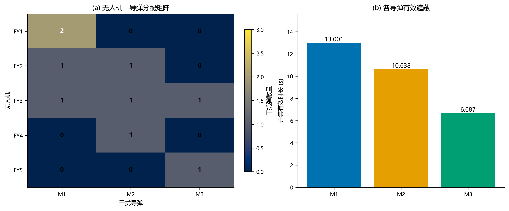

| 无人机 | 航向角 | 速度/(m/s) | 投弹数 | 目标分配 |
|---|---:|---:|---:|---|
| FY1 | 9.236484° | 103.596493 | 2 | M1×2 |
| FY2 | 280.191921° | 119.746503 | 2 | M2×1，M1×1 |
| FY3 | 88.902583° | 124.824214 | 3 | M3、M1、M2 各 1 |
| FY4 | 306.510863° | 138.778282 | 1 | M2×1 |
| FY5 | 115.190248° | 138.899763 | 1 | M3×1 |

| 弹号 | 目标 | 投放时刻/s | 引信延迟/s | 有效区间/s | 时长/s |
|---|---|---:|---:|---|---:|
| FY1-1 | M1 | 0.000000 | 0.005102 | [4.824835,7.401397] | 2.576562 |
| FY1-2 | M1 | 1.000000 | 0.000000 | [1.000001,4.824884] | 3.824883 |
| FY2-1 | M2 | 5.143517 | 3.079829 | [8.595608,12.508738] | 3.913130 |
| FY2-2 | M1 | 6.183406 | 5.497307 | [18.678242,22.447948] | 3.769707 |
| FY3-1 | M3 | 19.792127 | 3.321241 | [23.173809,26.109488] | 2.935678 |
| FY3-2 | M1 | 21.052144 | 3.597930 | [32.788956,35.618788] | 2.829832 |
| FY3-3 | M2 | 24.108707 | 2.153404 | [26.540972,29.468152] | 2.927180 |
| FY4-1 | M2 | 4.666304 | 9.563953 | [14.244630,18.042023] | 3.797393 |
| FY5-1 | M3 | 12.246622 | 0.576730 | [12.903942,16.655346] | 3.751405 |

| 导弹 | 有效区间并集 / s | 并集时长 / s |
|---|---|---:|
| M1 | [1.000001,7.401397]；[18.678242,22.447948]；[32.788956,35.618788] | **13.000935** |
| M2 | [8.595608,12.508738]；[14.244630,18.042023]；[26.540972,29.468152] | **10.637703** |
| M3 | [12.903942,16.655346]；[23.173809,26.109488] | **6.687083** |
| **总计** | — | **30.325721** |

图 15 展示九枚弹的投放、起爆和有效区间；图 16 按导弹汇总联合覆盖与累计时长。FY2 两次投放相隔 1.039890 s，FY3 两段间隔为 1.260017 s 和 3.056563 s，其余多弹航迹也满足 1 s 下限。

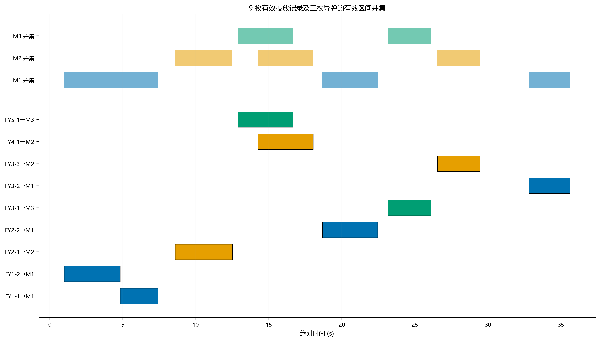

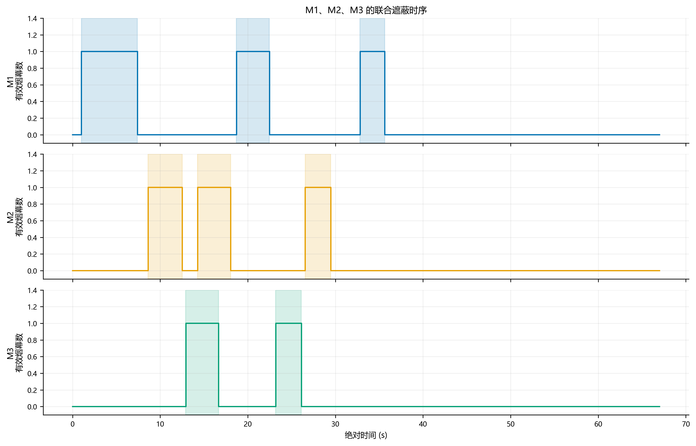

#### 5.5.5 解读层：资源效率与一般性结构

FY1 的两枚弹形成 M1 早期连续覆盖；FY2、FY4 填充 M2 前两段；FY3 在后期分别服务三个目标；FY5 补充 M3 早期区间。9 枚有效弹平均贡献 3.369525 s 总目标时长，但该平均值不能用于评价单弹，因为同目标重叠会被并集消除。

本问说明“投满 15 枚”不是优化目标。只有能够开辟新时间窗、补齐缺口或改善目标平衡的弹药才有边际价值。若额外要求三目标公平，可把目标改为最大化最小覆盖或在 $J_5$ 中加入离差惩罚；本文按题意只最大化三目标总时长，同时保证每个目标均为正。

AI辅助标注：问题 5 的候选库分层算法、程序、结果表、图表和结论边界由 OpenAI Codex 辅助生成；用户已完成人工复核。

## 6 灵敏度与稳健性分析

### 6.1 空间离散与时间求根收敛

完整圆柱以有限边界点近似。令 $J_N$ 为周向分辨率为 $N$ 时的结果，以高分辨率 $J_{N_h}$ 为基准，离散误差定义为

$$
\varepsilon_N=|J_N-J_{N_h}|.
$$

| 问题 | 低分辨率结果/s | 高分辨率结果/s | 最大差值/s |
|---|---:|---:|---:|
| 1：360→2880 点 | 1.391643 | 1.391643 | <5×10⁻⁷ |
| 2：180→1440 点 | 4.587672319 | 4.587671681 | 6.38×10⁻⁷ |
| 3：180→1440 点 | 6.401396146 | 6.401395959 | 1.87×10⁻⁷ |
| 4：180→1440 点 | 11.632869908 | 11.632852718 | 1.72×10⁻⁵ |
| 5：360→720 点 | 30.325751405 | 30.325720665 | 3.07×10⁻⁵ |

所有差异均远小于正文保留 0.001 s 的报告精度。问题五从 90 点到 720 点的总时长依次为 30.327004、30.325924、30.325751、30.325721 s，呈稳定收敛，没有出现粗网格下有效、细网格下完全失效的伪解。

### 6.2 多起点、次优盆地与基线比较

问题二、三均使用多个固定随机种子。问题二的缩减搜索稳定落入 3.954 s 次优盆地，而正式规模三组搜索均回到 4.588 s 主盆地；这一失败对照说明“跑过优化器”并不等于找到可靠答案。问题四、五先用连续接近度寻找非零区域，再用严格目标排序，避免 0 值平台掩盖搜索方向。

三类判据或策略构成基线链：目标中心视线用于快速代理，完整圆柱用于正式计时，空间离散加密用于数值复核；问题一固定策略、问题二单弹优化、问题三多弹排程又构成方案性能基线。任何一层结果异常，都能回到前一层定位误差来源。

### 6.3 2000 轮执行误差蒙特卡洛压力测试

题面没有提供风偏、航向误差或时延的实测分布，不能把任意假设伪装成真实统计规律。为满足随机稳健性检查，本文仅对问题二名义最优策略设置一个明确标注的压力测试场景：航向误差服从标准差 0.5° 的零均值正态分布，速度误差标准差 1.5 m/s 并截断到题设范围，释放延迟取标准差 0.08 s 正态变量的绝对值，引信误差标准差 0.05 s。写成

$$
\Delta\phi\sim N(0,0.5^2),\quad \Delta v\sim N(0,1.5^2),\quad \Delta t_d=|N(0,0.08^2)|,\quad \Delta\tau\sim N(0,0.05^2).
$$

固定随机种子 20260731，进行 $n=2000$ 轮严格圆柱粗网格复算。样本均值与标准差为

$$
\bar J=\frac{1}{n}\sum_{r=1}^{n}J_r,\qquad s_J=\sqrt{\frac{1}{n-1}\sum_{r=1}^{n}(J_r-\bar J)^2}.
$$

得到 $\bar J=4.154196$ s、$s_J=0.407291$ s；均值的正态近似 95% 置信区间为

$$
\bar J\pm1.96\frac{s_J}{\sqrt n}=[4.136346,4.172047]\ \mathrm{s}.
$$

全部样本保持正有效时长，87.4% 的样本达到同网格名义时长 4.587779 s 的 80%。5%、50%、95% 分位数分别为 3.377415、4.239468、4.584860 s。图 17 左侧给出时长分布，右侧给出误差变量与时长的线性相关：引信误差、释放延迟和航向误差影响较大，速度误差因名义速度已在上界且被截断而相关较弱。

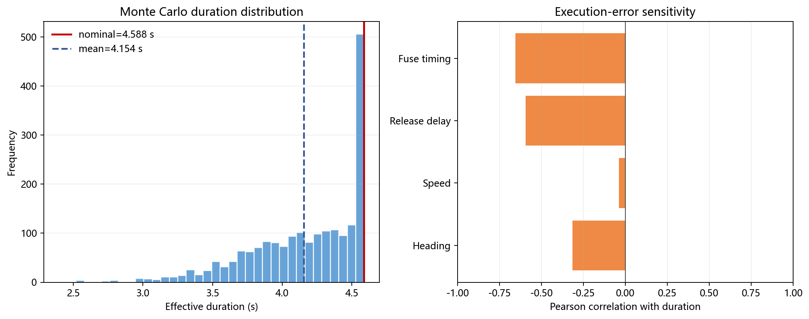

这些结果只回答“在上述假定误差场景下策略如何退化”，不能替代真实装备误差标定。若获得实测误差，应重新拟合分布并采用同一脚本复算。蒙特卡洛方法的重复次数、随机种子、均值、标准差和区间估计均按可复现原则记录[9]。

### 6.4 物理约束、程序测试与数据一致性

代码显式检查速度范围、非负投放/起爆时刻、起爆高度、20 s 烟幕寿命、同机投放间隔、固定航迹和导弹到达时刻。问题一—五及新增随机与排版验证共 42 项自动化测试通过，覆盖轨迹初值与连续性、抛体起爆点、烟幕下沉、线段投影截断、区间合并、参数双向转换、结果回归、模板输出、随机种子可复现性和行内公式可读性。

原始题目和结果模板的哈希保持不变，三个派生结果表与 JSON/CSV 输出交叉核对。数值计算采用 NumPy 的向量化数组运算[10]，图表由 Matplotlib 统一生成[11]，避免手工改图造成正文与数据不一致。

### 6.5 一般性策略与适用条件

1. **先提高布设质量，再增加弹数。** 在烟幕半径仅 10 m、视线跨越数千米的场景中，航向和起爆时机对是否进入非零盆地更关键；该结论在视线几何相近、烟幕半径远小于交战距离时适用。
2. **同一目标优先填补时间缺口。** 区间并集不计重复覆盖，新增弹应开辟新时间窗或与已有区间首尾衔接；当任务另有冗余可靠性要求时，重叠才可能具有额外价值。
3. **多平台先检查可分解性。** 若平台决策相互独立且单机最优区间不重叠，可分别优化后直接合并；一旦存在共享资源、航迹冲突或区间重叠，就必须恢复联合模型。
4. **混合问题先构造非零候选，再做组合。** 严格判据含大片零值平台时，连续接近度可用于找种子，正式收益仍应由严格判据复算；候选库结果只能称为可行下界。

## 7 模型评价与改进

### 7.1 模型优点

第一，五问共用同一运动学、完整圆柱距离和区间测度函数，问题规模扩展时只改变决策和组合层，减少口径漂移。第二，有限线段代替无限直线，完整圆柱代替中心点，问题一量化表明中心近似会高估 3.12%。第三，区间扫描后二分求根并加密圆柱边界，五问离散误差最大仅 3.07×10⁻⁵ s。第四，多保真搜索、失败搜索对照、42 项测试和 2000 轮压力测试分别覆盖优化、程序、排版和执行误差层，证据链完整。

### 7.2 模型缺点

烟幕被理想化为无风、均匀、半径固定球体，未表示浓度衰减和水平漂移；完整圆柱仍由有限点近似，虽已收敛但不是连续几何的解析证明；差分进化与候选库只能给出高质量数值解，问题五可能漏掉“单弹收益一般、组合协同更强”的航迹；蒙特卡洛误差分布是压力测试假设而非实测数据，不能直接用于真实成功概率。

### 7.3 改进方向

若有风场数据，可把烟幕中心改为含水平漂移的随机轨迹，并用随时间衰减的椭球等浓度面替代固定球。若需要执行可靠性，可将确定性目标推广为

$$
\max_{\boldsymbol q}\ \mathbb E[J(\boldsymbol q,\boldsymbol\xi)]-\lambda\operatorname{CVaR}_{\alpha}[-J(\boldsymbol q,\boldsymbol\xi)],
$$

同时控制期望覆盖与低分位风险。若需要更强的最优性保证，可对候选区间建立区间算术上界或分支定界；对问题五可采用自适应候选扩充，当某组合边际收益较高时反向触发连续航迹再优化。

## 8 结论

本文从匀速运动和平抛运动出发，推导导弹、无人机、干扰弹和烟幕轨迹；以烟幕中心到导弹—完整圆柱边界视线段的最大距离构造严格遮蔽判据，再用连续时间区间的测度统一五问目标。固定策略时长为 1.391643 s；FY1 单弹优化为 4.587672 s；同机三弹连续覆盖为 6.401396 s；三机单弹协同达到 11.632853 s 的可分解数值上界；五机三导弹方案以 9 枚有效弹获得 30.325721 s 总覆盖。

周向离散、时间求根、多起点搜索、失败盆地对照、42 项自动化测试和 2000 轮执行误差压力测试共同支持数值稳定性与文档可读性。结果进一步表明：严格几何口径能够避免中心点近似高估；多弹收益取决于新增区间而非弹数；多平台应先识别可分解结构；离散—连续混合问题适合用非零候选库缩小搜索空间。所有优化结果均按证据强度表述为数值最优、数值上界闭合或可行下界，没有把启发式结果包装成解析全局最优。

## 参考文献

[1] 全国大学生数学建模竞赛组委会. 2025 年全国大学生数学建模竞赛 A 题：烟幕干扰弹的投放策略[EB/OL]. 2025.

[2] 全国大学生数学建模竞赛组委会. 全国大学生数学建模竞赛论文格式规范（2013 年 8 月 26 日修改）[EB/OL]. https://www.mcm.edu.cn/html_cn/node/7a3db051b4bfcfb21cf53f847463ad84.html.

[3] 全国大学生数学建模竞赛组委会. 2025 年全国大学生数学建模竞赛参赛规则与提交说明[EB/OL]. https://www.mcm.edu.cn/upload_cn/node/745/ogFWOgXVc36c27bb3ee3adf21e06f53146b03585.pdf.

[4] 全国大学生数学建模竞赛组委会. 关于在竞赛中使用 AI 工具的规定[EB/OL]. https://www.mcm.edu.cn/html_cn/node/eebcfb6dc37fd2de9603dc16026fdf01.html.

[5] STORN R, PRICE K. Differential Evolution—A Simple and Efficient Heuristic for Global Optimization over Continuous Spaces[J]. Journal of Global Optimization, 1997, 11(4): 341-359. DOI:10.1023/A:1008202821328.

[6] DEB K. An Efficient Constraint Handling Method for Genetic Algorithms[J]. Computer Methods in Applied Mechanics and Engineering, 2000, 186(2-4): 311-338. DOI:10.1016/S0045-7825(99)00389-8.

[7] NOCEDAL J, WRIGHT S J. Numerical Optimization[M]. 2nd ed. New York: Springer, 2006. DOI:10.1007/978-0-387-40065-5.

[8] SCHNEIDER P J, EBERLY D H. Geometric Tools for Computer Graphics[M]. San Francisco: Morgan Kaufmann, 2002.

[9] RUBINSTEIN R Y, KROESE D P. Simulation and the Monte Carlo Method[M]. 3rd ed. Hoboken: Wiley, 2016. DOI:10.1002/9781118631980.

[10] HARRIS C R, MILLMAN K J, VAN DER WALT S J, et al. Array Programming with NumPy[J]. Nature, 2020, 585: 357-362. DOI:10.1038/s41586-020-2649-2.

[11] HUNTER J D. Matplotlib: A 2D Graphics Environment[J]. Computing in Science & Engineering, 2007, 9(3): 90-95. DOI:10.1109/MCSE.2007.55.

[12] OpenAI. OpenAI Codex（实际模型标识待从会话界面核对）[CP/OL]. 使用日期：2026-07-30—2026-07-31.

## 附录 A 核心算法伪码

```text
输入：题面位置、速度、烟幕参数、目标圆柱、各问约束
Step 1 由式(1)—式(5)计算导弹、无人机、起爆点和烟幕中心
Step 2 离散完整圆柱边界；对每个时刻计算所有有限视线段距离
Step 3 取最不利距离 D(t)，扫描 D(t)-10 的变号区间并二分求根
Step 4 合并单弹有效区间，得到严格目标值
Step 5 问题2：多种子代理搜索→完整圆柱重排→坐标精化
Step 6 问题3：共享航迹编码→三弹时序搜索→区间并集
Step 7 问题4：逐机非零种子→单机优化→检查上界等号条件
Step 8 问题5：机弹路径→原子候选→机内组合→五机枚举
Step 9 加密圆柱、端点复核、多起点、单因素和蒙特卡洛检验
输出：问题1—5参数、区间、时长、图表、结果表和支撑材料
```

## 附录 B 复现环境与命令

项目在 Windows 11、Python 3.12.5、NumPy 2.4.3、Matplotlib 3.10.8 环境完成。支撑材料包含问题一—五全部 Python 源代码、42 项自动化测试、JSON/CSV 数值结果、三个官方结果表派生副本、2000 轮蒙特卡洛样本和 AI 工具使用详情。

```text
python -m unittest discover -s Code/tests -p "test_*.py" -v
python Code/src/run_problem1.py --output-dir Code/outputs --figure-dir Paper/figures
python Code/src/run_problem2.py --output-dir Code/outputs --figure-dir Paper/figures
python Code/src/run_problem3.py --reuse-result --output-dir Code/outputs --figure-dir Paper/figures
python Code/src/run_problem4.py --reuse-result --output-dir Code/outputs --figure-dir Paper/figures
python Code/src/run_problem5.py --reuse-result --output-dir Code/outputs --figure-dir Paper/figures
python Code/src/run_paper_expert_validation.py --samples 2000 --seed 20260731
```

## 附录 C 结果文件对应关系

| 论文内容 | 机器可读结果 | 官方模板派生副本 |
|---|---|---|
| 问题一固定策略 | problem1_result.json | — |
| 问题二单弹优化 | problem2_result.json | — |
| 问题三三弹排程 | problem3_result.json | result1.xlsx |
| 问题四三机协同 | problem4_result.json | result2.xlsx |
| 问题五联合分配 | problem5_result.json | result3.xlsx |
| 2000 轮随机压力测试 | paper_expert_validation.json、paper_expert_monte_carlo.csv | — |

## 附录 D 36 项写作审查

下表按 `paper-expert` 的 36 项清单逐项核对。对题型不适用的项目不机械添加无关模型，而给出 A 类物理优化题的对应证据或明确标注“不适用”。

| # | 检查项 | 结果 | 本文证据 |
|---:|---|---|---|
| 1 | 摘要含全部问题量化结果 | 通过 | 五问均含方法与时长 |
| 2 | 摘要约 500—600 字且结构完整 | 通过 | 背景、五问、验证、关键词 |
| 3 | 章节完整 | 通过 | 八段式正文及附录 |
| 4 | 建模求解为全文主体 | 通过 | 第 5 章含五问五层闭环 |
| 5 | 独立模型评价 | 通过 | 第 7 章优点、缺点、改进 |
| 6 | 独立稳健性分析 | 通过 | 第 6 章五类验证 |
| 7 | 附录受控 | 通过 | 仅伪码、环境、文件映射和审查 |
| 8 | 公式全文连续编号 | 通过 | 由构建程序自动编号 |
| 9 | 公式居中且编号右侧 | 通过 | DOCX 构建规则统一 |
| 10 | 关键公式不跳步 | 通过 | 5.1.3 给出十步几何推导 |
| 11 | 变量符号完整定义 | 通过 | 第 4 章符号表及首次解释 |
| 12 | 推导标注依据 | 通过 | 运动学、投影定理、测度次可加性 |
| 13 | A 题公式数量充足 | 通过 | 正文 36 个独立公式 |
| 14 | 图下表上 | 通过 | 构建程序统一生成图题和表格 |
| 15 | 图号与表号分开 | 通过 | 图、表分别连续编号 |
| 16 | 正文引用每张图表 | 通过 | 图 1—17 均在邻近段落解读 |
| 17 | 图表轴名和单位完整 | 通过 | 定量图标注时间、距离或角度单位 |
| 18 | 图表数量充足 | 通过 | 正文 17 幅关键图 |
| 19 | 参考文献不少于 10 篇 | 通过 | 共 12 篇 |
| 20 | 包含英文文献 | 通过 | 优化、几何、仿真及计算工具文献 |
| 21 | 参考文献格式统一 | 通过 | 统一作者、题名、类型、出处 |
| 22 | 无网络百科引用 | 通过 | 仅官方材料、论文、教材与工具 |
| 23 | 正文引用与文献对应 | 通过 | 方法与软件文献均有正文落点 |
| 24 | 文献年代搭配合理 | 通过 | 经典算法与 2020 科学计算文献并存 |
| 25 | 页码统一 | 通过 | 页脚居中连续页码 |
| 26 | 字体统一 | 通过 | 中文宋体、标题黑体、英文 TNR |
| 27 | 标点统一 | 通过 | 中文正文全角、英文式内半角 |
| 28 | 行距统一 | 通过 | 正文统一段落样式 |
| 29 | 假设 4—6 条且说明理由 | 通过 | 第 3 章 6 条三列审计表 |
| 30 | 关键词以方法为主 | 通过 | 6 个关键词中 5 个为模型或方法 |
| 31 | 蒙特卡洛随机验证 | 通过 | 2000 轮、固定种子、均值与标准差 |
| 32 | 多模型递进逻辑 | 通过 | 问题 1→2→3/4→5 的真实输入复用 |
| 33 | 一般性策略提取 | 通过 | 第 6.5 节 4 条含适用条件的策略 |
| 34 | 不确定性场景建模 | A题适配通过 | 以执行误差随机场景替代无关 MDP |
| 35 | 机器学习基线对比 | 不适用 | 本题无预测或分类任务；保留几何判据基线 |
| 36 | 社会经济双维度评价 | 不适用 | 军事物理题改为弹药资源效率与风险边界 |

AI辅助标注：本文摘要、正文重构、公式排版、流程图、蒙特卡洛程序、图表选择与附录说明由 OpenAI Codex 辅助生成；全部确定性数值来自项目内可复现程序，随机检验的分布假设和结果已单独标明，用户仍需完成最终版面与工具版本人工确认。
